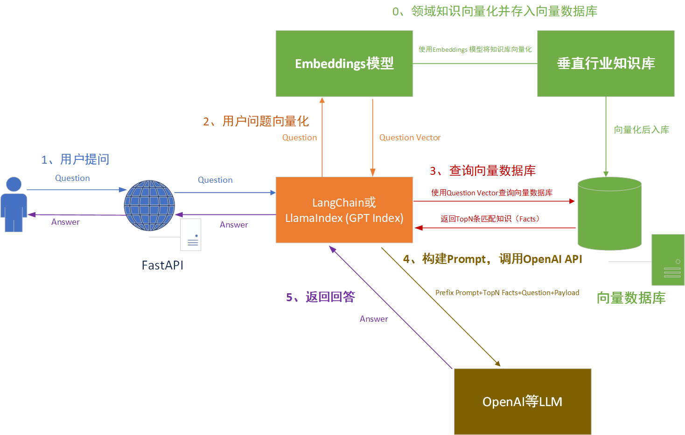

#### Embedding模型
Embedding 是个英文术语，如果非要找一个中文翻译对照的话，我觉得“向量化”（Vectorize）最合适。Embedding 的过程，就是把数据集合映射到向量空间，进而把数据进行向量化的过程。Embedding 的目标，就是找到一组合适的向量，来刻画现有的数据集合。

https://qiankunli.github.io/2022/03/02/embedding.html

* 列表索引
* 向量存储索引
* 树状索引
* 关键词表索引
* 可组合性图索引
* Pandas索引和SQL索引
* 文档摘要索引
* 知识图谱索引


```
from llama_index import SimpleDirectoryReader
​
# 从文件夹读取
documents = SimpleDirectoryReader(input_dir='./data').load_data()
​
# 从指定文件读取，输入为List
documents = SimpleDirectoryReader(input_files=['./data/file.txt']).load_data()

```
或者直接把自己的text改为document文档
```
from llama_index import Document
​
# 直接从文本转换
text_list = [text1, text2, ...]
documents = [Document(t) for t in text_list]
```


[LlamaIndex—正确使用索引](https://www.luxiangdong.com/2023/07/12/llamaindex/#/%E6%96%87%E6%A1%A3%E6%91%98%E8%A6%81%E7%B4%A2%E5%BC%95)   
[【城南 · LlamaIndex 教程】一文看懂LlamaIndex用法，为LLMs学习私有知识](https://juejin.cn/post/7237487578865795131)