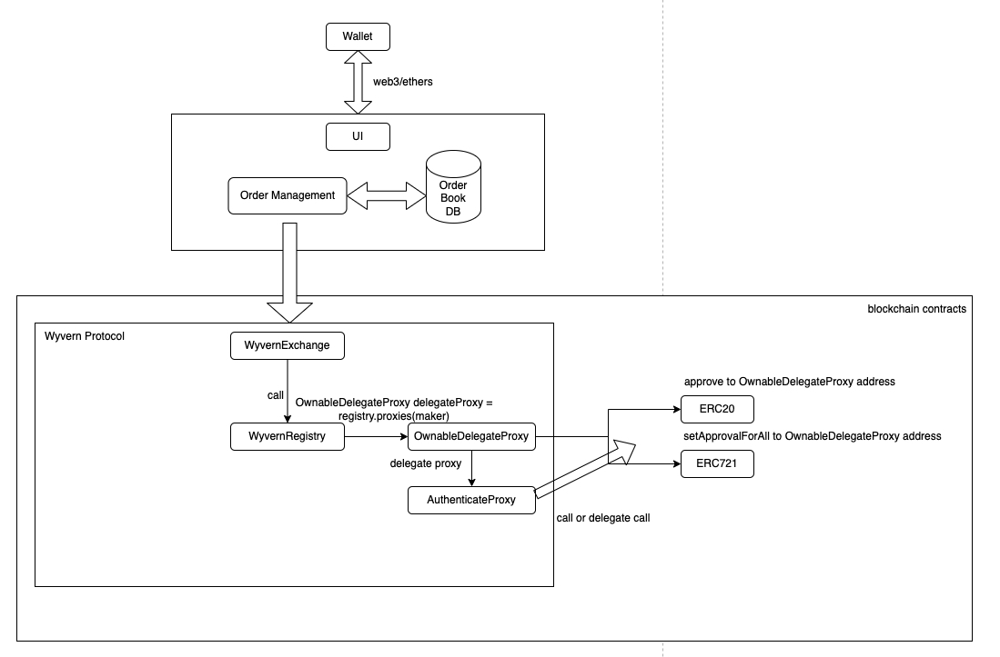
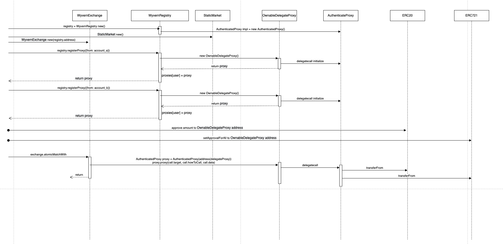

`opensea1.0使用的是wyvernprotocol`

## opensea的初始操作流程:
* Initialize Wallet 部署Proxy合約
* Approve Token  授权给Proxy合约
* Confirm Listing 确认你的信息，不需要上链

## Wyvern框架图
   
Wyvern具体是如何实现NFT交易市场的功能的呢？实际上Wyvern就是智能合约，当卖家和买家在OpenSea上创建买单和卖单时，这些订单会被存储在中心化的数据库里。在当买单和卖单匹配时，这些订单会被发送到Wyvern的智能合约上进行链上结算。Wyvern将验证这些订单是否被正确签名和匹配，并执行交易。

## Wyvern工作流程图

## seaport
升级为Seaport之后的OpenSea可能有哪些变化呢？首先，用户在OpenSea上交易时的gas fee会大幅降低，并且完成交易的耗时缩短。OpenSea还可能会推出全新的UI来支持新功能，比如NFT以物易物和组合交易。假设一位用户想出售BAYC，那么可以标价100ETH，或者标价50ETH+4个Azuki。再比如用户手上有20个流动性较差的NFT，用户可以选择打包20个NFT去交换其他卖家的一个近期较火的NFT。这种“组合交易”和“以物易物”的方式可以一定程度提高一些NFT在二级市场上的流动性。

参考:      
[NFT 及 OpenSea 交易背后的技术分享](https://web3caff.com/zh/archives/2472)           
[IOSG：Seaport，OpenSea代币化的开端？](https://www.tuoniaox.com/news/p-538667.html)       
[seaport opensea2.0](https://github.com/ProjectOpenSea/seaport)     
[理解 EIP712 - 类型结构化数据 Hash与签名](https://learnblockchain.cn/2019/04/24/token-EIP712)   
[wyvernprotocol](https://wyvernprotocol.com/docs)