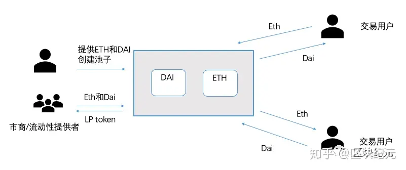
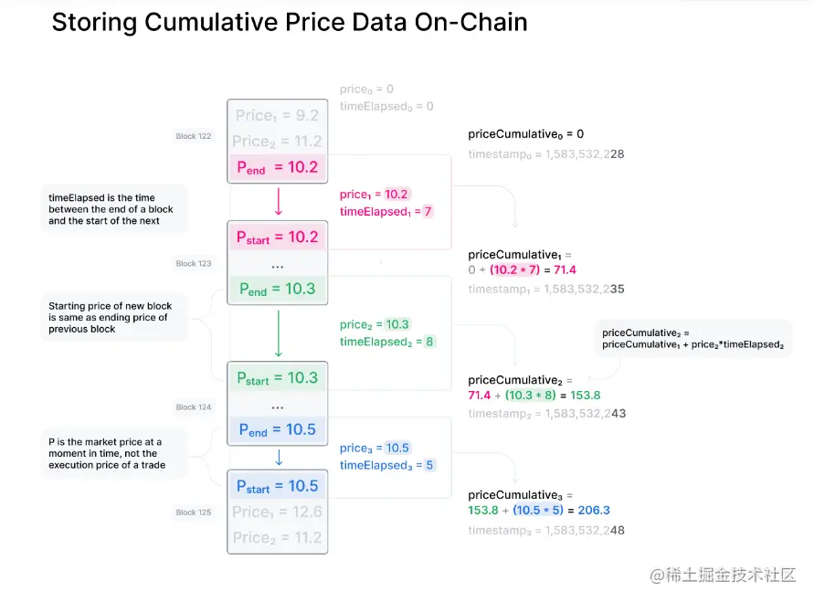
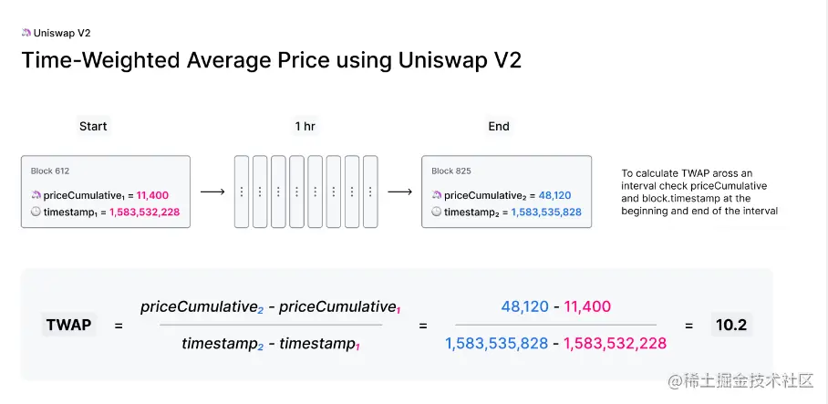

### uniswap交易生态的构成


### 计算公式
用户在uniswap进行交易的时候，遵循的就是AMM(Automated Market Maker，自动化做市机制)，AMM机制由算法构成，不同的项目有不同的算法，uniswap的机制是恒定乘积，即X*Y=k。  
假设池子中有A和B两种币组成（USDT，AAVE等），当前池子中A的数量为x，B的数量为y，两个币的乘积为k,即：x * y = k。
```
// 不考虑手续费情况
x*y = (x+x')*(y-y') = k // 交易者使用数量为x'换取数量为y'的币
// 手续费为0.3%
x*y = (x+(1-p)*x')*(y-y') = k  // p为手续费0.003

```
`对比之下，可以看出有手续费时，用相同数量的A币，所兑换出来的B币数量会减少。并且交易者使用的x'的数量并没有变化，所以k = ( x + x') * ( y - y')这一结果略大于k = x * y的结果。即k的结果不是一成不变，会略微增长。`


### 滑点
假设当前BNB/USDT的流动性池中有20个BNB和10000个USDT。此时可知道 1BNB = 500 USDT 理论上可以用250USDT换取0.5BNB,但实际上却不可以。
```
k = x * y = 20 * 10000
20 * 10000 = (20 - dy) * (10000 + 250)
=> dy = 0.487
```
表明只能用250USDT换取0.487BNB。
```
此时交易后的BNB价格为
250/0.487 = 513 USDT  （即此时购买1个BNB需要513个USDT）
根据滑点的计算公式可知：
slippageUSDT = dx/x = 250/10000 = 2.5%
slippagebnb = (513-500)/500 = 2.6%
```
以上可得出：交易量dx越大，产生的滑点就越大，偏离实际价位就越大（看上面的图），然而当池中的代币存储越多，dx所带来的变化就越小，滑点变化也越小，降低了用户的交易损耗。


### 链上预言机
Uniswap V2 中的价格预言，其实就是通过两个公式计算而来


用两者的累计价格相减除以时间间隔即可得到这一小时内的TWAP价格了。这是TWAP 最简单的计算方式，也称为固定时间窗口的 TWAP。

`但使用 UniswapV2 的TWAP，其主要缺点是需要链下程序定时触发合约中的update()函数，存在维护成本。`
```js
// range: [0, 2**112 - 1]
// resolution: 1 / 2**112

// 编码：将一个uint112的值编码为uint224
//0000000000000000000000000000000000000000000000000000000000000001 => 0x01 uint112
//00000000 => 前32位留空
//0000000000000000000000000001 => 整数部分
//0000000000000000000000000000 => 小数部分
//0000000000000000000000000000000000010000000000000000000000000000
library UQ112x112 {
    uint224 constant Q112 = 2**112;

    // encode a uint112 as a UQ112x112
    function encode(uint112 y) internal pure returns (uint224 z) {
        z = uint224(y) * Q112; // never overflows
    }

    // divide a UQ112x112 by a uint112, returning a UQ112x112
    function uqdiv(uint224 x, uint112 y) internal pure returns (uint224 z) {
        z = x / uint224(y);
    }
}
```


### 数值精度
由于solidity中并不原生支持小数，Uniswap采用UQ112.112这种编码方式来存储价格信息。UQ112.112意味着该数值采取224位来编码值，前112位存放小数点前的值，其范围是`[0,2**112-1]`,后112位存放小数点后的值，其精度可以达到`1/(2**112)`

参考:

[github](https://github.com/orgs/Uniswap)   
[defi ｜ uniswap v2 整体架构](https://benpaodewoniu.github.io/2022/01/06/defi15/)   
[defi | uniswap v2 uniswap-v2-core 工厂合约](https://benpaodewoniu.github.io/2022/01/06/defi16/)   
[Defi部署教程 Uniswap部署 搭建去中心化交易所](https://www.jianshu.com/p/aa1194f0b775)   
[DeFi:Uniswap v2协议原理解析](https://juejin.cn/post/7178857641421045820)   
[uniswap的工作原理（上）](https://zhuanlan.zhihu.com/p/269205336)   
[质押挖矿](https://github.com/Uniswap/liquidity-staker)   
[uniswap_deploy](https://github.com/chennyouneng2020/Uniswap)