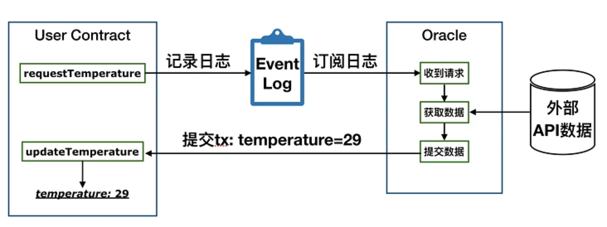
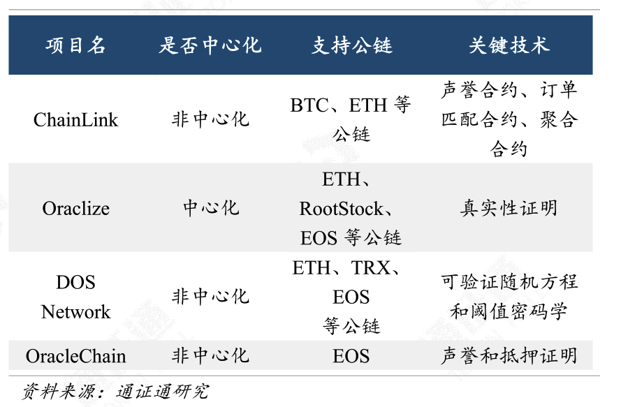

根据商业组织形式分类，预言机可以是中心化的单一预言者的机制（如 Oraclize）——中心化预言机，同样也可以是去中心化的多个预言者的机制（如 Chainlink、DOS Network 等）——去中心化预言机。

典型的预言机项目有 ChainLink、Oraclize、DOS Network、
OracleChain 等。

* Oraclize 是一个具有真实性证明的中心化预言机，目前支持以
太坊（Ethereum）、Rootstock、R3 Corda、Hyperledger Fabric 和 EOS
等多个平台。

参考:   
[如何在智能合约中使用 Oraclize 调取外部接口](https://blog.junezhu.top/2019/01/29/how-to-use-oraclize-at-ethereum.html)     
[Chainlink预言机基本原理](https://segmentfault.com/a/1190000022774144)     
[【以太坊开发】区块链中的预言机：Oraclize原理介绍](https://www.cnblogs.com/gzhlt/p/10052362.html)