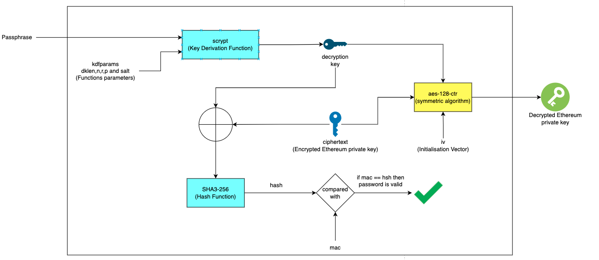

```
{
	"address": "26ce833a705af6846da8c1a43d1e418b93458137",  //账户地址
	"crypto": {
        //使用的加密算法,这里使用AES-CTR模式加密私钥,分组模式是128比特
		"cipher": "aes-128-ctr",    
        //这是对原始私钥加密后的私钥的密文
		"ciphertext": "e2edc5df564536dcf7fb8bcfde99404215d8dd8327684e9d27327a267181a791",
		"cipherparams": {
            //这是向量
			"iv": "9847020ef0bb269b0c463d2ed4bb2ac4"
		},
		"kdf": "scrypt",
		"kdfparams": {
			"dklen": 32, //解密秘钥的长度
        //进行加密解密运算的次数,在越大的情况下,可以增加暴力破解的成本,也会使签名速度变慢
			"n": 262144, 
        //设置为1为只能串行运算.0为并行运算.串行运算可以增加安全性.也会影响签名速度
			"p": 1,
        //加密的分组长度
			"r": 8,
        //可以理解为随机生成的向量
			"salt": "56fc7ac270cd1a357a2bc1959119f10df4b69fabb4d0c198d6527f3c0fe2df6b"
		},
        //这是解密私钥密文的秘钥的hash值,防止用户输入错误的密码而计算出错误的私钥.用与比对私钥是否正确.
		"mac": "7fde1727799710cf122d441c57c50cbc8182f666cca5a7717a8cb3bb8d21639d"
	},
	"id": "1d6b8676-de36-441d-a736-2a8ee94019ea",
	"version": 3
}
```
