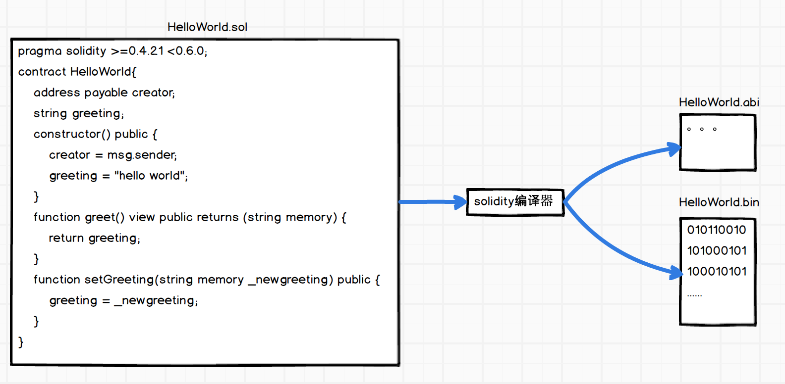
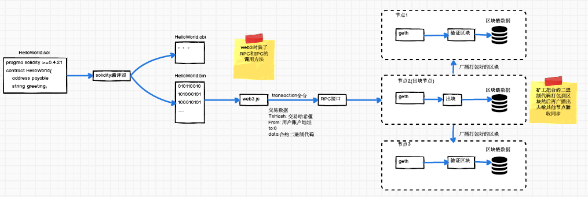
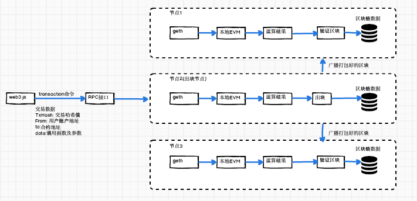

### 一、什么叫智能合约
智能合约其实不是合约也不智能，只是它能跑着区块链上的代码。

### 二、智能合约语言  
* Solidity  
    Solidity是和JavaScript相似的语言，你可以用它来开发合约并编译成以太坊虚拟机字节代码。它目前是以太坊最受欢迎的语言。
* Serpent  
    Serpent是和Python类似的语言，可以用于开发合约编译成以太坊虚拟机字节代码。它力求简洁， 将低级语言在效率方面的优点和编程风格的操作简易相结合，同时合约编程增加了独特的领域特定功能。Serpent用LLL编译。
* Lisp Like Language (LLL)  
    Lisp Like Language (LLL)是和Assembly类似的低级语言。它追求极简；本质上只是直接对以太坊虚拟机的一点包装。
* Mutan (弃用)  
    Mutan是个静态类型，由Jeffrey Wilcke 开发设计的C类语言。它已经不再受到维护。

我们这里用solidity作为合约开发语言进行讲解

### 三、智能合约的编译


如上图合约文件Helloworld.sol经过编译器编译生成Helloworld.abi和Helloworld.bin文件。
```
solc helloworld.sol --abi --bin -o ./
```
* ABI文件可以简单看作是合约的接口描述文件，具体见[以太坊智能合约---ABI](https://github.com/jxu86/technique-architect/blob/master/blockchain/ethereum/以太坊智能合约---ABI.md)  
* bin文件可以看作是一个二进制文件，这二进制文件就是EVM指令的集合。


### 四、合约的部署
  
如上图，合约的部署跟发送一笔交易是一样的操作，调用transaction函数，from为发布者的地址，to为0，data为合约的evm操作码。在矿工打包的时候会生成智能合约地址。智能合约地址的生成是由创建者的账号和发送的交易数作为随机数输入，通过Kecca-256加密算法重新创建一个地址作为账号。也就是说最后合约地址对应合约的代码会保存在区块链数据库。调用者只需要有合约地址和abi文件就可以调用合约的代码。  


### 五、合约的调用


* 要调用合约需要合约的地址和合约的方法 
* 智能合约是部署在区块链的代码，区块链本身不能执行代码，代码的执行是在本地的EVM中，实际上，部署在区块链上代码是能够在本地产生原智能合约代码的代码，可以理解区块链为一个数据库，而客户端从数据库中读取了存储的运行代码，并在本地运行后，将结果写入到了区块链这个数据库中。

参考:  
[一次搞懂「以太坊智能合约」如何运作](https://www.zuocoin.com/a/news/experience/2019/0825/63017.html)  
[图解以太坊智能合约中的概念](https://www.jianshu.com/p/9bca56e67d6e)  
[【译】完全理解以太坊智能合约](https://learnblockchain.cn/2018/01/04/understanding-smart-contracts/)  
[[以太坊源代码分析] I.区块和交易，合约和虚拟机](https://blog.csdn.net/teaspring/article/details/75389151)  
[EVM 以太坊虚拟机](https://fisco-bcos-documentation.readthedocs.io/zh_CN/latest/docs/design/virtual_machine/evm.html)  
[区块链开发（二）部署和运行第一个以太坊智能合约](https://blog.csdn.net/sportshark/article/details/52249607)  
[以太坊虚拟机（EVM）底层原理及性能缺陷](https://abelsu7.top/2018/02/28/ethereum-virtual-machine/)  
