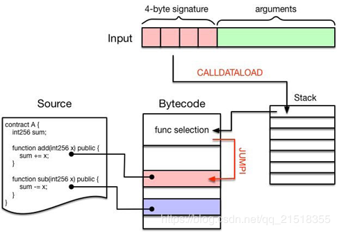
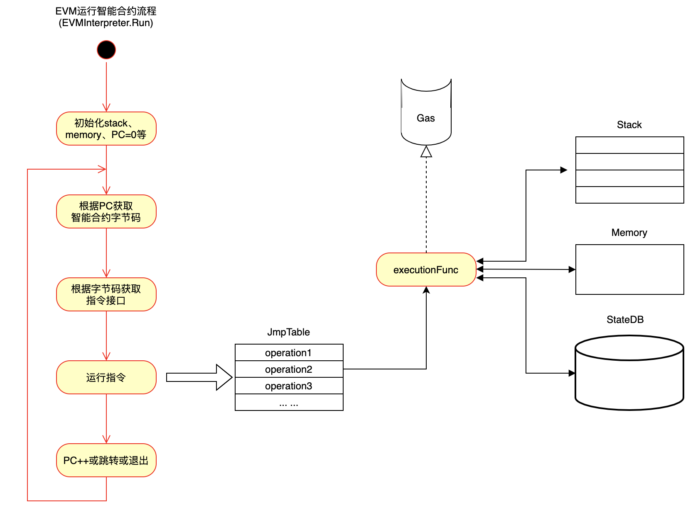
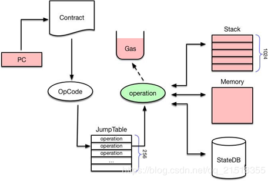
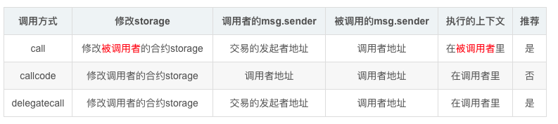

* 类图

### 概述

### 代码结构
```
// core/vm目录结构
.
├── analysis.go                 //跳转目标判定
├── analysis_test.go            
├── common.go                   
├── contract.go                 //合约数据结构
├── contracts.go                //预编译好的合约
├── contracts_test.go           
├── doc.go      
├── eips.go
├── errors.go
├── evm.go                      //执行器 对外提供一些外部接口
├── gas.go                      //call gas花费计算 一级指令耗费gas级别
├── gas_table.go                //指令耗费计算函数表
├── gas_table_test.go
├── gen_structlog.go            //
├── instructions.go             //指令操作
├── instructions_test.go
├── int_pool_verifier.go
├── int_pool_verifier_empty.go
├── interface.go
├── interpreter.go              //解释器 调用核心
├── intpool.go                  //int值池
├── intpool_test.go
├── jump_table.go               //指令和指令操作（操作，花费，验证）对应表
├── logger.go                   //状态日志
├── logger_json.go
├── logger_test.go
├── memory.go                   //EVM 内存
├── memory_table.go             //EVM 内存操作表 主要衡量操作所需内存大小
├── opcodes.go                  //Op指令 以及一些对应关系
├── runtime
│   ├── doc.go
│   ├── env.go                  //执行环境
│   ├── fuzz.go
│   ├── runtime.go              //运行接口 测试使用
│   ├── runtime_example_test.go
│   └── runtime_test.go
├── stack.go                    //栈 
├── stack_table.go              //栈验证
└── testdata                    
```

```
// core/vm/interpreter.go
// EVMInterpreter represents an EVM interpreter
type EVMInterpreter struct {
	evm *EVM				// EVM虚拟机对象
	cfg Config				// 当前解释器的配置文件

	intPool *intPool		// 数据回收对象

	// 签名算法接口
	hasher    keccakState // Keccak256 hasher instance shared across opcodes 
	// 签名后的数值
	hasherBuf common.Hash // Keccak256 hasher result array shared aross opcodes
	// 合约调用方式
	readOnly   bool   // Whether to throw on stateful modifications
	// 合约调用后的返回值
	returnData []byte // Last CALL's return data for subsequent reuse
}

// Config are the configuration options for the Interpreter
type Config struct {
	Debug                   bool   // Enables debugging
	Tracer                  Tracer // Opcode logger
	NoRecursion             bool   // Disables call, callcode, delegate call and create
	EnablePreimageRecording bool   // Enables recording of SHA3/keccak preimages

	JumpTable [256]operation // EVM instruction table, automatically populated if unset

	EWASMInterpreter string // External EWASM interpreter options
	EVMInterpreter   string // External EVM interpreter options

	ExtraEips []int // Additional EIPS that are to be enabled
}
```

### 合约的创建
```
// core/vm/evm.go
// create creates a new contract using code as deployment code.
func (evm *EVM) create(caller ContractRef, codeAndHash *codeAndHash, gas uint64, value *big.Int, address common.Address) ([]byte, common.Address, uint64, error) {
	// Depth check execution. Fail if we're trying to execute above the
	// limit.
	// 合约调用深度检查
	if evm.depth > int(params.CallCreateDepth) {
		return nil, common.Address{}, gas, ErrDepth
	}
	// 检查balance
	if !evm.CanTransfer(evm.StateDB, caller.Address(), value) {
		return nil, common.Address{}, gas, ErrInsufficientBalance
	}
	nonce := evm.StateDB.GetNonce(caller.Address())
	evm.StateDB.SetNonce(caller.Address(), nonce+1)

	// Ensure there's no existing contract already at the designated address
	// 确定特定地址没有合约存在
	contractHash := evm.StateDB.GetCodeHash(address)
	if evm.StateDB.GetNonce(address) != 0 || (contractHash != (common.Hash{}) && contractHash != emptyCodeHash) {
		return nil, common.Address{}, 0, ErrContractAddressCollision
	}
	// Create a new account on the state
	// 创建一个StateDB的快照，以便回滚
	snapshot := evm.StateDB.Snapshot()
	evm.StateDB.CreateAccount(address)
	if evm.chainRules.IsEIP158 {
		evm.StateDB.SetNonce(address, 1)
	}
	// 转账
	evm.Transfer(evm.StateDB, caller.Address(), address, value)

	// Initialise a new contract and set the code that is to be used by the EVM.
	// The contract is a scoped environment for this execution context only.
	// 创建一个新的合约
	contract := NewContract(caller, AccountRef(address), value, gas)
	contract.SetCodeOptionalHash(&address, codeAndHash)

	if evm.vmConfig.NoRecursion && evm.depth > 0 {
		return nil, address, gas, nil
	}

	if evm.vmConfig.Debug && evm.depth == 0 {
		evm.vmConfig.Tracer.CaptureStart(caller.Address(), address, true, codeAndHash.code, gas, value)
	}
	start := time.Now()
	// 执行合约
	ret, err := run(evm, contract, nil, false)

	// check whether the max code size has been exceeded
	// 检查初始化生成的代码的长度不超过限制
	maxCodeSizeExceeded := evm.chainRules.IsEIP158 && len(ret) > params.MaxCodeSize
	// if the contract creation ran successfully and no errors were returned
	// calculate the gas required to store the code. If the code could not
	// be stored due to not enough gas set an error and let it be handled
	// by the error checking condition below.
	// 如果合同创建成功并且没有错误返回，则计算存储代码所需的GAS。
    // 如果由于没有足够的GAS而导致代码不能被存储设置错误，并通过下面的错误检查条件来处理
	if err == nil && !maxCodeSizeExceeded {
		createDataGas := uint64(len(ret)) * params.CreateDataGas
		if contract.UseGas(createDataGas) {
			evm.StateDB.SetCode(address, ret)
		} else {
			err = ErrCodeStoreOutOfGas
		}
	}

	// When an error was returned by the EVM or when setting the creation code
	// above we revert to the snapshot and consume any gas remaining. Additionally
	// when we're in homestead this also counts for code storage gas errors.
	// 当发生错误是回滚，但是gas不退回
	if maxCodeSizeExceeded || (err != nil && (evm.chainRules.IsHomestead || err != ErrCodeStoreOutOfGas)) {
		evm.StateDB.RevertToSnapshot(snapshot)
		if err != errExecutionReverted {
			contract.UseGas(contract.Gas)
		}
	}
	// Assign err if contract code size exceeds the max while the err is still empty.
	if maxCodeSizeExceeded && err == nil {
		err = errMaxCodeSizeExceeded
	}
	if evm.vmConfig.Debug && evm.depth == 0 {
		evm.vmConfig.Tracer.CaptureEnd(ret, gas-contract.Gas, time.Since(start), err)
	}
	return ret, address, contract.Gas, err

}

// Create creates a new contract using code as deployment code.
func (evm *EVM) Create(caller ContractRef, code []byte, gas uint64, value *big.Int) (ret []byte, contractAddr common.Address, leftOverGas uint64, err error) {
	contractAddr = crypto.CreateAddress(caller.Address(), evm.StateDB.GetNonce(caller.Address()))
	return evm.create(caller, &codeAndHash{code: code}, gas, value, contractAddr)
}
```

* 合约地址的创建  
```
// crypto/crypto.go

// CreateAddress creates an ethereum address given the bytes and the nonce
func CreateAddress(b common.Address, nonce uint64) common.Address {
	data, _ := rlp.EncodeToBytes([]interface{}{b, nonce})
	return common.BytesToAddress(Keccak256(data)[12:])
}
```
创建合约地址，采用下面的计算公式：Keccak256(RLP(call_addr, nonce))[12:]。也就是说，对交易发起人的地址和nonce进行RLP编码，再算出Keccak哈希值，取后20个字节作为该合约的地址。

* create流程
	* 创建合约地址
	* 判断虚拟机EVM的调用深度，不能超过限定值，默认是1024
	* 根据value判断合约发布者是否有足额的以太币
	* 合约部署者caller的nonce加1
	* 根据address确保上面创建的合约地址没有被使用
	* 创建一个当前StateDB的快照，以便回滚
	* 创建新的帐户nonce设置为1
	* 给该合约转帐，转帐值为value
	* 使用caller address value gas创建合约对象
	* 把代码和哈希值codeAndHash放进去合约对象
	* 运行虚拟机EVM
	* 检查合约允许的最大字节码，即代码是否溢出
	* 花费gas并保存合约代码
	* 如果执行失败，回滚到快照的状态


### 合约的调用  

* 调用合约函数流程图  	




```
pragma solidity >=0.4.21 <0.6.0;
contract HelloWorld {
    uint a;
    constructor() public {
      a = 0x55;
    }

    function sayHello() public pure returns(string memory) {
      return "helloworld";
    }
}
```

```
... ...
sub_0: assembly {
        /* "HelloWorld.sol":34:214  contract HelloWorld {... */
      mstore(0x40, 0x80)
      callvalue
        /* "--CODEGEN--":8:17   */
      dup1
        /* "--CODEGEN--":5:7   */
      iszero
      tag_1
      jumpi
        /* "--CODEGEN--":30:31   */
      0x00
        /* "--CODEGEN--":27:28   */
      dup1
        /* "--CODEGEN--":20:32   */
      revert
        /* "--CODEGEN--":5:7   */
    tag_1:
        /* "HelloWorld.sol":34:214  contract HelloWorld {... */
      pop
      jumpi(tag_2, lt(calldatasize, 0x04))
      shr(0xe0, calldataload(0x00))
      dup1
      0xef5fb05b
      eq
      tag_3
      jumpi
    tag_2:
      0x00
      dup1
      revert
        /* "HelloWorld.sol":122:211  function sayHello() public pure returns(string memory) {... */
    tag_3:
      tag_4
      tag_5
      jump  // in
    tag_4:
      0x40
      dup1
      mload
      0x20
      dup1
... ...
```

&emsp;&emsp;流程图结合代码一起看，先看代码，可以看到编译出来的合约代码从tag_1开始看，回去检查calldatasize的大小，如果是小于4个字节就直接退出，如果是大于等于4个字节就拿高4字节跟"0xef5fb05b"对比，"0xef5fb05b"为sha3("sayHello()")的值，如果相等就调到tag_3的位置，tag_3为sayHello()函数地址。	

&emsp;&emsp;再看回流程图，首先通过CALLDATALOAD指令将input字段中的前“4-byte signature”压入堆栈中，然后依次跟该合约中包含的函数进行比对，如果匹配则调用JUMPI指令跳入该段代码继续执行。最后根据执行过程中的指令不同，分别对Stack、Memory或者StateDB进行读写操作。


* 代码分析
```
// core/vm/evm.go
// Call executes the contract associated with the addr with the given input as
// parameters. It also handles any necessary value transfer required and takes
// the necessary steps to create accounts and reverses the state in case of an
// execution error or failed value transfer.
func (evm *EVM) Call(caller ContractRef, addr common.Address, input []byte, gas uint64, value *big.Int) (ret []byte, leftOverGas uint64, err error) {
	if evm.vmConfig.NoRecursion && evm.depth > 0 {
		return nil, gas, nil
	}

	// Fail if we're trying to execute above the call depth limit
	// 调用深度不超过1024
	if evm.depth > int(params.CallCreateDepth) {
		return nil, gas, ErrDepth
	}
	// Fail if we're trying to transfer more than the available balance
	// 查看账户是否有足够钱
	if !evm.Context.CanTransfer(evm.StateDB, caller.Address(), value) {
		return nil, gas, ErrInsufficientBalance
	}

	var (
		to       = AccountRef(addr)
		snapshot = evm.StateDB.Snapshot()
	)
	if !evm.StateDB.Exist(addr) { // 查看指定地址是否存在
		precompiles := PrecompiledContractsHomestead
		if evm.chainRules.IsByzantium {
			precompiles = PrecompiledContractsByzantium
		}
		if evm.chainRules.IsIstanbul {
			precompiles = PrecompiledContractsIstanbul
		}
		if precompiles[addr] == nil && evm.chainRules.IsEIP158 && value.Sign() == 0 {
			// Calling a non existing account, don't do anything, but ping the tracer
			if evm.vmConfig.Debug && evm.depth == 0 {
				evm.vmConfig.Tracer.CaptureStart(caller.Address(), addr, false, input, gas, value)
				evm.vmConfig.Tracer.CaptureEnd(ret, 0, 0, nil)
			}
			return nil, gas, nil
		}
		// 负责在本地状态创建addr
		evm.StateDB.CreateAccount(addr)
	}
	//执行转账
	evm.Transfer(evm.StateDB, caller.Address(), to.Address(), value)
	// Initialise a new contract and set the code that is to be used by the EVM.
	// The contract is a scoped environment for this execution context only.
	// 创建一个合约对象
	contract := NewContract(caller, to, value, gas)
	contract.SetCallCode(&addr, evm.StateDB.GetCodeHash(addr), evm.StateDB.GetCode(addr))

	// Even if the account has no code, we need to continue because it might be a precompile
	start := time.Now()

	// Capture the tracer start/end events in debug mode
	if evm.vmConfig.Debug && evm.depth == 0 {
		evm.vmConfig.Tracer.CaptureStart(caller.Address(), addr, false, input, gas, value)

		defer func() { // Lazy evaluation of the parameters
			evm.vmConfig.Tracer.CaptureEnd(ret, gas-contract.Gas, time.Since(start), err)
		}()
	}
	// 执行合约
	ret, err = run(evm, contract, input, false)

	// When an error was returned by the EVM or when setting the creation code
	// above we revert to the snapshot and consume any gas remaining. Additionally
	// when we're in homestead this also counts for code storage gas errors.
	if err != nil {
		evm.StateDB.RevertToSnapshot(snapshot)
		if err != errExecutionReverted {
			contract.UseGas(contract.Gas)
		}
	}
	return ret, contract.Gas, err
}
```

* call流程
	* 判断虚拟机EVM的调用深度，不能超过1024
	* 根据value判断合约发布者是否有⾜足额的以太币
	* 根据addr设置合约地址
	* 创建当前状态的快照，用于后结出错的回滚
	* 根据addr判断该地址是否在状态库中已存在，如果不存在，则创建该帐户
	* 给该合约地址转帐，转帐值为value
	* 使⽤caller to value gas创建合约对象
	* 根据addr把库中查到的合约的地下、代码和哈希值放进去
	* 运行虚拟机EVM

### EVM执行合约代码

* EVM执行合约代码  




&emsp;&emsp;首先PC会从合约代码中读取一个OpCode，然后从一个JumpTable中检索出对应的operation，也就是与其相关联的函数集合。接下来会计算该操作需要消耗的油费，如果油费耗光则执行失败，返回ErrOutOfGas错误。如果油费充足，则调用execute()执行该指令，根据指令类型的不同，会分别对Stack、Memory或者StateDB进行读写操作。

* 代码分析
```
// core/vm/interpreter.go·

// Run loops and evaluates the contract's code with the given input data and returns
// the return byte-slice and an error if one occurred.
//
// It's important to note that any errors returned by the interpreter should be
// considered a revert-and-consume-all-gas operation except for
// errExecutionReverted which means revert-and-keep-gas-left.
func (in *EVMInterpreter) Run(contract *Contract, input []byte, readOnly bool) (ret []byte, err error) {
	if in.intPool == nil {
		in.intPool = poolOfIntPools.get()
		defer func() {
			poolOfIntPools.put(in.intPool)
			in.intPool = nil
		}()
	}

	// Increment the call depth which is restricted to 1024
	in.evm.depth++
	defer func() { in.evm.depth-- }()

	// Make sure the readOnly is only set if we aren't in readOnly yet.
	// This makes also sure that the readOnly flag isn't removed for child calls.
	if readOnly && !in.readOnly {
		in.readOnly = true
		defer func() { in.readOnly = false }()
	}

	// Reset the previous call's return data. It's unimportant to preserve the old buffer
	// as every returning call will return new data anyway.
	in.returnData = nil

	// Don't bother with the execution if there's no code.
	if len(contract.Code) == 0 {
		return nil, nil
	}

	var (
		op    OpCode        // current opcode 当前操作码
		mem   = NewMemory() // bound memory 内存
		stack = newstack()  // local stack	栈
		// For optimisation reason we're using uint64 as the program counter.
		// It's theoretically possible to go above 2^64. The YP defines the PC
		// to be uint256. Practically much less so feasible.
		pc   = uint64(0) // program counter 程序指针，决定获取字节码的位置
		cost uint64		// gas花费
		// copies used by tracer
		pcCopy  uint64 // needed for the deferred Tracer, debug使用
		gasCopy uint64 // for Tracer to log gas remaining before execution, debug使用
		logged  bool   // deferred Tracer should ignore already logged steps, debug使用
		//当前操作码执行函数的返回值
		res     []byte // result of the opcode execution function
	)
	// 交易参数获取，就是json-rpc的data
	contract.Input = input

	// Reclaim the stack as an int pool when the execution stops
	// 执行停止时将栈回收为int值缓存池
	defer func() { in.intPool.put(stack.data...) }()

	if in.cfg.Debug {
		defer func() {
			if err != nil {
				if !logged {
					in.cfg.Tracer.CaptureState(in.evm, pcCopy, op, gasCopy, cost, mem, stack, contract, in.evm.depth, err)
				} else {
					in.cfg.Tracer.CaptureFault(in.evm, pcCopy, op, gasCopy, cost, mem, stack, contract, in.evm.depth, err)
				}
			}
		}()
	}
	// The Interpreter main run loop (contextual). This loop runs until either an
	// explicit STOP, RETURN or SELFDESTRUCT is executed, an error occurred during
	// the execution of one of the operations or until the done flag is set by the
	// parent context.
	// 解释器主循环，循环运行直到执行显式STOP，RETURN或SELFDESTRUCT，发生错误
	for atomic.LoadInt32(&in.evm.abort) == 0 {
		if in.cfg.Debug {
			// Capture pre-execution values for tracing.
			logged, pcCopy, gasCopy = false, pc, contract.Gas
		}
		// Get the operation from the jump table and validate the stack to ensure there are
		// enough stack items available to perform the operation.
		// 根据pc的值去拿opcode
		op = contract.GetOp(pc)
		// 获取opcode的operation实例
		operation := in.cfg.JumpTable[op]
		// 校验指令的有效性
		if !operation.valid {
			return nil, fmt.Errorf("invalid opcode 0x%x", int(op))
		}
		// Validate stack，栈校验
		if sLen := stack.len(); sLen < operation.minStack {
			return nil, fmt.Errorf("stack underflow (%d <=> %d)", sLen, operation.minStack)
		} else if sLen > operation.maxStack {
			return nil, fmt.Errorf("stack limit reached %d (%d)", sLen, operation.maxStack)
		}
		// If the operation is valid, enforce and write restrictions
		if in.readOnly && in.evm.chainRules.IsByzantium {
			// If the interpreter is operating in readonly mode, make sure no
			// state-modifying operation is performed. The 3rd stack item
			// for a call operation is the value. Transferring value from one
			// account to the others means the state is modified and should also
			// return with an error.
			if operation.writes || (op == CALL && stack.Back(2).Sign() != 0) {
				return nil, errWriteProtection
			}
		}
		// Static portion of gas
		// 获取指令的gas
		cost = operation.constantGas // For tracing
		// 扣除固定静态操作gas值
		if !contract.UseGas(operation.constantGas) {
			return nil, ErrOutOfGas
		}

		var memorySize uint64
		// calculate the new memory size and expand the memory to fit
		// the operation
		// Memory check needs to be done prior to evaluating the dynamic gas portion,
		// to detect calculation overflows
		// 计算内存 按操作所需要的操作数来算
		if operation.memorySize != nil {
			memSize, overflow := operation.memorySize(stack)
			if overflow {
				return nil, errGasUintOverflow
			}
			// memory is expanded in words of 32 bytes. Gas
			// is also calculated in words.
			if memorySize, overflow = math.SafeMul(toWordSize(memSize), 32); overflow {
				return nil, errGasUintOverflow
			}
		}
		// Dynamic portion of gas
		// consume the gas and return an error if not enough gas is available.
		// cost is explicitly set so that the capture state defer method can get the proper cost
		if operation.dynamicGas != nil {
			var dynamicCost uint64
			dynamicCost, err = operation.dynamicGas(in.evm, contract, stack, mem, memorySize)
			cost += dynamicCost // total cost, for debug tracing
			if err != nil || !contract.UseGas(dynamicCost) {
				return nil, ErrOutOfGas
			}
		}
		if memorySize > 0 {
			mem.Resize(memorySize)
		}

		if in.cfg.Debug {
			in.cfg.Tracer.CaptureState(in.evm, pc, op, gasCopy, cost, mem, stack, contract, in.evm.depth, err)
			logged = true
		}

		// execute the operation
		// 执行指令操作
		res, err = operation.execute(&pc, in, contract, mem, stack)
		// verifyPool is a build flag. Pool verification makes sure the integrity
		// of the integer pool by comparing values to a default value.
		// 验证int值缓存池
		if verifyPool {
			verifyIntegerPool(in.intPool)
		}
		// if the operation clears the return data (e.g. it has returning data)
		// set the last return to the result of the operation.
		// 如果遇到return 设置返回值
		if operation.returns {
			in.returnData = res
		}

		switch {
		case err != nil:
			return nil, err		// 报错
		case operation.reverts:	// 出错回滚
			return res, errExecutionReverted
		case operation.halts:
			return res, nil		// 停止
		case !operation.jumps:	// 查看指令是不是跳转，如果是跳转，pc已经在execute的时候给赋值了，如果不是pc++
			pc++
		}
	}
	return nil, nil
}
```
* run流程
	* 初始化变量表，内存、栈等
	* 获取交易参数
	* 根据pc的值去拿opcode
	* 获取opcode的operation实例
	* 校验指令的有效性
	* 校验栈的长度
	* 获取指令的gas
	* 计算内存，按操作所需要的操作数来算
	* 执行指令操作
	* 验证int值缓存池
	* 判断错误类型
	* 跳回第三步或者返回


### 存储模型
&emsp;&emsp;EVM中数据可以在三个地方进行存储，分别是栈，临时存储，永久存储。由于EVM是基于栈的虚拟机，因此基本上所有的操作都是在栈上进行的，并且EVM中没有寄存器的概念,这样EVM对栈的依赖就更大，虽然这样的设计使实现比较简单且易于理解，但是带来的问题就是需要更多数据的相关操作。在EVM中栈是唯一的免费（几乎是）存放数据的地方。栈自然有深度的限制，目前的限制是1024。因为栈的限制，因此栈上的临时变量的使用会受限制。临时内存存储在每个VM实例中，并在合约执行完后消失永久内存存储在区块链的状态层。 ​​​​​


#### 栈存储
&emsp;&emsp;EVM中栈用于保存操作数，每个操作数的类型是big.int，长度为1024。执行opcode的时候，从上往下弹出操作数，作为操作的参数。

&emsp;&emsp;代码位于`core/vm/stack.go`
```
type Stack struct {
	data []*big.Int
}

func newstack() *Stack {
	return &Stack{data: make([]*big.Int, 0, 1024)}
}
```
其他的函数:	 
* Data()：返回栈中的数据  
* push()：把一个元素放入栈中   
* pushN()：把多个元素放入栈中    
* pop()：取出栈顶元素
* len()：栈的长度
* swap()：第几个元素和栈顶元素交换
* dup()：复制第几个元素到栈顶
* peek()：偷看栈顶元素
* Back()：返回栈中的第几个元素
* require()：确定是否有该元素
* Print()：打印栈中的内容临时存储


#### memory存储
&emsp;&emsp;内存用于一些内存操作（MLOAD,MSTORE,MSTORE8）及合约调用的参数拷贝（CALL，CALLCODE）。内存数据结构，维护了一个byte数组，MLOAD，MSTORE读取存入的时候都要指定位置及长度才能准确的读写。

&emsp;&emsp;代码位于`core/vm/stack.go`
```
// Memory implements a simple memory model for the ethereum virtual machine.
type Memory struct {
	store       []byte
	lastGasCost uint64
}

// NewMemory returns a new memory model.
func NewMemory() *Memory {
	return &Memory{}
}
```
* Set()：把数据放入内存中
* Set32()：把32字节的数据放入内存中，不足部分用0补齐
* Resize()：扩展内存到指定大小
* Get()：从内存中获取数据，作为一个新的slice返回
* GetPtr()：从内存中获取数据
* Len()：返回内存的长度
* Data()：返回内存中的数据
* Print()：打印内存中的数据


#### storage存储
&emsp;&emsp;合约及其调用类似于数据库的日志，保存了合约定义以及对他的一系列操作，只要将这些操作执行一遍就能获取当前的结果，但是如果每次都要去执行就太慢了，因而这部分数据是会持久化到stateDb里面的。code中定义了两条指令SSTORE SLOAD用于从db中读写合约当前的状态。


### GAS模型
&emsp;&emsp;以太坊中发送交易固定收取21000gas，除此之外gas收取主要分为两种:
* 固定消耗的gas（例如:加减乘除消耗的gas）
```
// core/vm/gas.go
const (
   GasQuickStep   uint64 = 2
   GasFastestStep uint64 = 3
   GasFastStep    uint64 = 5
   GasMidStep     uint64 = 8
   GasSlowStep    uint64 = 10
   GasExtStep     uint64 = 20
)
```
* 动态调整的gas（例如:扩展内容的gas大小根据内存大小而定） 
```
const (
	GasLimitBoundDivisor uint64 = 1024    // The bound divisor of the gas limit, used in update calculations.
	MinGasLimit          uint64 = 5000    // Minimum the gas limit may ever be.
	GenesisGasLimit      uint64 = 4712388 // Gas limit of the Genesis block.

	MaximumExtraDataSize  uint64 = 32    // Maximum size extra data may be after Genesis.
	ExpByteGas            uint64 = 10    // Times ceil(log256(exponent)) for the EXP instruction.
	SloadGas              uint64 = 50    // Multiplied by the number of 32-byte words that are copied (round up) for any *COPY operation and added.
	CallValueTransferGas  uint64 = 9000  // Paid for CALL when the value transfer is non-zero.
	CallNewAccountGas     uint64 = 25000 // Paid for CALL when the destination address didn't exist prior.
	TxGas                 uint64 = 21000 // Per transaction not creating a contract. NOTE: Not payable on data of calls between transactions.
	TxGasContractCreation uint64 = 53000 // Per transaction that creates a contract. NOTE: Not payable on data of calls between transactions.
	TxDataZeroGas         uint64 = 4     // Per byte of data attached to a transaction that equals zero. NOTE: Not payable on data of calls between transactions.
	QuadCoeffDiv          uint64 = 512   // Divisor for the quadratic particle of the memory cost equation.
	LogDataGas            uint64 = 8     // Per byte in a LOG* operation's data.
	CallStipend           uint64 = 2300  // Free gas given at beginning of call.

	Sha3Gas     uint64 = 30 // Once per SHA3 operation.
	Sha3WordGas uint64 = 6  // Once per word of the SHA3 operation's data.

	SstoreSetGas    uint64 = 20000 // Once per SLOAD operation.
	SstoreResetGas  uint64 = 5000  // Once per SSTORE operation if the zeroness changes from zero.
	SstoreClearGas  uint64 = 5000  // Once per SSTORE operation if the zeroness doesn't change.
	SstoreRefundGas uint64 = 15000 // Once per SSTORE operation if the zeroness changes to zero.

	NetSstoreNoopGas  uint64 = 200   // Once per SSTORE operation if the value doesn't change.
	NetSstoreInitGas  uint64 = 20000 // Once per SSTORE operation from clean zero.
	NetSstoreCleanGas uint64 = 5000  // Once per SSTORE operation from clean non-zero.
	NetSstoreDirtyGas uint64 = 200   // Once per SSTORE operation from dirty.

	NetSstoreClearRefund      uint64 = 15000 // Once per SSTORE operation for clearing an originally existing storage slot
	NetSstoreResetRefund      uint64 = 4800  // Once per SSTORE operation for resetting to the original non-zero value
	NetSstoreResetClearRefund uint64 = 19800 // Once per SSTORE operation for resetting to the original zero value

	SstoreSentryGasEIP2200   uint64 = 2300  // Minimum gas required to be present for an SSTORE call, not consumed
	SstoreNoopGasEIP2200     uint64 = 800   // Once per SSTORE operation if the value doesn't change.
	SstoreDirtyGasEIP2200    uint64 = 800   // Once per SSTORE operation if a dirty value is changed.
	SstoreInitGasEIP2200     uint64 = 20000 // Once per SSTORE operation from clean zero to non-zero
	SstoreInitRefundEIP2200  uint64 = 19200 // Once per SSTORE operation for resetting to the original zero value
	SstoreCleanGasEIP2200    uint64 = 5000  // Once per SSTORE operation from clean non-zero to something else
	SstoreCleanRefundEIP2200 uint64 = 4200  // Once per SSTORE operation for resetting to the original non-zero value
	SstoreClearRefundEIP2200 uint64 = 15000 // Once per SSTORE operation for clearing an originally existing storage slot

	JumpdestGas   uint64 = 1     // Once per JUMPDEST operation.
	EpochDuration uint64 = 30000 // Duration between proof-of-work epochs.

	CreateDataGas            uint64 = 200   //
	CallCreateDepth          uint64 = 1024  // Maximum depth of call/create stack.
	ExpGas                   uint64 = 10    // Once per EXP instruction
	LogGas                   uint64 = 375   // Per LOG* operation.
	CopyGas                  uint64 = 3     //
	StackLimit               uint64 = 1024  // Maximum size of VM stack allowed.
	TierStepGas              uint64 = 0     // Once per operation, for a selection of them.
	LogTopicGas              uint64 = 375   // Multiplied by the * of the LOG*, per LOG transaction. e.g. LOG0 incurs 0 * c_txLogTopicGas, LOG4 incurs 4 * c_txLogTopicGas.
	CreateGas                uint64 = 32000 // Once per CREATE operation & contract-creation transaction.
	Create2Gas               uint64 = 32000 // Once per CREATE2 operation
	SelfdestructRefundGas    uint64 = 24000 // Refunded following a selfdestruct operation.
	MemoryGas                uint64 = 3     // Times the address of the (highest referenced byte in memory + 1). NOTE: referencing happens on read, write and in instructions such as RETURN and CALL.
	TxDataNonZeroGasFrontier uint64 = 68    // Per byte of data attached to a transaction that is not equal to zero. NOTE: Not payable on data of calls between transactions.
	TxDataNonZeroGasEIP2028  uint64 = 16    // Per byte of non zero data attached to a transaction after EIP 2028 (part in Istanbul)

	// These have been changed during the course of the chain
	CallGasFrontier              uint64 = 40  // Once per CALL operation & message call transaction.
	CallGasEIP150                uint64 = 700 // Static portion of gas for CALL-derivates after EIP 150 (Tangerine)
	BalanceGasFrontier           uint64 = 20  // The cost of a BALANCE operation
	BalanceGasEIP150             uint64 = 400 // The cost of a BALANCE operation after Tangerine
	BalanceGasEIP1884            uint64 = 700 // The cost of a BALANCE operation after EIP 1884 (part of Istanbul)
	ExtcodeSizeGasFrontier       uint64 = 20  // Cost of EXTCODESIZE before EIP 150 (Tangerine)
	ExtcodeSizeGasEIP150         uint64 = 700 // Cost of EXTCODESIZE after EIP 150 (Tangerine)
	SloadGasFrontier             uint64 = 50
	SloadGasEIP150               uint64 = 200
	SloadGasEIP1884              uint64 = 800  // Cost of SLOAD after EIP 1884 (part of Istanbul)
	ExtcodeHashGasConstantinople uint64 = 400  // Cost of EXTCODEHASH (introduced in Constantinople)
	ExtcodeHashGasEIP1884        uint64 = 700  // Cost of EXTCODEHASH after EIP 1884 (part in Istanbul)
	SelfdestructGasEIP150        uint64 = 5000 // Cost of SELFDESTRUCT post EIP 150 (Tangerine)

	// EXP has a dynamic portion depending on the size of the exponent
	ExpByteFrontier uint64 = 10 // was set to 10 in Frontier
	ExpByteEIP158   uint64 = 50 // was raised to 50 during Eip158 (Spurious Dragon)

	// Extcodecopy has a dynamic AND a static cost. This represents only the
	// static portion of the gas. It was changed during EIP 150 (Tangerine)
	ExtcodeCopyBaseFrontier uint64 = 20
	ExtcodeCopyBaseEIP150   uint64 = 700

	// CreateBySelfdestructGas is used when the refunded account is one that does
	// not exist. This logic is similar to call.
	// Introduced in Tangerine Whistle (Eip 150)
	CreateBySelfdestructGas uint64 = 25000

	MaxCodeSize = 24576 // Maximum bytecode to permit for a contract

	// Precompiled contract gas prices

	EcrecoverGas        uint64 = 3000 // Elliptic curve sender recovery gas price
	Sha256BaseGas       uint64 = 60   // Base price for a SHA256 operation
	Sha256PerWordGas    uint64 = 12   // Per-word price for a SHA256 operation
	Ripemd160BaseGas    uint64 = 600  // Base price for a RIPEMD160 operation
	Ripemd160PerWordGas uint64 = 120  // Per-word price for a RIPEMD160 operation
	IdentityBaseGas     uint64 = 15   // Base price for a data copy operation
	IdentityPerWordGas  uint64 = 3    // Per-work price for a data copy operation
	ModExpQuadCoeffDiv  uint64 = 20   // Divisor for the quadratic particle of the big int modular exponentiation

	Bn256AddGasByzantium             uint64 = 500    // Byzantium gas needed for an elliptic curve addition
	Bn256AddGasIstanbul              uint64 = 150    // Gas needed for an elliptic curve addition
	Bn256ScalarMulGasByzantium       uint64 = 40000  // Byzantium gas needed for an elliptic curve scalar multiplication
	Bn256ScalarMulGasIstanbul        uint64 = 6000   // Gas needed for an elliptic curve scalar multiplication
	Bn256PairingBaseGasByzantium     uint64 = 100000 // Byzantium base price for an elliptic curve pairing check
	Bn256PairingBaseGasIstanbul      uint64 = 45000  // Base price for an elliptic curve pairing check
	Bn256PairingPerPointGasByzantium uint64 = 80000  // Byzantium per-point price for an elliptic curve pairing check
	Bn256PairingPerPointGasIstanbul  uint64 = 34000  // Per-point price for an elliptic curve pairing check
)
```

### 指令集设计


### 操作指令集


### 指令详解

* 创建EVM,计算交易金额,设置交易对象,计算交易gas

* EVM的虚拟机解析器通过合约指令，执行合约代码

* EVM.DelegateCall 这个调用方式将「库合约」的调用者，设置成自己的调用者；将「库合约」的地址，设置成自己的地址（但代码还是「库合约」的代码）。如此一来，「库合约」的属性，就完全和自己的属性一样了，「库合约」的代码就像是自己的写的代码一样。  
例如 A 账户调用了 B 合约，而在 B 合约中通过 DelegateCall 调用了 C 合约，那么 C 合约的调用者将被修改成 A ， C 合约的地址将被修改成 B 合约的地址。所以在刚才用来转账的「库合约」的例子中，「自己账户」指的不再是「库合约」的账户了，而是调用「库合约」的账户，转账也就可以按我们想要的方式进行了。
* EVM.CallCode 与EVM.DelegateCall类似，不同的是 EVM.CallCode 不改变「库合约」的调用者，只是改变「库合约」的合约地址。也就是说，如果 A 通过 CallCode 的方式调用 B，那么 B 的调用者是 A，而 B 的账户地址也被改成了 A。
* EVM.StaticCall 与 EVM.Call 类似，唯一不同的是 EVM.StaticCall 不允许执行会修改永久存储的数据的指令。




参考:   
[以太坊源码深入分析（9）-- 以太坊通过EVM执行交易过程分析](https://www.jianshu.com/p/bf4e2cd86e81)    
[以太坊源码研读0xa0 EVM机制](https://www.jianshu.com/p/c9b307316750)   
[深入了解以太坊虚拟机第5部分——一个新合约被创建后会发生什么](https://www.jianshu.com/p/d9137e87c9d3)   
[深入探索EVM : 编译和部署智能合约](https://www.arcblock.io/zh/post/2018/12/08/evm-part-1)   
[以太坊虚拟机原理及源代码深入挖掘(推荐)](https://blog.csdn.net/qq_21518355/article/details/89407178)     
[以太坊源码解析：evm](http://yangzhe.me/2019/08/12/ethereum-evm/)     
[以太坊合约调用call、callcode和delegatecall的联系与区别](https://blog.csdn.net/sanqima/article/details/114305130)


