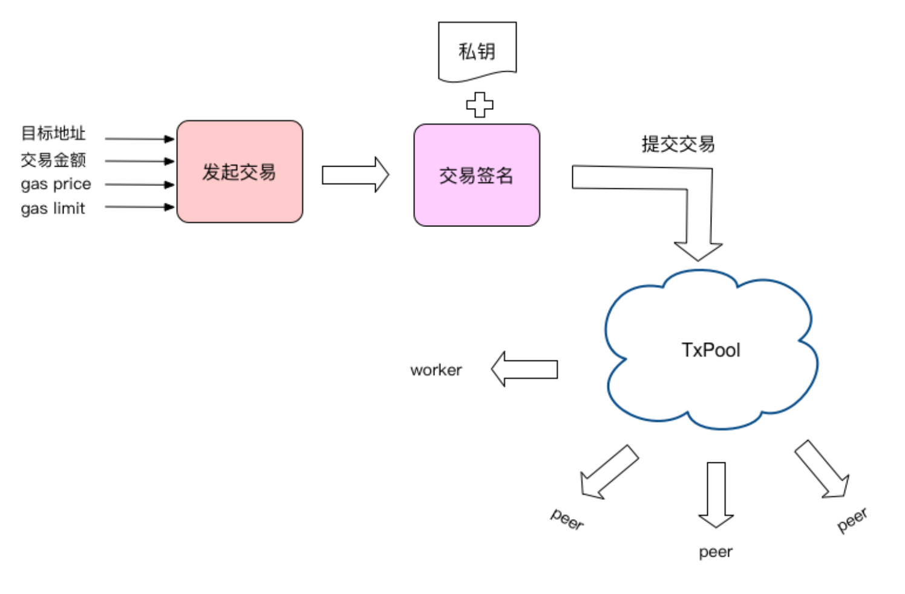
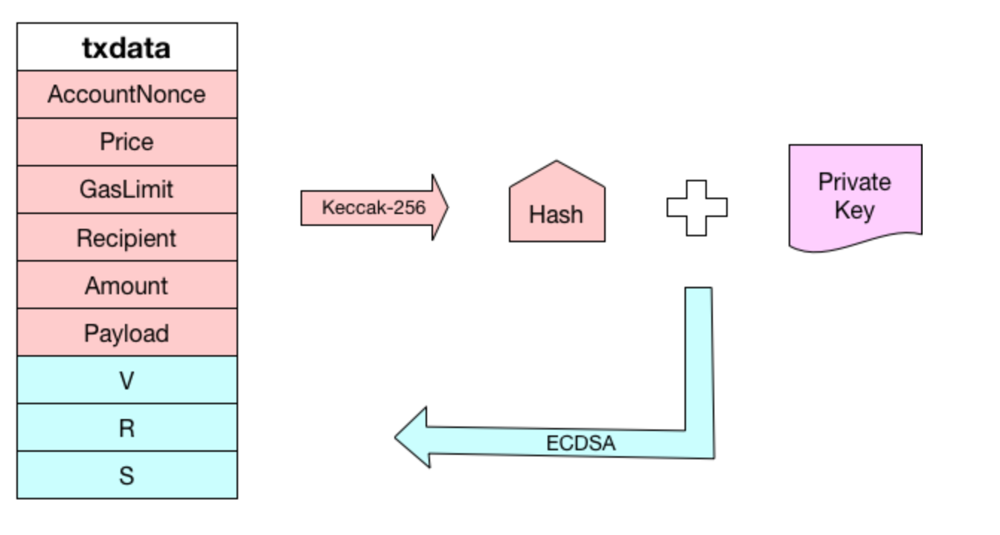
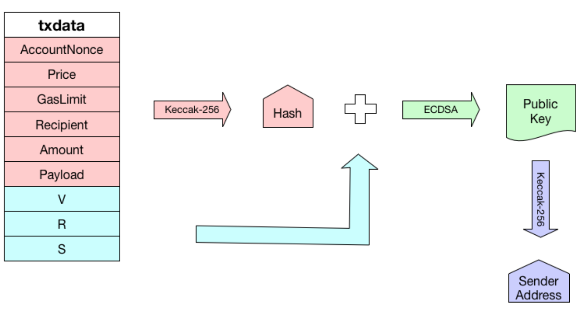

### 一、概述
`go-ethereum版本为v1.9.6`   

交易流程主要分为以下步骤:  
1.创建交易：指定目标地址和交易金额，以及必需的gas/gasLimit  
2.交易签名：使用账户私钥对交易进行签名  
3.提交交易：验签交易，并将交易提交到交易缓冲池  
4.广播交易：通知以太坊虚拟机把交易信息广播给其他节点  
先上个交易流程图，然后在看具体的代码分析

  


### 二、创建交易  
当用户通过JSON RPC发起sendTransaction请求时，最终调用internal/ethapi/api.go:SendTransaction方法:
```
// SendTransaction creates a transaction for the given argument, sign it and submit it to the
// transaction pool.
func (s *PublicTransactionPoolAPI) SendTransaction(ctx context.Context, args SendTxArgs) (common.Hash, error) {
	// Look up the wallet containing the requested signer
	account := accounts.Account{Address: args.From} //用发送者的地址创建一个Account结构体变量  
    // 获取发送者地址的钱包信息
	wallet, err := s.b.AccountManager().Find(account)
	if err != nil {
		return common.Hash{}, err
	}

	if args.Nonce == nil {
		// Hold the addresse's mutex around signing to prevent concurrent assignment of
		// the same nonce to multiple accounts.
		s.nonceLock.LockAddr(args.From)
		defer s.nonceLock.UnlockAddr(args.From)
	}

	// Set some sanity defaults and terminate on failure
	if err := args.setDefaults(ctx, s.b); err != nil {
		return common.Hash{}, err
	}
	// Assemble the transaction and sign with the wallet
	tx := args.toTransaction()

	signed, err := wallet.SignTx(account, tx, s.b.ChainConfig().ChainID)
	if err != nil {
		return common.Hash{}, err
	}
	return SubmitTransaction(ctx, s.b, signed)
}
```
* args.toTransaction()创建交易
* wallet.SignTx()对交易签名
* SubmitTransaction()提交交易和广播交易

我们先看传入的参数SendTxArgs类型的定义(internal/ethapi/api.go):
```
// SendTxArgs represents the arguments to sumbit a new transaction into the transaction pool.
type SendTxArgs struct {
	From     common.Address  `json:"from"`  //发送账户地址
	To       *common.Address `json:"to"`    //接收账户地址，如果是创建合约为nil
	Gas      *hexutil.Uint64 `json:"gas"`
	GasPrice *hexutil.Big    `json:"gasPrice"`
	Value    *hexutil.Big    `json:"value"`
	Nonce    *hexutil.Uint64 `json:"nonce"` //随账户交易次数自增的数字，一般会自动填充
	// We accept "data" and "input" for backwards-compatibility reasons. "input" is the
	// newer name and should be preferred by clients.
	Data  *hexutil.Bytes `json:"data"`      //和input的作用一样，为了向后兼容，推荐用input
	Input *hexutil.Bytes `json:"input"`     //交易的额外数据，如果是创建合约是合约的字节码，如果是调用合约，是合约方法和参数
}
```
接着看toTransaction()函数:
```
func (args *SendTxArgs) toTransaction() *types.Transaction {
	var input []byte
	if args.Input != nil {
		input = *args.Input
	} else if args.Data != nil {
		input = *args.Data
	}
	if args.To == nil { //判断是不是合约的创建
		return types.NewContractCreation(uint64(*args.Nonce), (*big.Int)(args.Value), uint64(*args.Gas), (*big.Int)(args.GasPrice), input)
	}
	return types.NewTransaction(uint64(*args.Nonce), *args.To, (*big.Int)(args.Value), uint64(*args.Gas), (*big.Int)(args.GasPrice), input)
}
```
由上面的代码可以看出，args.To为nil就调用创建合约的交易，否则创建普通的交易。  
可以继续跟进去看看NewContractCreation和NewTransaction区别:  
`core/types/transaction.go`
```
func NewTransaction(nonce uint64, to common.Address, amount *big.Int, gasLimit uint64, gasPrice *big.Int, data []byte) *Transaction {
	return newTransaction(nonce, &to, amount, gasLimit, gasPrice, data)
}

func NewContractCreation(nonce uint64, amount *big.Int, gasLimit uint64, gasPrice *big.Int, data []byte) *Transaction {
	return newTransaction(nonce, nil, amount, gasLimit, gasPrice, data)
}
```
他们都是调用了newTransaction(),区别是第二个参数to为空和非空的区别。
```
func newTransaction(nonce uint64, to *common.Address, amount *big.Int, gasLimit uint64, gasPrice *big.Int, data []byte) *Transaction {
	if len(data) > 0 {
		data = common.CopyBytes(data)
	}
	d := txdata{
		AccountNonce: nonce,
		Recipient:    to,
		Payload:      data,
		Amount:       new(big.Int),
		GasLimit:     gasLimit,
		Price:        new(big.Int),
		V:            new(big.Int),
		R:            new(big.Int),
		S:            new(big.Int),
	}
	if amount != nil {
		d.Amount.Set(amount)
	}
	if gasPrice != nil {
		d.Price.Set(gasPrice)
	}

	return &Transaction{data: d}
}
```
newTransaction返回了Transaction实例，也就是完成创建交易的最后一步。  
我们来看看Transaction类型的定义(core/types/transaction.go):
```
type Transaction struct {
	data txdata
	// caches
	hash atomic.Value
	size atomic.Value
	from atomic.Value
}

type txdata struct {
	AccountNonce uint64          `json:"nonce"    gencodec:"required"`
	Price        *big.Int        `json:"gasPrice" gencodec:"required"`
	GasLimit     uint64          `json:"gas"      gencodec:"required"`
	Recipient    *common.Address `json:"to"       rlp:"nil"` // nil means contract creation
	Amount       *big.Int        `json:"value"    gencodec:"required"`
	Payload      []byte          `json:"input"    gencodec:"required"`

	// Signature values
	V *big.Int `json:"v" gencodec:"required"`
	R *big.Int `json:"r" gencodec:"required"`
	S *big.Int `json:"s" gencodec:"required"`

	// This is only used when marshaling to JSON.
	Hash *common.Hash `json:"hash" rlp:"-"`
}

```

### 三、交易签名
创建完Transaction实例后，会调用wallet.SignTx()进行签名。具体如下图:  
  
可以看到，是先通过Keccak-256算法计算交易数据的hash值，然后结合账户的私钥，通过ECDSA（Elliptic Curve Digital Signature Algorithm），也就是椭圆曲线数字签名算法生成签名数据。   
发送方的地址没有记录到txdata里，是因为实际发送的地址是可以根据交易数据已经签名推算出来的，如下图:  



在`accounts\keystore\wallet.go`找到SignTx的实现

```
// SignTx implements accounts.Wallet, attempting to sign the given transaction
// with the given account. If the wallet does not wrap this particular account,
// an error is returned to avoid account leakage (even though in theory we may
// be able to sign via our shared keystore backend).
func (w *keystoreWallet) SignTx(account accounts.Account, tx *types.Transaction, chainID *big.Int) (*types.Transaction, error) {
	// Make sure the requested account is contained within
	if !w.Contains(account) {
		return nil, accounts.ErrUnknownAccount
	}
	// Account seems valid, request the keystore to sign
	return w.keystore.SignTx(account, tx, chainID)
}
```
继续跟踪下去，代码位于`accounts/keystore/keystore.go`:
```
// SignTx signs the given transaction with the requested account.
func (ks *KeyStore) SignTx(a accounts.Account, tx *types.Transaction, chainID *big.Int) (*types.Transaction, error) {
	// Look up the key to sign with and abort if it cannot be found
	ks.mu.RLock()
	defer ks.mu.RUnlock()
    //获取账户私钥
	unlockedKey, found := ks.unlocked[a.Address]
	if !found {
		return nil, ErrLocked
	}
	// Depending on the presence of the chain ID, sign with EIP155 or homestead
	if chainID != nil {
		return types.SignTx(tx, types.NewEIP155Signer(chainID), unlockedKey.PrivateKey)
	}
	return types.SignTx(tx, types.HomesteadSigner{}, unlockedKey.PrivateKey)
}
```
这里会首先判断账户是否已经解锁，如果已经解锁的话就可以获取它的私钥。  
然后创建签名器，如果要符合EIP155规范的话，需要把chainID传进去，也就是我们的“--networkid”命令行参数。 
最后调用一个全局函数SignTx()完成签名，代码位于`core/types/transaction_signing.go`  
```
// SignTx signs the transaction using the given signer and private key
func SignTx(tx *Transaction, s Signer, prv *ecdsa.PrivateKey) (*Transaction, error) {
	h := s.Hash(tx)
	sig, err := crypto.Sign(h[:], prv)
	if err != nil {
		return nil, err
	}
	return tx.WithSignature(s, sig)
}
```
上面的函数主要做了:
* 生成交易的hash值  
* 根据hash值和私钥生成签名
* 把签名数据填充到Transaction实例中  


#### 生成交易的hash值：以EIP155Signer为例，代码如下：
```
// Hash returns the hash to be signed by the sender.
// It does not uniquely identify the transaction.
func (s EIP155Signer) Hash(tx *Transaction) common.Hash {
	return rlpHash([]interface{}{
		tx.data.AccountNonce,
		tx.data.Price,
		tx.data.GasLimit,
		tx.data.Recipient,
		tx.data.Amount,
		tx.data.Payload,
		s.chainId, uint(0), uint(0),
	})
}

func rlpHash(x interface{}) (h common.Hash) {
	hw := sha3.NewLegacyKeccak256()
	rlp.Encode(hw, x)
	hw.Sum(h[:0])
	return h
}
```
可以看到，先进行RLP编码，然后再用SHA3-256生成hash值。RLP是一种数据序列化方法.

#### 根据hash值和私钥生成签名  
crypto.Sign()函数代码位于`crypto/signature_cgo.go`
```
// Sign calculates an ECDSA signature.
//
// This function is susceptible to chosen plaintext attacks that can leak
// information about the private key that is used for signing. Callers must
// be aware that the given digest cannot be chosen by an adversery. Common
// solution is to hash any input before calculating the signature.
//
// The produced signature is in the [R || S || V] format where V is 0 or 1.
func Sign(digestHash []byte, prv *ecdsa.PrivateKey) (sig []byte, err error) {
	if len(digestHash) != DigestLength {
		return nil, fmt.Errorf("hash is required to be exactly %d bytes (%d)", DigestLength, len(digestHash))
	}
	seckey := math.PaddedBigBytes(prv.D, prv.Params().BitSize/8)
	defer zeroBytes(seckey)
	return secp256k1.Sign(digestHash, seckey)
}
```
这里是通过ECDSA算法生成签名数据，水平有限就不继续分析了。最终会返回的签名是一个字节数组，按R/S/V的顺序排列

#### 填充签名数据

最后一步就是把签名数据的这3个值填充到Transaction结构中了，看一下WithSignature()函数，代码位于`core/types/transaction.go`：
```
// WithSignature returns a new transaction with the given signature.
// This signature needs to be in the [R || S || V] format where V is 0 or 1.
func (tx *Transaction) WithSignature(signer Signer, sig []byte) (*Transaction, error) {
	r, s, v, err := signer.SignatureValues(tx, sig)
	if err != nil {
		return nil, err
	}
	cpy := &Transaction{data: tx.data}
	cpy.data.R, cpy.data.S, cpy.data.V = r, s, v
	return cpy, nil
}
```
生成的签名数据是字节数组类型，需要通过signer.SignatureValues()函数转换成3个big.Int类型的数据，然后填充到Transaction结构的R/S/V字段上。可以瞄一眼这个转换函数：

```
// SignatureValues returns signature values. This signature
// needs to be in the [R || S || V] format where V is 0 or 1.
func (fs FrontierSigner) SignatureValues(tx *Transaction, sig []byte) (r, s, v *big.Int, err error) {
	if len(sig) != crypto.SignatureLength {
		panic(fmt.Sprintf("wrong size for signature: got %d, want %d", len(sig), crypto.SignatureLength))
	}
	r = new(big.Int).SetBytes(sig[:32])
	s = new(big.Int).SetBytes(sig[32:64])
	v = new(big.Int).SetBytes([]byte{sig[64] + 27})
	return r, s, v, nil
}
```
第0～31字节是R，第32～63字节是S，第64位加上27就可以得到V。

### 四、提交交易  
我们先看看TxPool结构的定义:  
代码位于`core/tx_pool.go`
```
// TxPool contains all currently known transactions. Transactions
// enter the pool when they are received from the network or submitted
// locally. They exit the pool when they are included in the blockchain.
//
// The pool separates processable transactions (which can be applied to the
// current state) and future transactions. Transactions move between those
// two states over time as they are received and processed.
type TxPool struct {
	config      TxPoolConfig
	chainconfig *params.ChainConfig
	chain       blockChain
	gasPrice    *big.Int
	txFeed      event.Feed
	scope       event.SubscriptionScope
	signer      types.Signer
	mu          sync.RWMutex

	istanbul bool // Fork indicator whether we are in the istanbul stage.

	currentState  *state.StateDB // Current state in the blockchain head
	pendingNonces *txNoncer      // Pending state tracking virtual nonces
	currentMaxGas uint64         // Current gas limit for transaction caps

	locals  *accountSet // Set of local transaction to exempt from eviction rules
	journal *txJournal  // Journal of local transaction to back up to disk

	pending map[common.Address]*txList   // All currently processable transactions
	queue   map[common.Address]*txList   // Queued but non-processable transactions
	beats   map[common.Address]time.Time // Last heartbeat from each known account
	all     *txLookup                    // All transactions to allow lookups
	priced  *txPricedList                // All transactions sorted by price

	chainHeadCh     chan ChainHeadEvent
	chainHeadSub    event.Subscription
	reqResetCh      chan *txpoolResetRequest
	reqPromoteCh    chan *accountSet
	queueTxEventCh  chan *types.Transaction
	reorgDoneCh     chan chan struct{}
	reorgShutdownCh chan struct{}  // requests shutdown of scheduleReorgLoop
	wg              sync.WaitGroup // tracks loop, scheduleReorgLoop
}
```


### 五、广播交易


参考:  
[以太坊源码解析 - 交易源码分析](https://blog.csdn.net/luckydog612/article/details/80546989)  
[以太坊交易源码分析](https://blog.csdn.net/TurkeyCock/article/details/80485391)   
[以太坊交易流程源码解析](https://blog.csdn.net/kswkly/article/details/89739996)
