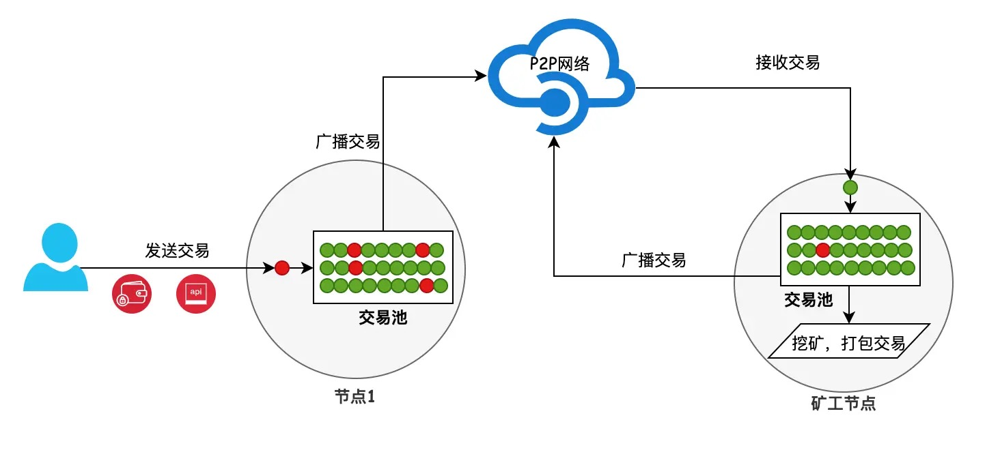
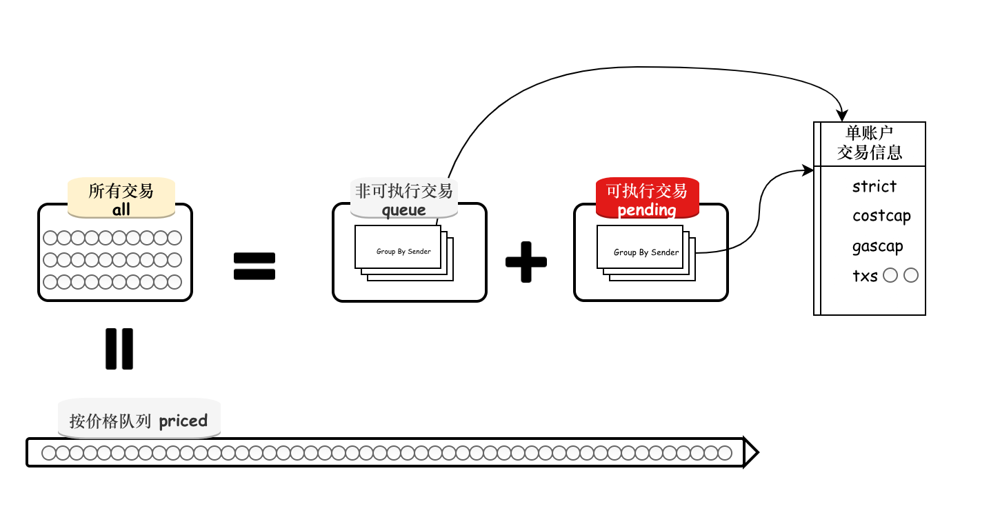

  

首先，用户可通过以太坊钱包或者其他调用以太坊节点API (eth_sendRawTransaction等)发送交易到一个运行中的以太坊 geth 节点。

此时，因为交易时通过节点的API接收，因此此交易被视为一笔来自本地(local)（图中用红球表示），在经过一系列校验和处理后。交易成功进入交易池，随后向已连接的邻近节点发送此交易。

当邻近节点，如矿工节点从邻近节点接收到此交易时，在进入交易池之前。会将交易标记为来自远方（remote）的交易（图中用绿球表示）。也需要经过校验和处理后，进入矿工节点的交易池，等待矿工打包到区块中。

如果邻近节点，不是矿工，也无妨。因为任何节点会默认将接受到得合法交易及时发送给邻近节点。得益于P2P网络，一笔交易平均在6s内扩散到整个以太坊公链网络的各个节点中。

  

参考:   
[以太坊源码分析：交易缓冲池txpool](https://segmentfault.com/a/1190000017333194)    
[以太坊交易池源码解析](https://www.cnblogs.com/1314xf/p/13822394.html)