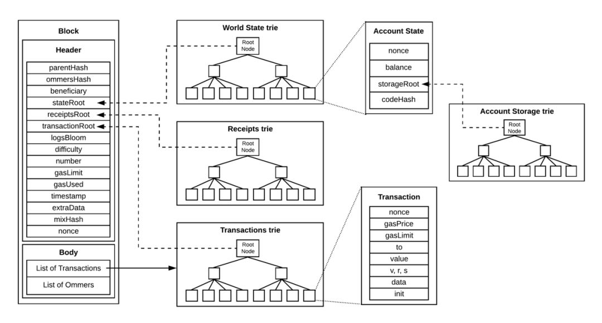
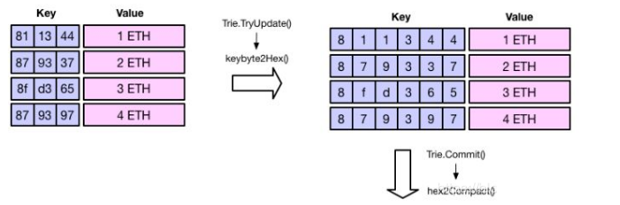
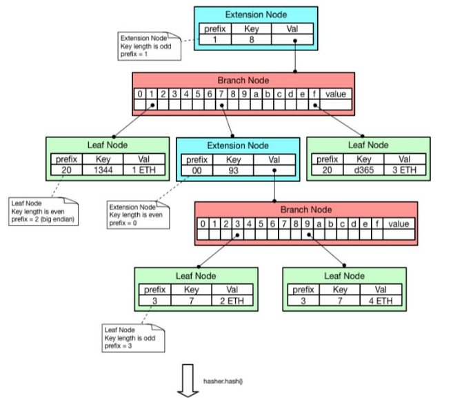
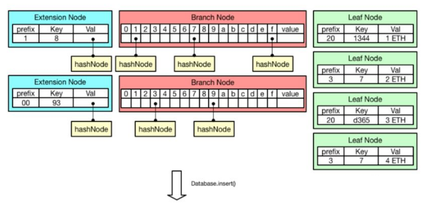
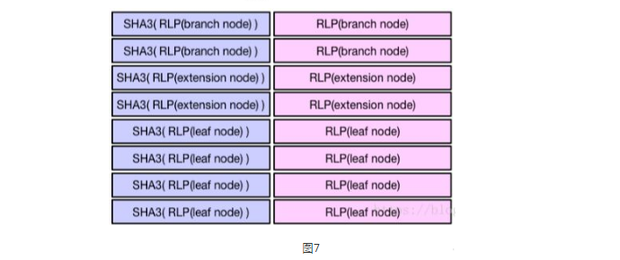
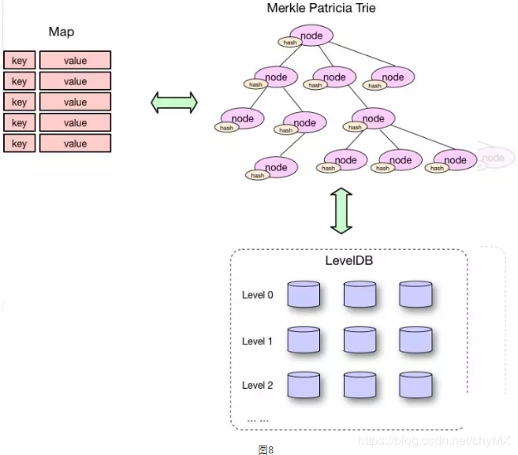
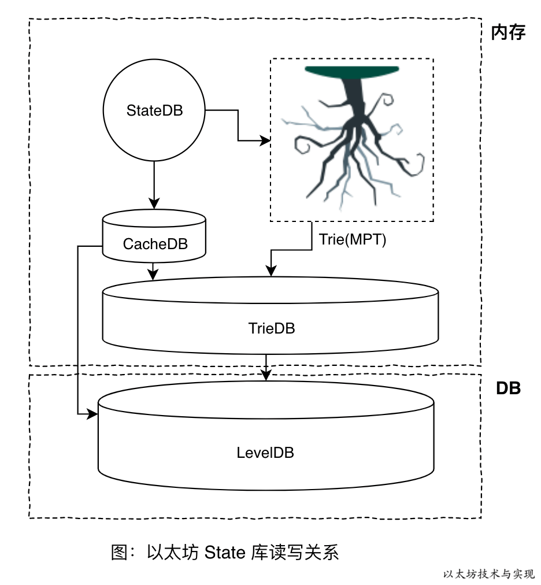
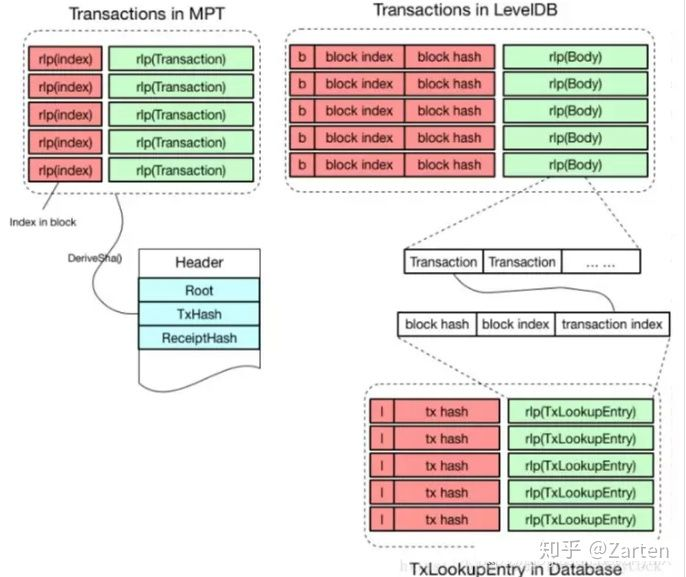

### MPT




这里面有三种节点，扩展节点、分支节点和叶子节点。其中我们最终要存的是[811344:1ETH]、[879337:2ETH]、[8fd365:3ETH]、[879397:4ETH]这4个键值对:

* [叶子节点（leaf）]表示为 [ key,value ] 的一个键值对。key是16进制编码出来的字符串，value是RLP编码的数据；  
* [扩展节点（extension）]也是 [ key，value ] 的一个键值对，但是这里的value是其他节点的hash值，通过hash链接到其他节点；  
* [分支节点（branch）]因为MPT树中的key被编码成一种特殊的16进制的表示，再加上最后的value，所以分支节点是一个长度为17的数组。前16个元素对应着key中的16个可能的十六进制字符，如果某个key在这个节点的共享前缀刚好结束，那么这个键值对的value就存在数组的最后一位。  
* [prefix]
  * 扩展结点，关键字长度为偶数，前面加00前缀
  * 扩展结点，关键字长度为奇数，前面加1前缀（前缀和第1个字节合并为一个字节）
  * 叶子结点，关键字长度为偶数，前面加20前缀（因为是Big Endian）
  * 叶子结点，关键字长度为奇数，前面加3前缀（前缀和第1个字节合并为一个字节）

### MPT节点种类即储存
```
type node interface {
	fstring(string) string
	cache() (hashNode, bool)
}

type (
	fullNode struct { //分支节点
		Children [17]node // Actual trie node data to encode/decode (needs custom encoder)
		flags    nodeFlag
	}
	shortNode struct { //短节点：叶子节点、扩展节点
		Key   []byte
		Val   node
		flags nodeFlag
	}
	hashNode  []byte //哈希节点
	valueNode []byte //数据节点,但他的值就是实际数据hash值
)

// nodeFlag contains caching-related metadata about a node.
type nodeFlag struct {
	hash  hashNode // cached hash of the node (may be nil)
	dirty bool     // whether the node has changes that must be written to the database
}
```
* fullNode: 分支节点，fullNode[16]的类型是 valueNode。前 16 个元素对应键中可能存在的一个十六进制字符。如果键[key,value]在对应的分支处结束，则在列表末尾存储 value 。
* shortNode: 叶子节点或者扩展节点，当 shortNode.Key的末尾字节是终止符 16 时表示为叶子节点。当 shortNode 是叶子节点是，Val 是 valueNode。
* hashNode: 应该取名为 collapsedNode 折叠节点更合适些，但因为其值是一个哈希值当做指针使用，所以取名 hashNode。使用这个哈希值可以从数据库读取节点数据展开节点。
* valueNode: 数据节点，实际的业务数据值，严格来说他不属于树中的节点，它只存在于 fullNode.Children 或者 shortNode.Val 中。
  
`最后存放到leveldb是以[key:value]的形式存放的，即[SHA3(RLP(xxxNode)):RLP(xxxNode)]`






参考:    
[详解以太坊默克尔压缩前缀树-MPT](https://learnblockchain.cn/books/geth/part3/mpt.html)    
[以太坊源码解读（22）merkle-Patricia Tries（MPT）默克前缀树原理](https://blog.csdn.net/lj900911/article/details/84981395?spm=1001.2014.3001.5502)    
[【深度知识】以太坊区块数据结构及以太坊的4棵数](https://learnblockchain.cn/article/472)    
[以太坊 Merkle Patricia Trie 是如何工作的](https://learnblockchain.cn/article/2664)   
[Ethereum以太坊源码分析（三）Trie树源码分析（上）](https://zhuanlan.zhihu.com/p/50242014)