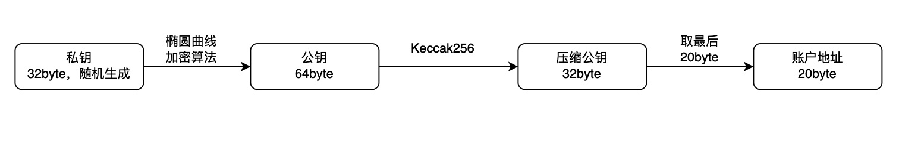
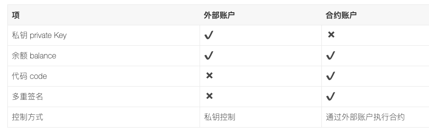

`go-ethereum版本为v1.9.6`   

## 一、外部账户


外部账户创建流程:
* 创建随机私钥(64位16进制字符/32字节): `ecdsa.GenerateKey(crypto.S256(), rand)`
* 从私钥推导出公钥(128位16进制字符/64字节): `privateKeyECDSA.PublicKey`
* 从公钥推导出地址(40位16进制字符/20字节): `Keccak256(pubBytes[1:])[12:]`

当使用`geth account new`命令新建账户，最终调用`accountCreate(accountcmd.go)=>keystore.StoreKey=>storeNewKey(key.go)`
```
func newKeyFromECDSA(privateKeyECDSA *ecdsa.PrivateKey) *Key {
	id, err := uuid.NewRandom()
	if err != nil {
		panic(fmt.Sprintf("Could not create random uuid: %v", err))
	}
	key := &Key{
		Id:         id,
		Address:    crypto.PubkeyToAddress(privateKeyECDSA.PublicKey), // 生成地址 Keccak256(pubBytes[1:])[12:]
		PrivateKey: privateKeyECDSA,
	}
	return key
}
func newKey(rand io.Reader) (*Key, error) {
	privateKeyECDSA, err := ecdsa.GenerateKey(crypto.S256(), rand) // 随机生成私钥
	if err != nil {
		return nil, err
	}
	return newKeyFromECDSA(privateKeyECDSA), nil
}

func storeNewKey(ks keyStore, rand io.Reader, auth string) (*Key, accounts.Account, error) {
	key, err := newKey(rand)
	if err != nil {
		return nil, accounts.Account{}, err
	}
	a := accounts.Account{
		Address: key.Address,
		URL:     accounts.URL{Scheme: KeyStoreScheme, Path: ks.JoinPath(keyFileName(key.Address))},
	}
	if err := ks.StoreKey(a.URL.Path, key, auth); err != nil {
		zeroKey(key.PrivateKey)
		return nil, a, err
	}
	return key, a, err
}
```
storeNewKey完成私钥、公钥、地址的生产，最后保存成keystore文件到指定路径。   

最后保存的keystore文件为json格式，如下:
```
{
	"address": "26ce833a705af6846da8c1a43d1e418b93458137",  //账户地址
	"crypto": {
        //使用的加密算法,这里使用AES-CTR模式加密私钥,分组模式是128比特
		"cipher": "aes-128-ctr",    
        //这是对原始私钥加密后的私钥的密文
		"ciphertext": "e2edc5df564536dcf7fb8bcfde99404215d8dd8327684e9d27327a267181a791",
		"cipherparams": {
            //这是向量
			"iv": "9847020ef0bb269b0c463d2ed4bb2ac4"
		},
		"kdf": "scrypt",
		"kdfparams": {
			"dklen": 32, //解密秘钥的长度
        //进行加密解密运算的次数,在越大的情况下,可以增加暴力破解的成本,也会使签名速度变慢
			"n": 262144, 
        //设置为1为只能串行运算.0为并行运算.串行运算可以增加安全性.也会影响签名速度
			"p": 1,
        //加密的分组长度
			"r": 8,
        //可以理解为随机生成的向量
			"salt": "56fc7ac270cd1a357a2bc1959119f10df4b69fabb4d0c198d6527f3c0fe2df6b"
		},
        //这是解密私钥密文的秘钥的hash值,防止用户输入错误的密码而计算出错误的私钥.用与比对私钥是否正确.
		"mac": "7fde1727799710cf122d441c57c50cbc8182f666cca5a7717a8cb3bb8d21639d"
	},
	"id": "1d6b8676-de36-441d-a736-2a8ee94019ea",
	"version": 3
}
```
以下为用密码可以推出私钥的流程


## 二、内部账户
对交易发起人的地址和nonce进行RLP编码，再算出Keccak哈希值，取后20个字节作为该合约的地址,即:`
Keccak-256(RLP(sender, nonce))[12:]`
函数位于:`crypto/crypto.go`
```
// CreateAddress creates an ethereum address given the bytes and the nonce
func CreateAddress(b common.Address, nonce uint64) common.Address {
	data, _ := rlp.EncodeToBytes([]interface{}{b, nonce})
	return common.BytesToAddress(Keccak256(data)[12:])
}
```


## 三、账户结构
账户在区块链上的存储结构，内外账户的结构都是一样
```
type Account struct {
	Nonce    uint64      // 账户发起交易的次数
	Balance  *big.Int    // 账户的余额
	Root     common.Hash // 合约账户存储空间的一棵MPT树的根节点的Hash
	CodeHash []byte      // 合约代码的Hash值
}
```




参考:   
[以太坊账户管理源码分析](https://blog.csdn.net/TurkeyCock/article/details/80429377)    
[从命令行开始解析以太坊新建账户过程（geth account new命令）](https://blog.csdn.net/jiang_xinxing/article/details/80289694)  
[【Ethereum基础】：账户、地址、私钥和公钥](http://blog.luoyuanhang.com/2018/04/17/eth-basis-accounts-address-pubkey-prikey/)