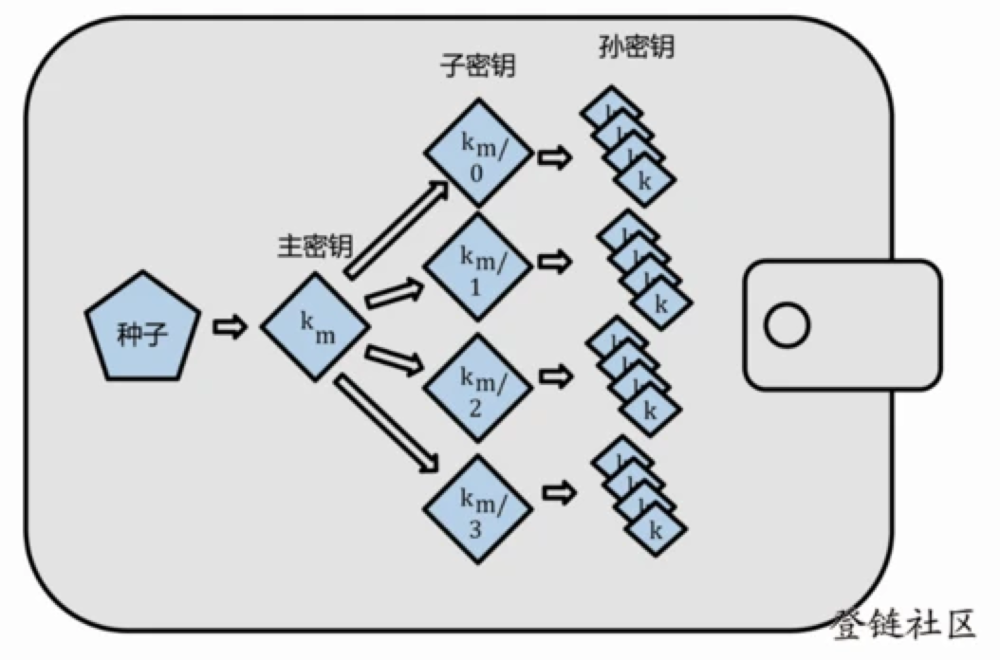
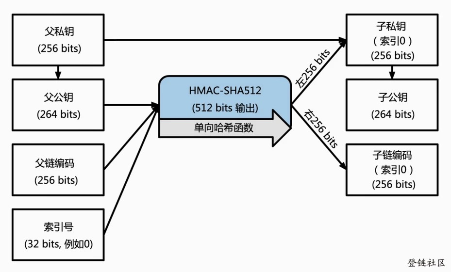
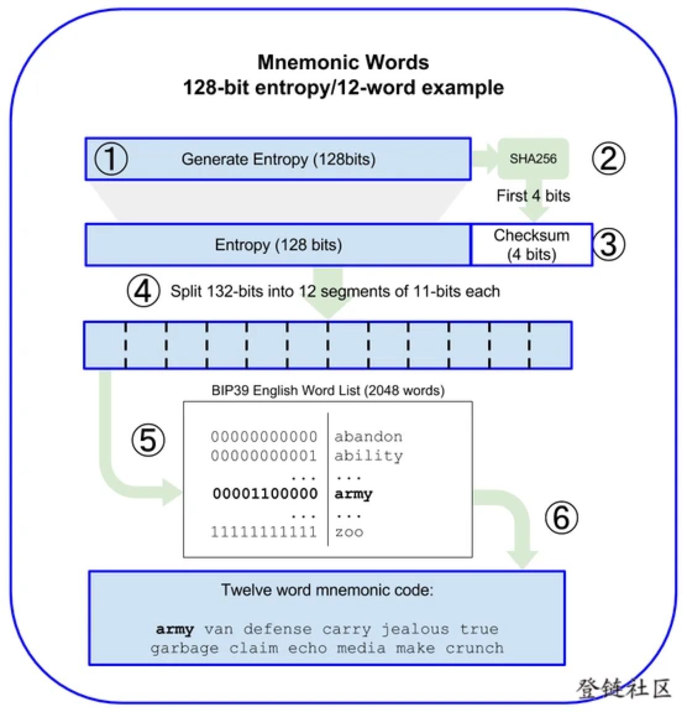

## HD钱包

### BIP32
为了避免管理一堆私钥的麻烦提出的分层推导方案.  
`BIP32 协议中的种子是一个 16 字节的 16 进制的随机数，非常难记。于是比特币开发社区在 BIP39 协议中提出了一个助记词方案`

### BIP39
BIP32 提案可以让我们保存一个随机数种子（通常16进制数表示），而不是一堆秘钥，确实方便一些，不过用户使用起来(比如冷备份)也比较繁琐，这就出现了BIP39，它是使用助记词的方式，生成种子的，这样用户只需要记住12（或24）个单词，单词序列通过 PBKDF2 与 HMAC-SHA512 函数创建出随机种子作为 BIP32 的种子。     
`使用助记词作为种子其实包含2个部分：助记词生成及助记词推导出随机种子，下面分析下这个过程`    
* 生成助记词
助记词生成的过程是这样的：先生成一个128位随机数，再加上对随机数做的校验4位，得到132位的一个数，然后按每11位做切分，这样就有了12个二进制数，然后用每个数去查BIP39定义的单词表，这样就得到12个助记词，这个过程图示如下：    

* 助记词推导出种子
这个过程使用密钥拉伸（Key stretching）函数，被用来增强弱密钥的安全性，PBKDF2是常用的密钥拉伸算法中的一种。   
PBKDF2基本原理是通过一个为随机函数(例如 HMAC 函数)，把助记词明文和盐值作为输入参数，然后重复进行运算最终产生生成一个更长的（512 位）密钥种子。这个种子再构建一个确定性钱包并派生出它的密钥。   
密钥拉伸函数需要两个参数：助记词和盐。盐可以提高暴力破解的难度。 盐由常量字符串 "mnemonic" 及一个可选的密码组成，注意使用不同密码，则拉伸函数在使用同一个助记词的情况下会产生一个不同的种子，这个过程图示图下:

### BIP44
从协议的数字上来看，不难知道，这又是一个升级版了，BIP44 基于 BIP32 协议，对 HD 钱包的树状结构中的每一层给予了特殊的意义（5层）。能让同一个种子支援多币种、多帐户等。

各层定义如下：m / purpose’ / coin_type’ / account’ / change / address_index第二层的“coin_type”，就是指的不同币种，多链HD钱包可以在这个层级分出不同体系的数字货币钱包。比方说比特币钱包、以太坊钱包…..

到这里，就完全解决了文中最开始的问题了：为什么我可以只使用一个私钥/助记词去控制多条链上的资产？

因为使用了 BIP44 协议的 HD 钱包，可以分出不同体系币种的私钥。意味着，一个主私钥可以生成一个比特币钱包私钥，可以生成一个以太坊钱包的私钥…..而且因为同用一个主私钥和助记词，非常方便用户备份。

### 多重签名钱包

参考:   
[使用 ethers.js 开发以太坊 Web 钱包 1 - 创建钱包账号](https://learnblockchain.cn/2018/10/25/eth-web-wallet_1/)      
[理解开发HD 钱包涉及的 BIP32、BIP44、BIP39](https://learnblockchain.cn/2018/09/28/hdwallet/)      
[分层确定性钱包 HD Wallet 剖析：设计和实现](https://www.arcblock.io/blog/zh/post/2018/12/01/hd-wallets-design-and-implementation)