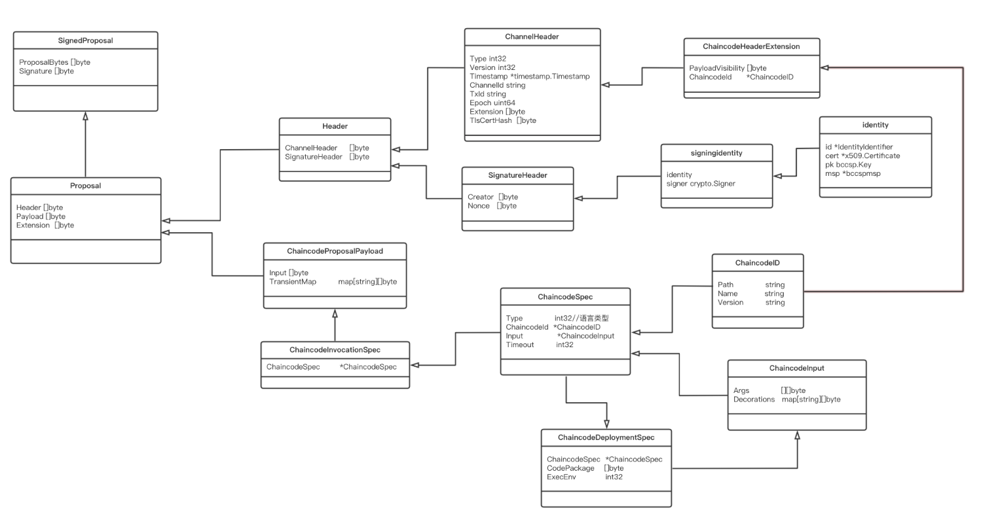

`environment:`      
`fabric v1.4.2`


## 1.概述       
在Fabric中交易的处理过程，客户端将提案首先发送到背书节点，背书节点检提案的合法性。如果合法的话，背书节点将通过交易所属的链码临时执行一个交易，并执行背书节点在本地持有的状态副本。  
Chaincode应该仅仅被安装于chaincode所有者的背书节点上，链码运行在节点上的沙盒（Docker容器）中，并通过gRPC协议与相应的Peer节点进行交互，以使该chaincode逻辑对整个网络的其他成员保密。     
请务必在一条channel上每一个要运行你chaincode的背书节点上安装你的chaincode       
其他没有chaincode的成员将无权成为chaincode影响下的交易的认证节点（endorser）。也就是说，他们不能执行chaincode。不过，他们仍可以验证交易并提交到账本上。     
ChainCode要在区块链网络中运行，需要经过链码安装和链码实例化两个步骤。


链码的安装涉及到3个服务，分别是client，peer背书节点和LSCC容器
主要流程:
* 客户端构造提案信息并发送给背书节点
* 背书节点检提案的合法性
* 背书节点调用lscc容器
* lscc容器进行链码安装
* 提案背书返回

以下是在客户端执行`peer chaincode install ...`的业务流程图:


## 2. 客户端构造提案信息并发送给背书节点
客户端执行链码安装命令:
```bash
#-n 指定mycc是由用户定义的链码名字，-v 指定1.0是链码的版本，-p 是指定链码的路径
peer chaincode install -p chaincodedev/chaincode/sacc -n mycc -v 1.0
```
客户端的整个流程切入点为`fabric/peer/main.go`的`main`函数
```go
...
mainCmd.AddCommand(chaincode.Cmd(nil))  // chaincode命令入口
...
```
然后继续找到`peer/chaincode/chaincode.go`
```go
// Cmd returns the cobra command for Chaincode
func Cmd(cf *ChaincodeCmdFactory) *cobra.Command {
	addFlags(chaincodeCmd)

	chaincodeCmd.AddCommand(installCmd(cf))			// 执行链码的安装
	chaincodeCmd.AddCommand(instantiateCmd(cf))		// 链码的实例化
	chaincodeCmd.AddCommand(invokeCmd(cf))			// 链码的调用，具体调用什么方法要看链码是怎么写的
	chaincodeCmd.AddCommand(packageCmd(cf, nil))	// 链码的打包
	chaincodeCmd.AddCommand(queryCmd(cf))			// 对链码数据进行查询，这个只是向指定的Peer节点请求查询数据，不会生成交易最后打包区块的 
	chaincodeCmd.AddCommand(signpackageCmd(cf))		// 对已打包的链码进行签名操作
	chaincodeCmd.AddCommand(upgradeCmd(cf))			// 更新链码，之前提到过 -v是指定链码的版本，如果需要对链码进行更新的话，使用这条命令，比较常用
	chaincodeCmd.AddCommand(listCmd(cf))			// 如果已指定通道的话，则查询已实例化的链码，否则查询当前Peer节点已安装的链码

	return chaincodeCmd
}
```
继续找到`peer/chaincode/install.go`的 `installCmd`函数，可以看出`chaincodeInstall`为主要的入口函数
```go
// installCmd returns the cobra command for Chaincode Deploy
func installCmd(cf *ChaincodeCmdFactory) *cobra.Command {
	chaincodeInstallCmd = &cobra.Command{
		Use:       "install",
		Short:     fmt.Sprint(installDesc),
		Long:      fmt.Sprint(installDesc),
		ValidArgs: []string{"1"},
		RunE: func(cmd *cobra.Command, args []string) error {
			var ccpackfile string
			if len(args) > 0 {
				ccpackfile = args[0]
			}
			// 入口函数
			return chaincodeInstall(cmd, ccpackfile, cf)
		},
	}
	flagList := []string{ // 在安装链码的命令中指定的相关参数
		"lang",
		"ctor",
		"path",
		"name",
		"version",
		"peerAddresses",
		"tlsRootCertFiles",
		"connectionProfile",
	}
	attachFlags(chaincodeInstallCmd, flagList)

	return chaincodeInstallCmd
}
```

```go
// chaincodeInstall installs the chaincode. If remoteinstall, does it via a lscc call
func chaincodeInstall(cmd *cobra.Command, ccpackfile string, cf *ChaincodeCmdFactory) error {
	// Parsing of the command line is done so silence cmd usage
	cmd.SilenceUsage = true

	var err error
	if cf == nil {
		// 如果ChaincodeCmdFactory为空，则初始化一个
		cf, err = InitCmdFactory(cmd.Name(), true, false)
		if err != nil {
			return err
		}
	}

	var ccpackmsg proto.Message
	// 这个地方有两种情况，链码可能是根据传入参数从本地链码源代码文件读取，也有可能是由其他节点签名打包完成发送过来的
	if ccpackfile == "" {
		// 这里是从本地链码源代码文件读取,一般从这里进去
		if chaincodePath == common.UndefinedParamValue || chaincodeVersion == common.UndefinedParamValue || chaincodeName == common.UndefinedParamValue {
			return fmt.Errorf("Must supply value for %s name, path and version parameters.", chainFuncName)
		}
		//generate a raw ChaincodeDeploymentSpec
		// 生成ChaincodeDeploymentSpce
		ccpackmsg, err = genChaincodeDeploymentSpec(cmd, chaincodeName, chaincodeVersion)
		if err != nil {
			return err
		}
	} else {
		//read in a package generated by the "package" sub-command (and perhaps signed
		//by multiple owners with the "signpackage" sub-command)
		// 首先从ccpackfile中获取数据，主要就是从文件中读取已定义的ChaincodeDeploymentSpec
		var cds *pb.ChaincodeDeploymentSpec
		ccpackmsg, cds, err = getPackageFromFile(ccpackfile)

		if err != nil {
			return err
		}

		//get the chaincode details from cds
		// 由于ccpackfile中已经定义完成了以上的数据结构，所以这里就直接获取了
		cName := cds.ChaincodeSpec.ChaincodeId.Name
		cVersion := cds.ChaincodeSpec.ChaincodeId.Version

		//if user provided chaincodeName, use it for validation
		if chaincodeName != "" && chaincodeName != cName {
			return fmt.Errorf("chaincode name %s does not match name %s in package", chaincodeName, cName)
		}

		//if user provided chaincodeVersion, use it for validation
		if chaincodeVersion != "" && chaincodeVersion != cVersion {
			return fmt.Errorf("chaincode version %s does not match version %s in packages", chaincodeVersion, cVersion)
		}
	}
	// 链码安装
	err = install(ccpackmsg, cf)

	return err
}
```
### 2.1 构造ChaincodeCmdFactory结构体
我们进去看看`InitCmdFactory`做了什么，位置在`peer/chaincode/common.go`
```go
// InitCmdFactory init the ChaincodeCmdFactory with default clients
func InitCmdFactory(cmdName string, isEndorserRequired, isOrdererRequired bool) (*ChaincodeCmdFactory, error) {
	var err error
	var endorserClients []pb.EndorserClient
	var deliverClients []api.PeerDeliverClient
	if isEndorserRequired {
		if err = validatePeerConnectionParameters(cmdName); err != nil {
			return nil, errors.WithMessage(err, "error validating peer connection parameters")
		}
		for i, address := range peerAddresses {
			var tlsRootCertFile string
			if tlsRootCertFiles != nil {
				tlsRootCertFile = tlsRootCertFiles[i]
			}
			endorserClient, err := common.GetEndorserClientFnc(address, tlsRootCertFile)
			if err != nil {
				return nil, errors.WithMessage(err, fmt.Sprintf("error getting endorser client for %s", cmdName))
			}
			endorserClients = append(endorserClients, endorserClient)
			deliverClient, err := common.GetPeerDeliverClientFnc(address, tlsRootCertFile)
			if err != nil {
				return nil, errors.WithMessage(err, fmt.Sprintf("error getting deliver client for %s", cmdName))
			}
			deliverClients = append(deliverClients, deliverClient)
		}
		if len(endorserClients) == 0 {
			return nil, errors.New("no endorser clients retrieved - this might indicate a bug")
		}
	}
	certificate, err := common.GetCertificateFnc()
	if err != nil {
		return nil, errors.WithMessage(err, "error getting client cerificate")
	}

	signer, err := common.GetDefaultSignerFnc()
	if err != nil {
		return nil, errors.WithMessage(err, "error getting default signer")
	}

	var broadcastClient common.BroadcastClient
	if isOrdererRequired {
		if len(common.OrderingEndpoint) == 0 {
			if len(endorserClients) == 0 {
				return nil, errors.New("orderer is required, but no ordering endpoint or endorser client supplied")
			}
			endorserClient := endorserClients[0]

			orderingEndpoints, err := common.GetOrdererEndpointOfChainFnc(channelID, signer, endorserClient)
			if err != nil {
				return nil, errors.WithMessage(err, fmt.Sprintf("error getting channel (%s) orderer endpoint", channelID))
			}
			if len(orderingEndpoints) == 0 {
				return nil, errors.Errorf("no orderer endpoints retrieved for channel %s", channelID)
			}
			logger.Infof("Retrieved channel (%s) orderer endpoint: %s", channelID, orderingEndpoints[0])
			// override viper env
			viper.Set("orderer.address", orderingEndpoints[0])
		}

		broadcastClient, err = common.GetBroadcastClientFnc()

		if err != nil {
			return nil, errors.WithMessage(err, "error getting broadcast client")
		}
	}
	return &ChaincodeCmdFactory{
		EndorserClients: endorserClients,
		DeliverClients:  deliverClients,
		Signer:          signer,
		BroadcastClient: broadcastClient,
		Certificate:     certificate,
	}, nil
}
```
返回了`ChaincodeCmdFactory`的结构体，定义为:
```go
// ChaincodeCmdFactory holds the clients used by ChaincodeCmd
type ChaincodeCmdFactory struct {
	EndorserClients []pb.EndorserClient			// 用于向背书节点发送消息
	DeliverClients  []api.PeerDeliverClient 	// 用于与Order节点通信
	Certificate     tls.Certificate				// TLS证书相关
	Signer          msp.SigningIdentity			// 用于消息的签名
	BroadcastClient common.BroadcastClient		// 用于广播消息
}
```

### 2.2 构造链码部署标准数据结构ChaincodeDeploymentSpec
找到定义`genChaincodeDeploymentSpec`

```go
//genChaincodeDeploymentSpec creates ChaincodeDeploymentSpec as the package to install
func genChaincodeDeploymentSpec(cmd *cobra.Command, chaincodeName, chaincodeVersion string) (*pb.ChaincodeDeploymentSpec, error) {
	// 首先根据链码名称与链码版本查找当前链码是否已经安装过，如果安装过则返回链码已存在的错误
	if existed, _ := ccprovider.ChaincodePackageExists(chaincodeName, chaincodeVersion); existed {
		return nil, fmt.Errorf("chaincode %s:%s already exists", chaincodeName, chaincodeVersion)
	}
	// 获取链码标准数据结构
	spec, err := getChaincodeSpec(cmd)
	if err != nil {
		return nil, err
	}
	// 获取链码部署标准数据结构
	cds, err := getChaincodeDeploymentSpec(spec, true)
	if err != nil {
		return nil, fmt.Errorf("error getting chaincode code %s: %s", chaincodeName, err)
	}

	return cds, nil
}
```
先看`getChaincodeSpec`,位于`peer/chaincode/common.go`
```go
// getChaincodeSpec get chaincode spec from the cli cmd pramameters
func getChaincodeSpec(cmd *cobra.Command) (*pb.ChaincodeSpec, error) {
	spec := &pb.ChaincodeSpec{}
	// 检查由用户输入的命令中的参数信息，比如格式，是否有没有定义过的参数等等
	if err := checkChaincodeCmdParams(cmd); err != nil {
		// unset usage silence because it's a command line usage error
		cmd.SilenceUsage = false
		return spec, err
	}

	// Build the spec
	// 定义一个链码输入参数结构
	input := &pb.ChaincodeInput{}
	if err := json.Unmarshal([]byte(chaincodeCtorJSON), &input); err != nil {
		return spec, errors.Wrap(err, "chaincode argument error")
	}

	chaincodeLang = strings.ToUpper(chaincodeLang)
	// 最后封装为ChaincodeSpec结构体返回 
	spec = &pb.ChaincodeSpec{
		Type:        pb.ChaincodeSpec_Type(pb.ChaincodeSpec_Type_value[chaincodeLang]),
		ChaincodeId: &pb.ChaincodeID{Path: chaincodePath, Name: chaincodeName, Version: chaincodeVersion},
		Input:       input,
	}
	return spec, nil
}
```
封装返回`ChaincodeSpec`结构体
```go
// Carries the chaincode specification. This is the actual metadata required for
// defining a chaincode.
type ChaincodeSpec struct {
	Type                 ChaincodeSpec_Type // 链码的编写语言，GOLANG、JAVA
	ChaincodeId          *ChaincodeID       // ChaincodeId，链码路径、链码名称、链码版本
	Input                *ChaincodeInput    // 链码的具体执行参数信息
	Timeout              int32              
}
```

刚才生成的`ChaincodeSpec`作为`getChaincodeDeploymentSpec`函数的输入参数，返回`ChaincodeDeploymentSpec`结构体
```go
// getChaincodeDeploymentSpec get chaincode deployment spec given the chaincode spec
func getChaincodeDeploymentSpec(spec *pb.ChaincodeSpec, crtPkg bool) (*pb.ChaincodeDeploymentSpec, error) {
	var codePackageBytes []byte
	// 首先判断是否当前Fabric网络处于开发模式，如果不是的话进入这里
	if chaincode.IsDevMode() == false && crtPkg {
		var err error
		// 然后对之前创建的链码标准数据结构进行验证，验证是否为空，链码类型路径等信息
		if err = checkSpec(spec); err != nil {
			return nil, err
		}
		// #获取链码信息的有效载荷
		codePackageBytes, err = container.GetChaincodePackageBytes(platformRegistry, spec)
		if err != nil {
			err = errors.WithMessage(err, "error getting chaincode package bytes")
			return nil, err
		}
	}
	// 最后封装为ChaincodeDeploymentSpec，这里如果Fabric网络处于开发模式下，codePackageBytes为空
	chaincodeDeploymentSpec := &pb.ChaincodeDeploymentSpec{ChaincodeSpec: spec, CodePackage: codePackageBytes}
	return chaincodeDeploymentSpec, nil
}
```

```go
// Specify the deployment of a chaincode.
// TODO: Define `codePackage`.
type ChaincodeDeploymentSpec struct {
	ChaincodeSpec        *ChaincodeSpec     // ChaincodeSpec消息
	CodePackage          []byte             // 链码文件打包
	ExecEnv              ChaincodeDeploymentSpec_ExecutionEnvironment  // 链码执行环境，DOCKER或SYSTEM
}
```

### 2.3 创建提案结构、签名和发送提案

```go
//install the depspec to "peer.address"
func install(msg proto.Message, cf *ChaincodeCmdFactory) error {
	// 首先获取一个用于发起提案与签名的creator
	creator, err := cf.Signer.Serialize()
	if err != nil {
		return fmt.Errorf("Error serializing identity for %s: %s", cf.Signer.GetIdentifier(), err)
	}
	// 从ChaincodeDeploymentSpec中创建一个用于安装链码的Proposal
	prop, _, err := utils.CreateInstallProposalFromCDS(msg, creator)
	if err != nil {
		return fmt.Errorf("Error creating proposal  %s: %s", chainFuncName, err)
	}

	var signedProp *pb.SignedProposal
	// 对创建的Proposal进行签名
	signedProp, err = utils.GetSignedProposal(prop, cf.Signer)
	if err != nil {
		return fmt.Errorf("Error creating signed proposal  %s: %s", chainFuncName, err)
	}

	// install is currently only supported for one peer
	// 这里安装链码只在指定的Peer节点，而不是所有Peer节点，依旧是调用了主要的方法ProcessProposal
	proposalResponse, err := cf.EndorserClients[0].ProcessProposal(context.Background(), signedProp)
	// 到这里，Peer节点对提案处理完成之后，整个链码安装的过程就结束了
	if err != nil {
		return fmt.Errorf("Error endorsing %s: %s", chainFuncName, err)
	}

	if proposalResponse != nil {
		if proposalResponse.Response.Status != int32(pcommon.Status_SUCCESS) {
			return errors.Errorf("Bad response: %d - %s", proposalResponse.Response.Status, proposalResponse.Response.Message)
		}
		logger.Infof("Installed remotely %v", proposalResponse)
	} else {
		return errors.New("Error during install: received nil proposal response")
	}

	return nil
}
```
#### 2.3.1 创建提案结构
`CreateInstallProposalFromCDS`位于`protos/utils/proutils.go`        
```go
// CreateInstallProposalFromCDS returns a install proposal given a serialized
// identity and a ChaincodeDeploymentSpec
func CreateInstallProposalFromCDS(ccpack proto.Message, creator []byte) (*peer.Proposal, string, error) {
	return createProposalFromCDS("", ccpack, creator, "install")
}
```
调用`createProposalFromCDS`
```go
// createProposalFromCDS returns a deploy or upgrade proposal given a
// serialized identity and a ChaincodeDeploymentSpec
// 传入的参数说明一下：chainID为空，msg，creator由之前的方法传入，propType为install，args为空
func createProposalFromCDS(chainID string, msg proto.Message, creator []byte, propType string, args ...[]byte) (*peer.Proposal, string, error) {
	// in the new mode, cds will be nil, "deploy" and "upgrade" are instantiates.
	var ccinp *peer.ChaincodeInput
	var b []byte
	var err error
	if msg != nil {
		b, err = proto.Marshal(msg)
		if err != nil {
			return nil, "", err
		}
	}
	switch propType {
	// 这里就判断propTypre类型，如果是deploy,或者是upgrade需要链码已经实例化完成
	case "deploy":
		fallthrough
		// 如果是deploy不跳出代码块，继续执行upgrade中的代码
	case "upgrade":
		cds, ok := msg.(*peer.ChaincodeDeploymentSpec)
		if !ok || cds == nil {
			return nil, "", errors.New("invalid message for creating lifecycle chaincode proposal")
		}
		Args := [][]byte{[]byte(propType), []byte(chainID), b}
		Args = append(Args, args...)
		// 与安装链码相同，都需要定义一个ChaincodeInput结构体，该结构体保存链码的基本信息
		ccinp = &peer.ChaincodeInput{Args: Args}
	case "install":
		ccinp = &peer.ChaincodeInput{Args: [][]byte{[]byte(propType), b}}
	}

	// wrap the deployment in an invocation spec to lscc...
	// 安装链码需要使用到生命周期系统链码，所以这里定义了一个lsccSpce，注意这里的ChaincodeInvocationSpec在下面使用到
	lsccSpec := &peer.ChaincodeInvocationSpec{
		ChaincodeSpec: &peer.ChaincodeSpec{
			Type:        peer.ChaincodeSpec_GOLANG,
			ChaincodeId: &peer.ChaincodeID{Name: "lscc"},
			Input:       ccinp,
		},
	}

	// ...and get the proposal for it
	// 根据ChaincodeInvocationSpec创建Proposal
	return CreateProposalFromCIS(common.HeaderType_ENDORSER_TRANSACTION, chainID, lsccSpec, creator)
}
```
从结构体`ChaincodeInvocationSpec`可以看到用户链码安装需要调用到系统链码`lscc`   
通过`CreateProposalFromCIS=>CreateChaincodeProposal=>CreateChaincodeProposalWithTransient`

```go
// CreateChaincodeProposalWithTransient creates a proposal from given input
// It returns the proposal and the transaction id associated to the proposal
func CreateChaincodeProposalWithTransient(typ common.HeaderType, chainID string, cis *peer.ChaincodeInvocationSpec, creator []byte, transientMap map[string][]byte) (*peer.Proposal, string, error) {
	// generate a random nonce
	// 生成一个随机数
	nonce, err := crypto.GetRandomNonce()
	if err != nil {
		return nil, "", err
	}

	// compute txid
	// 计算出一个TxID，具体是根据HASH算法生成的
	txid, err := ComputeTxID(nonce, creator)
	if err != nil {
		return nil, "", err
	}
	// 用了这个方法,将之前生成的数据传入进去
	return CreateChaincodeProposalWithTxIDNonceAndTransient(txid, typ, chainID, cis, nonce, creator, transientMap)
}
```
再看`CreateChaincodeProposalWithTxIDNonceAndTransient`函数
```go
/ CreateChaincodeProposalWithTxIDNonceAndTransient creates a proposal from
// given input
func CreateChaincodeProposalWithTxIDNonceAndTransient(txid string, typ common.HeaderType, chainID string, cis *peer.ChaincodeInvocationSpec, nonce, creator []byte, transientMap map[string][]byte) (*peer.Proposal, string, error) {
	// 首先是构造一个ChaincodeHeaderExtension结构体
	ccHdrExt := &peer.ChaincodeHeaderExtension{ChaincodeId: cis.ChaincodeSpec.ChaincodeId}
	// 将该结构体序列化
	ccHdrExtBytes, err := proto.Marshal(ccHdrExt)
	if err != nil {
		return nil, "", errors.Wrap(err, "error marshaling ChaincodeHeaderExtension")
	}
	// 将ChaincodeInvocationSpec结构体序列化
	cisBytes, err := proto.Marshal(cis)
	if err != nil {
		return nil, "", errors.Wrap(err, "error marshaling ChaincodeInvocationSpec")
	}
	// ChaincodeProposalPayload结构体
	ccPropPayload := &peer.ChaincodeProposalPayload{Input: cisBytes, TransientMap: transientMap}
	// 序列化
	ccPropPayloadBytes, err := proto.Marshal(ccPropPayload)
	if err != nil {
		return nil, "", errors.Wrap(err, "error marshaling ChaincodeProposalPayload")
	}

	// TODO: epoch is now set to zero. This must be changed once we
	// get a more appropriate mechanism to handle it in.
	var epoch uint64
	// 创建一个时间戳
	timestamp := util.CreateUtcTimestamp()
	// 构造Header结构体，包含两部分ChannelHeader和SignatureHeader
	hdr := &common.Header{
		ChannelHeader: MarshalOrPanic(
			&common.ChannelHeader{
				Type:      int32(typ),
				TxId:      txid,
				Timestamp: timestamp,
				ChannelId: chainID,
				Extension: ccHdrExtBytes,
				Epoch:     epoch,
			},
		),
		SignatureHeader: MarshalOrPanic(
			&common.SignatureHeader{
				Nonce:   nonce,
				Creator: creator,
			},
		),
	}
	// 序列化
	hdrBytes, err := proto.Marshal(hdr)
	if err != nil {
		return nil, "", err
	}
	// 最后构造成一个Proposal
	prop := &peer.Proposal{
		Header:  hdrBytes,
		Payload: ccPropPayloadBytes,
	}
	return prop, txid, nil
}
```
最后返回`Proposal`结构体，定义见`protos\peer\proposal.pb.go`
```go
type Proposal struct {
	// The header of the proposal. It is the bytes of the Header
	Header []byte `protobuf:"bytes,1,opt,name=header,proto3" json:"header,omitempty"`
	// The payload of the proposal as defined by the type in the proposal
	// header.
	Payload []byte `protobuf:"bytes,2,opt,name=payload,proto3" json:"payload,omitempty"`
	// Optional extensions to the proposal. Its content depends on the Header's
	// type field.  For the type CHAINCODE, it might be the bytes of a
	// ChaincodeAction message.
	Extension            []byte   `protobuf:"bytes,3,opt,name=extension,proto3" json:"extension,omitempty"`
	XXX_NoUnkeyedLiteral struct{} `json:"-"`
	XXX_unrecognized     []byte   `json:"-"`
	XXX_sizecache        int32    `json:"-"`
}
```
到这里`install`调用的`CreateInstallProposalFromCDS`完毕，返回`Proposal`结构体       
关系有点复杂，给出一个类图能看得清晰点  



#### 2.3.2 签名
回到`install`，看`GetSignedProposal`对刚创建的提案结构进行签名      
函数位于`protos/utils/txutils.go`
```go
// GetSignedProposal returns a signed proposal given a Proposal message and a
// signing identity
func GetSignedProposal(prop *peer.Proposal, signer msp.SigningIdentity) (*peer.SignedProposal, error) {
	// check for nil argument
	if prop == nil || signer == nil {
		return nil, errors.New("nil arguments")
	}
	// 获取提案信息的字节数组
	propBytes, err := GetBytesProposal(prop)
	if err != nil {
		return nil, err
	}
	// 对字节数组进行签名
	signature, err := signer.Sign(propBytes)
	if err != nil {
		return nil, err
	}
	// 返回SignedProposal结构体
	return &peer.SignedProposal{ProposalBytes: propBytes, Signature: signature}, nil
}
```
返回`SignedProposal`结构体,定义位于`protos/peer/proposal.pb.go`

```go
type SignedProposal struct {
	// The bytes of Proposal
	ProposalBytes []byte `protobuf:"bytes,1,opt,name=proposal_bytes,json=proposalBytes,proto3" json:"proposal_bytes,omitempty"`
	// Signaure over proposalBytes; this signature is to be verified against
	// the creator identity contained in the header of the Proposal message
	// marshaled as proposalBytes
	Signature            []byte   `protobuf:"bytes,2,opt,name=signature,proto3" json:"signature,omitempty"`
	XXX_NoUnkeyedLiteral struct{} `json:"-"`
	XXX_unrecognized     []byte   `json:"-"`
	XXX_sizecache        int32    `json:"-"`
}
```
#### 2.3.3 发送提案
提案签名完后`install`调用`ProcessProposal`发送提案到peer节点进行处理，参数带了`SignedProposal`结构体    
接下来client端就等到peer的`proposalResponse`


## 3. 背书节点检提案的合法性
当client调用了`ProposalResponse`消息就发送到peer背书节点,也就是走peer节点背书提案流程.      
要看安装链码前做了什么，直接看[peer节点背书提案流程](https://github.com/jxu86/technique-architect/blob/master/blockchain/fabric/fabric源码分析之(三)peer节点背书提案流程.md)就好。


## 4. 背书节点调用lscc容器
我们从`core/endorser/endorser.go`的`callChaincode=>Execute`函数开始讲
```go
// call specified chaincode (system or user)
func (e *Endorser) callChaincode(txParams *ccprovider.TransactionParams, version string, input *pb.ChaincodeInput, cid *pb.ChaincodeID) (*pb.Response, *pb.ChaincodeEvent, error) {
    ... ...
	// is this a system chaincode
	// 执行链码，如果是用户链码具体怎么执行的要看用户写的链码逻辑，执行完毕后返回响应信息与链码事件
	res, ccevent, err = e.s.Execute(txParams, txParams.ChannelID, cid.Name, version, txParams.TxID, txParams.SignedProp, txParams.Proposal, input)
	if err != nil {
		return nil, nil, err
    }
    ... ...
```
在`core/chaincode/chaincode_support.go`找到`Execute`
```go
// Execute invokes chaincode and returns the original response.
func (cs *ChaincodeSupport) Execute(txParams *ccprovider.TransactionParams, cccid *ccprovider.CCContext, input *pb.ChaincodeInput) (*pb.Response, *pb.ChaincodeEvent, error) {
	// 主要是启动链码容器，调用链码
	resp, err := cs.Invoke(txParams, cccid, input)
	// 对链码执行结果进行处理
	return processChaincodeExecutionResult(txParams.TxID, cccid.Name, resp, err)
}
```

主要看`Invoke`:
```go
// Invoke will invoke chaincode and return the message containing the response.
// The chaincode will be launched if it is not already running.
func (cs *ChaincodeSupport) Invoke(txParams *ccprovider.TransactionParams, cccid *ccprovider.CCContext, input *pb.ChaincodeInput) (*pb.ChaincodeMessage, error) {
	// 启动链码容器
	h, err := cs.Launch(txParams.ChannelID, cccid.Name, cccid.Version, txParams.TXSimulator)
	if err != nil {
		return nil, err
	}

	// TODO add Init exactly once semantics here once new lifecycle
	// is available.  Enforced if the target channel is using the new lifecycle
	//
	// First, the function name of the chaincode to invoke should be checked.  If it is
	// "init", then consider this invocation to be of type pb.ChaincodeMessage_INIT,
	// otherwise consider it to be of type pb.ChaincodeMessage_TRANSACTION,
	//
	// Secondly, A check should be made whether the chaincode has been
	// inited, then, if true, only allow cctyp pb.ChaincodeMessage_TRANSACTION,
	// otherwise, only allow cctype pb.ChaincodeMessage_INIT,
	cctype := pb.ChaincodeMessage_TRANSACTION
	// 给链码发送消息
	return cs.execute(cctype, txParams, cccid, input, h)
}
```


```go
// Launch starts executing chaincode if it is not already running. This method
// blocks until the peer side handler gets into ready state or encounters a fatal
// error. If the chaincode is already running, it simply returns.
func (cs *ChaincodeSupport) Launch(chainID, chaincodeName, chaincodeVersion string, qe ledger.QueryExecutor) (*Handler, error) {
    cname := chaincodeName + ":" + chaincodeVersion
    // 如果是系统链码，在peer启动的时候已经初始化了，所以如果是链码安装在下面语句直接返回了
	if h := cs.HandlerRegistry.Handler(cname); h != nil {
		return h, nil
	}

	// 此处到得容器相关的信息，包括生产容器的具体类型是系统链码容器还是用户链码容器
	// 在后面会说明，系统链码启动的容器是：inprocVM---inproContainer,用户链码启动的容器是DockerVM---DockerContainer
	ccci, err := cs.Lifecycle.ChaincodeContainerInfo(chaincodeName, qe)
	if err != nil {
		// TODO: There has to be a better way to do this...
		if cs.UserRunsCC {
			chaincodeLogger.Error(
				"You are attempting to perform an action other than Deploy on Chaincode that is not ready and you are in developer mode. Did you forget to Deploy your chaincode?",
			)
		}

		return nil, errors.Wrapf(err, "[channel %s] failed to get chaincode container info for %s", chainID, cname)
	}

	// 启动Runtime中的Launch
	if err := cs.Launcher.Launch(ccci); err != nil {
		return nil, errors.Wrapf(err, "[channel %s] could not launch chaincode %s", chainID, cname)
	}

	h := cs.HandlerRegistry.Handler(cname)
	if h == nil {
		return nil, errors.Wrapf(err, "[channel %s] claimed to start chaincode container for %s but could not find handler", chainID, cname)
	}

	return h, nil
}
```
根据之前的信息，我们调用的是`lscc`来安装链码，所以在peer启动的时候已经初始化`lscc`链码容器了，所以回直接返回`handler`对象，后面的语句就不说了，在启动链码容器的章节再详细研究。     

接着我们看`execute`函数，调用`createCCMessage`创建一个`ChaincodeMessage结构体消息`.`Execute`负责把消息发送出去
```go
// execute executes a transaction and waits for it to complete until a timeout value.
func (cs *ChaincodeSupport) execute(cctyp pb.ChaincodeMessage_Type, txParams *ccprovider.TransactionParams, cccid *ccprovider.CCContext, input *pb.ChaincodeInput, h *Handler) (*pb.ChaincodeMessage, error) {
	input.Decorations = txParams.ProposalDecorations
	// 创建一个ChaincodeMessage结构体消息
	ccMsg, err := createCCMessage(cctyp, txParams.ChannelID, txParams.TxID, input)
	if err != nil {
		return nil, errors.WithMessage(err, "failed to create chaincode message")
	}
	
	ccresp, err := h.Execute(txParams, cccid, ccMsg, cs.ExecuteTimeout)
	if err != nil {
		return nil, errors.WithMessage(err, fmt.Sprintf("error sending"))
	}

	return ccresp, nil
}
```
在`core/chaincode/handler.go`找到`Execute`
```go
func (h *Handler) Execute(txParams *ccprovider.TransactionParams, cccid *ccprovider.CCContext, msg *pb.ChaincodeMessage, timeout time.Duration) (*pb.ChaincodeMessage, error) {
	chaincodeLogger.Debugf("Entry")
	defer chaincodeLogger.Debugf("Exit")

	txParams.CollectionStore = h.getCollectionStore(msg.ChannelId)
	txParams.IsInitTransaction = (msg.Type == pb.ChaincodeMessage_INIT)

	txctx, err := h.TXContexts.Create(txParams)
	if err != nil {
		return nil, err
	}
	defer h.TXContexts.Delete(msg.ChannelId, msg.Txid)

	if err := h.setChaincodeProposal(txParams.SignedProp, txParams.Proposal, msg); err != nil {
		return nil, err
	}
    // 异步发送grpc消息
	h.serialSendAsync(msg)

	var ccresp *pb.ChaincodeMessage
	select {
	case ccresp = <-txctx.ResponseNotifier:
		// response is sent to user or calling chaincode. ChaincodeMessage_ERROR
		// are typically treated as error
	case <-time.After(timeout):
		err = errors.New("timeout expired while executing transaction")
		ccName := cccid.Name + ":" + cccid.Version
		h.Metrics.ExecuteTimeouts.With(
			"chaincode", ccName,
		).Add(1)
	}

	return ccresp, err
}
```
这里关键是`h.serialSendAsync(msg)`语句，功能是把包装好的信息以grpc协议发送出去，直接就等返回结果了。    
至此`Execute`调用的`Invoke`就在等返回结果，结果返回就调用`processChaincodeExecutionResult`对链码结果进行处理        

## 5. lscc容器进行链码安装
### 5.1 容器信息接收以及处理
peer发送的信息哪去了呢？        
我们定位到`code/chaincode/shim/chaincode.go`,我们看到两个入口函数`Start`和`StartInProc`，`Start`为用户链码的入口函数，而`StartInProc`是系统链码的入口函数，他们同时都调用了`chatWithPeer`,因为我们调用的是lscc，就看`StartInProc`
```go
// StartInProc is an entry point for system chaincodes bootstrap. It is not an
// API for chaincodes.
func StartInProc(env []string, args []string, cc Chaincode, recv <-chan *pb.ChaincodeMessage, send chan<- *pb.ChaincodeMessage) error {
	chaincodeLogger.Debugf("in proc %v", args)

	var chaincodename string
	for _, v := range env {
		if strings.Index(v, "CORE_CHAINCODE_ID_NAME=") == 0 {
			p := strings.SplitAfter(v, "CORE_CHAINCODE_ID_NAME=")
			chaincodename = p[1]
			break
		}
	}
	if chaincodename == "" {
		return errors.New("error chaincode id not provided")
	}

	stream := newInProcStream(recv, send)
	chaincodeLogger.Debugf("starting chat with peer using name=%s", chaincodename)
	err := chatWithPeer(chaincodename, stream, cc)
	return err
}

```
chatWithPeer就是开启grpc的接收模式在等到节点发来信息，接收到信息后就调用`handleMessage`处理信息。
```go
func chatWithPeer(chaincodename string, stream PeerChaincodeStream, cc Chaincode) error {
	// Create the shim handler responsible for all control logic
	handler := newChaincodeHandler(stream, cc)
	defer stream.CloseSend()

	// Send the ChaincodeID during register.
	chaincodeID := &pb.ChaincodeID{Name: chaincodename}
	payload, err := proto.Marshal(chaincodeID)
	if err != nil {
		return errors.Wrap(err, "error marshalling chaincodeID during chaincode registration")
	}

	// Register on the stream
	chaincodeLogger.Debugf("Registering.. sending %s", pb.ChaincodeMessage_REGISTER)
	if err = handler.serialSend(&pb.ChaincodeMessage{Type: pb.ChaincodeMessage_REGISTER, Payload: payload}); err != nil {
		return errors.WithMessage(err, "error sending chaincode REGISTER")
	}

	// holds return values from gRPC Recv below
	type recvMsg struct {
		msg *pb.ChaincodeMessage
		err error
	}
	msgAvail := make(chan *recvMsg, 1)
	errc := make(chan error)

	receiveMessage := func() {
		in, err := stream.Recv()
		msgAvail <- &recvMsg{in, err}
	}
	// 开启线程等信息
	go receiveMessage()
	for {
		select {
		case rmsg := <-msgAvail:
			switch {
			case rmsg.err == io.EOF:
				err = errors.Wrapf(rmsg.err, "received EOF, ending chaincode stream")
				chaincodeLogger.Debugf("%+v", err)
				return err
			case rmsg.err != nil:
				err := errors.Wrap(rmsg.err, "receive failed")
				chaincodeLogger.Errorf("Received error from server, ending chaincode stream: %+v", err)
				return err
			case rmsg.msg == nil:
				err := errors.New("received nil message, ending chaincode stream")
				chaincodeLogger.Debugf("%+v", err)
				return err
			default:
				chaincodeLogger.Debugf("[%s]Received message %s from peer", shorttxid(rmsg.msg.Txid), rmsg.msg.Type)
				// 处理接收到的信息
				err := handler.handleMessage(rmsg.msg, errc)
				if err != nil {
					err = errors.WithMessage(err, "error handling message")
					return err
				}

				go receiveMessage()
			}

		case sendErr := <-errc:
			if sendErr != nil {
				err := errors.Wrap(sendErr, "error sending")
				return err
			}
		}
	}
}
```

因为我们信息类型为`ChaincodeMessage_TRANSACTION`,所以我们在`core/chaincode/shim/handler.go`顺着`handleMessage=>handleReady`扎到`handleTransaction`
```go
// handleTransaction Handles request to execute a transaction.
func (handler *Handler) handleTransaction(msg *pb.ChaincodeMessage, errc chan error) {
	// The defer followed by triggering a go routine dance is needed to ensure that the previous state transition
	// is completed before the next one is triggered. The previous state transition is deemed complete only when
	// the beforeInit function is exited. Interesting bug fix!!
	go func() {
		//better not be nil
		var nextStateMsg *pb.ChaincodeMessage

		defer func() {
			handler.triggerNextState(nextStateMsg, errc)
		}()

		errFunc := func(err error, ce *pb.ChaincodeEvent, errStr string, args ...interface{}) *pb.ChaincodeMessage {
			if err != nil {
				payload := []byte(err.Error())
				chaincodeLogger.Errorf(errStr, args...)
				return &pb.ChaincodeMessage{Type: pb.ChaincodeMessage_ERROR, Payload: payload, Txid: msg.Txid, ChaincodeEvent: ce, ChannelId: msg.ChannelId}
			}
			return nil
		}

		// Get the function and args from Payload
		input := &pb.ChaincodeInput{}
		unmarshalErr := proto.Unmarshal(msg.Payload, input)
		if nextStateMsg = errFunc(unmarshalErr, nil, "[%s] Incorrect payload format. Sending %s", shorttxid(msg.Txid), pb.ChaincodeMessage_ERROR.String()); nextStateMsg != nil {
			return
		}

		// Call chaincode's Run
		// Create the ChaincodeStub which the chaincode can use to callback
		stub := new(ChaincodeStub)
		err := stub.init(handler, msg.ChannelId, msg.Txid, input, msg.Proposal)
		if nextStateMsg = errFunc(err, stub.chaincodeEvent, "[%s] Transaction execution failed. Sending %s", shorttxid(msg.Txid), pb.ChaincodeMessage_ERROR.String()); nextStateMsg != nil {
			return
		}
		res := handler.cc.Invoke(stub)

		// Endorser will handle error contained in Response.
		resBytes, err := proto.Marshal(&res)
		if nextStateMsg = errFunc(err, stub.chaincodeEvent, "[%s] Transaction execution failed. Sending %s", shorttxid(msg.Txid), pb.ChaincodeMessage_ERROR.String()); nextStateMsg != nil {
			return
		}

		// Send COMPLETED message to chaincode support and change state
		chaincodeLogger.Debugf("[%s] Transaction completed. Sending %s", shorttxid(msg.Txid), pb.ChaincodeMessage_COMPLETED)
		nextStateMsg = &pb.ChaincodeMessage{Type: pb.ChaincodeMessage_COMPLETED, Payload: resBytes, Txid: msg.Txid, ChaincodeEvent: stub.chaincodeEvent, ChannelId: stub.ChannelId}
	}()
}
```
其中关键语句`res := handler.cc.Invoke(stub)`,这语句是调用相应链码的`Invoke`函数，所以我们找到`core/scc/lscc/lscc.go`下的`Invoke`函数

### 5.2 链码安装
进去`core/scc/lscc/lscc.go`的`Invoke`函数可以看到，这里有`"INSTALL", "DEPLOY", "UPGRADE"`等操作，我们只看`INSTALL`部分。    
关键调用函数是`executeInstall`
```go
// Invoke implements lifecycle functions "deploy", "start", "stop", "upgrade".
// Deploy's arguments -  {[]byte("deploy"), []byte(<chainname>), <unmarshalled pb.ChaincodeDeploymentSpec>}
//
// Invoke also implements some query-like functions
// Get chaincode arguments -  {[]byte("getid"), []byte(<chainname>), []byte(<chaincodename>)}
func (lscc *LifeCycleSysCC) Invoke(stub shim.ChaincodeStubInterface) pb.Response {
	args := stub.GetArgs()
	if len(args) < 1 {
		return shim.Error(InvalidArgsLenErr(len(args)).Error())
	}

	function := string(args[0])

	// Handle ACL:
	// 1. get the signed proposal
	// 获取签名提案
	sp, err := stub.GetSignedProposal()
	if err != nil {
		return shim.Error(fmt.Sprintf("Failed retrieving signed proposal on executing %s with error %s", function, err))
	}

	switch function {
    // 链码安装
	case INSTALL:
		if len(args) < 2 {
			return shim.Error(InvalidArgsLenErr(len(args)).Error())
		}

        // 2. check local MSP Admins policy
        // 检查 local MSP Admins 策略
		if err = lscc.PolicyChecker.CheckPolicyNoChannel(mgmt.Admins, sp); err != nil {
			return shim.Error(fmt.Sprintf("access denied for [%s]: %s", function, err))
		}

		depSpec := args[1]

		err := lscc.executeInstall(stub, depSpec)
		if err != nil {
			return shim.Error(err.Error())
		}
        return shim.Success([]byte("OK"))
    
    ... ...

```
接着看`executeInstall`  
```go
// executeInstall implements the "install" Invoke transaction
func (lscc *LifeCycleSysCC) executeInstall(stub shim.ChaincodeStubInterface, ccbytes []byte) error {
	// 还原链码结构CDSPackage
	ccpack, err := ccprovider.GetCCPackage(ccbytes)
	if err != nil {
		return err
	}
	// 获取ChaincodeDeploymentSpec结构数据
	cds := ccpack.GetDepSpec()

	if cds == nil {
		return fmt.Errorf("nil deployment spec from from the CC package")
	}
	// 链码名字是否合法
	if err = lscc.isValidChaincodeName(cds.ChaincodeSpec.ChaincodeId.Name); err != nil {
		return err
	}
	// 链码版本是否合法
	if err = lscc.isValidChaincodeVersion(cds.ChaincodeSpec.ChaincodeId.Name, cds.ChaincodeSpec.ChaincodeId.Version); err != nil {
		return err
	}

	// 系统链码不给安装
	if lscc.SCCProvider.IsSysCC(cds.ChaincodeSpec.ChaincodeId.Name) {
		return errors.Errorf("cannot install: %s is the name of a system chaincode", cds.ChaincodeSpec.ChaincodeId.Name)
	}

	// Get any statedb artifacts from the chaincode package, e.g. couchdb index definitions
	// 解压状态db数据
	statedbArtifactsTar, err := ccprovider.ExtractStatedbArtifactsFromCCPackage(ccpack, lscc.PlatformRegistry)
	if err != nil {
		return err
	}

	if err = isValidStatedbArtifactsTar(statedbArtifactsTar); err != nil {
		return InvalidStatedbArtifactsErr(err.Error())
	}

	chaincodeDefinition := &cceventmgmt.ChaincodeDefinition{
		Name:    ccpack.GetChaincodeData().Name,
		Version: ccpack.GetChaincodeData().Version,
		Hash:    ccpack.GetId()} // Note - The chaincode 'id' is the hash of chaincode's (CodeHash || MetaDataHash), aka fingerprint

	// HandleChaincodeInstall will apply any statedb artifacts (e.g. couchdb indexes) to
	// any channel's statedb where the chaincode is already instantiated
	// Note - this step is done prior to PutChaincodeToLocalStorage() since this step is idempotent and harmless until endorsements start,
	// that is, if there are errors deploying the indexes the chaincode install can safely be re-attempted later.
	// 处理安装，含有db数据
	err = cceventmgmt.GetMgr().HandleChaincodeInstall(chaincodeDefinition, statedbArtifactsTar)
	defer func() {
		cceventmgmt.GetMgr().ChaincodeInstallDone(err == nil)
	}()
	if err != nil {
		return err
	}

	// Finally, if everything is good above, install the chaincode to local peer file system so that endorsements can start
	// 最后把文件写到指定文件路径
	if err = lscc.Support.PutChaincodeToLocalStorage(ccpack); err != nil {
		return err
	}

	logger.Infof("Installed Chaincode [%s] Version [%s] to peer", ccpack.GetChaincodeData().Name, ccpack.GetChaincodeData().Version)

	return nil
}
```
`HandleChaincodeInstall`为处理statedb，而`PutChaincodeToLocalStorage`是把链码文件安装到本地文件目录     
链码安装到peer的默认路径`/var/hyperledger/production/chaincodes`
到此链码的安装完毕

## 6 提案背书返回
lscc链码安装完毕后，返回信息给peer节点，peer节点就给提案背书返回给client服务端，至此链码安装完毕。


参考:  
[5-ChainCode生命周期、分类及安装、实例化命令解析](https://zhuanlan.zhihu.com/p/35419439)        
[fabric源码解读【peer chaincode】：安装链码](https://blog.csdn.net/bondsui/article/details/89598290)        
[Fabric1.4源码解析：客户端安装链码](https://www.cnblogs.com/cbkj-xd/p/11133244.html)        