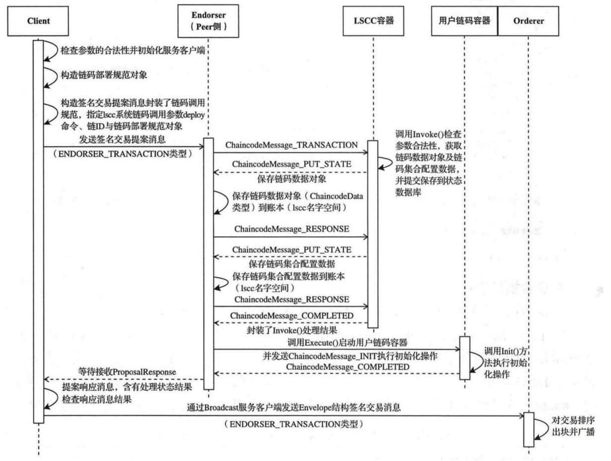

`environment:`      
`fabric v1.4.2`


##  1.概述
`instance`链码的对象是`channel`，主要目的是为了将安装过的链码在指定通道上进行实例化调用，在节点上创建容器启动，并执行初始化操作。实例化的过程中，需要指定背书策略，来确定通道上哪些节点执行的交易才能添加到账本中。			
实例化链上代码主要是在Peer所在的机器上对前面安装好的链上代码进行包装，生成对应`Channel`的`Docker`镜像和`Docker`容器。并且在实例化时我们可以指定背书策略。	
链码的安装涉及到5个服务，分别是client，peer背书节点、LSCC容器、用户链码容器和Orderer节点		
主要流程:	
* 客户端构造提案信息并发送给背书节点
* 背书节点检提案的合法性
* 背书节点调用lscc容器
* lscc容器进行链码安装(操作statedb)
* 链码容器启动
* 链码发送注册信息到peer节点
* 提案背书返回
* client提交签名交易给orderer节点进行广播

以下是在客户端执行`"peer chaincode instantiate ..."`的业务流程图:


## 2. 客户端构造提案信息并发送给背书节点
客户端执行链码实例化命令:
```bash
#-n 实例化链码的名称。 -c --ctor，链码的具体执行参数，为json格式。 -P --Policy 指定实例化策略。 -C 通道
peer chaincode instantiate -n mycc -v 0 -c '{"Args":["a","10"]}' -C myc
```
客户端的整个流程切入点为`fabric/peer/main.go`的`main`函数
```go
...
mainCmd.AddCommand(chaincode.Cmd(nil))  // chaincode命令入口
...
```
然后继续找到`peer/chaincode/chaincode.go`
```go
// Cmd returns the cobra command for Chaincode
func Cmd(cf *ChaincodeCmdFactory) *cobra.Command {
	addFlags(chaincodeCmd)

	chaincodeCmd.AddCommand(installCmd(cf))			// 执行链码的安装
	chaincodeCmd.AddCommand(instantiateCmd(cf))		// 链码的实例化
	chaincodeCmd.AddCommand(invokeCmd(cf))			// 链码的调用，具体调用什么方法要看链码是怎么写的
	chaincodeCmd.AddCommand(packageCmd(cf, nil))	// 链码的打包
	chaincodeCmd.AddCommand(queryCmd(cf))			// 对链码数据进行查询，这个只是向指定的Peer节点请求查询数据，不会生成交易最后打包区块的 
	chaincodeCmd.AddCommand(signpackageCmd(cf))		// 对已打包的链码进行签名操作
	chaincodeCmd.AddCommand(upgradeCmd(cf))			// 更新链码，之前提到过 -v是指定链码的版本，如果需要对链码进行更新的话，使用这条命令，比较常用
	chaincodeCmd.AddCommand(listCmd(cf))			// 如果已指定通道的话，则查询已实例化的链码，否则查询当前Peer节点已安装的链码

	return chaincodeCmd
}
```
继续找到`peer/chaincode/instantiate.go`的 `instantiateCmd`函数，可以看出`chaincodeDeploy`为主要的入口函数

```go
// instantiateCmd returns the cobra command for Chaincode Deploy
func instantiateCmd(cf *ChaincodeCmdFactory) *cobra.Command {
	chaincodeInstantiateCmd = &cobra.Command{
		Use:       instantiateCmdName,
		Short:     fmt.Sprint(instantiateDesc),
		Long:      fmt.Sprint(instantiateDesc),
		ValidArgs: []string{"1"},
		RunE: func(cmd *cobra.Command, args []string) error {
			return chaincodeDeploy(cmd, args, cf)
		},
	}
	flagList := []string{
		"lang",
		"ctor",
		"name",
		"channelID",
		"version",
		"policy",
		"escc",
		"vscc",
		"collections-config",
		"peerAddresses",
		"tlsRootCertFiles",
		"connectionProfile",
	}
	attachFlags(chaincodeInstantiateCmd, flagList)

	return chaincodeInstantiateCmd
}
```

```go
// chaincodeDeploy instantiates the chaincode. On success, the chaincode name
// (hash) is printed to STDOUT for use by subsequent chaincode-related CLI
// commands.
func chaincodeDeploy(cmd *cobra.Command, args []string, cf *ChaincodeCmdFactory) error {
	if channelID == "" {
		return errors.New("The required parameter 'channelID' is empty. Rerun the command with -C flag")
	}
	// Parsing of the command line is done so silence cmd usage
	cmd.SilenceUsage = true

	var err error
	if cf == nil {
		// 初始化ChaincodeCmdFactory结构，这里可以看peer链码安装部分的说明
		cf, err = InitCmdFactory(cmd.Name(), true, true)
		if err != nil {
			return err
		}
	}
	defer cf.BroadcastClient.Close()
	// 链码实例化
	env, err := instantiate(cmd, cf)
	if err != nil {
		return err
	}

	if env != nil {
		// 给Orderer节点发广播信息
		err = cf.BroadcastClient.Send(env)
	}

	return err
}
```
`InitCmdFactory`函数我们就不看了，要看就看peer链码安装篇，`BroadcastClient.Send`在这里也不看，这个函数主要是广播交易给orderer节点去打包出块的，我们主要看`instantiate`
```go
//instantiate the command via Endorser
func instantiate(cmd *cobra.Command, cf *ChaincodeCmdFactory) (*protcommon.Envelope, error) {
	spec, err := getChaincodeSpec(cmd)
	if err != nil {
		return nil, err
	}
	// 返回ChaincodeDeploymentSpec结构体
	cds, err := getChaincodeDeploymentSpec(spec, false)
	if err != nil {
		return nil, fmt.Errorf("error getting chaincode code %s: %s", chaincodeName, err)
	}
	// 取一个用于发起提案与签名的creator
	creator, err := cf.Signer.Serialize()
	if err != nil {
		return nil, fmt.Errorf("error serializing identity for %s: %s", cf.Signer.GetIdentifier(), err)
	}
	// 从ChaincodeDeploymentSpec中创建一个用于实例化链码的Proposal
	prop, _, err := utils.CreateDeployProposalFromCDS(channelID, cds, creator, policyMarshalled, []byte(escc), []byte(vscc), collectionConfigBytes)
	if err != nil {
		return nil, fmt.Errorf("error creating proposal  %s: %s", chainFuncName, err)
	}

	var signedProp *pb.SignedProposal
	// 对创建的Proposal进行签名
	signedProp, err = utils.GetSignedProposal(prop, cf.Signer)
	if err != nil {
		return nil, fmt.Errorf("error creating signed proposal  %s: %s", chainFuncName, err)
	}

	// instantiate is currently only supported for one peer
	// 这里实例化链码调用了主要的方法ProcessProposal
	proposalResponse, err := cf.EndorserClients[0].ProcessProposal(context.Background(), signedProp)
	if err != nil {
		return nil, fmt.Errorf("error endorsing %s: %s", chainFuncName, err)
	}

	if proposalResponse != nil {
		// assemble a signed transaction (it's an Envelope message)
		env, err := utils.CreateSignedTx(prop, cf.Signer, proposalResponse)
		if err != nil {
			return nil, fmt.Errorf("could not assemble transaction, err %s", err)
		}

		return env, nil
	}

	return nil, nil
}
```
这个流程跟`install`的流程基本一样，其中不一样的是`CreateDeployProposalFromCDS`，位置`protos/utils/proputils.go`
```go
// CreateDeployProposalFromCDS returns a deploy proposal given a serialized
// identity and a ChaincodeDeploymentSpec
func CreateDeployProposalFromCDS(
	chainID string,
	cds *peer.ChaincodeDeploymentSpec,
	creator []byte,
	policy []byte,
	escc []byte,
	vscc []byte,
	collectionConfig []byte) (*peer.Proposal, string, error) {
	if collectionConfig == nil {
		return createProposalFromCDS(chainID, cds, creator, "deploy", policy, escc, vscc)
	}
	return createProposalFromCDS(chainID, cds, creator, "deploy", policy, escc, vscc, collectionConfig)
}
```
```go
// createProposalFromCDS returns a deploy or upgrade proposal given a
// serialized identity and a ChaincodeDeploymentSpec
func createProposalFromCDS(chainID string, msg proto.Message, creator []byte, propType string, args ...[]byte) (*peer.Proposal, string, error) {
	// in the new mode, cds will be nil, "deploy" and "upgrade" are instantiates.
	var ccinp *peer.ChaincodeInput
	var b []byte
	var err error
	if msg != nil {
		b, err = proto.Marshal(msg)
		if err != nil {
			return nil, "", err
		}
	}
	switch propType {
	case "deploy":
		fallthrough
	case "upgrade":
		cds, ok := msg.(*peer.ChaincodeDeploymentSpec)
		if !ok || cds == nil {
			return nil, "", errors.New("invalid message for creating lifecycle chaincode proposal")
		}
		Args := [][]byte{[]byte(propType), []byte(chainID), b}
		Args = append(Args, args...)

		ccinp = &peer.ChaincodeInput{Args: Args}
	case "install":
		ccinp = &peer.ChaincodeInput{Args: [][]byte{[]byte(propType), b}}
	}

	// wrap the deployment in an invocation spec to lscc...
	lsccSpec := &peer.ChaincodeInvocationSpec{
		ChaincodeSpec: &peer.ChaincodeSpec{
			Type:        peer.ChaincodeSpec_GOLANG,
			ChaincodeId: &peer.ChaincodeID{Name: "lscc"},
			Input:       ccinp,
		},
	}

	// ...and get the proposal for it
	return CreateProposalFromCIS(common.HeaderType_ENDORSER_TRANSACTION, chainID, lsccSpec, creator)
}
```
从上面两个函数可以看到，链码实例化也是调用了`lscc`系统链码进行实例化	
其他部分的打包，签名这些都是跟`install`流程一样，这里就不在说明了
## 3. 背书节点检提案的合法性
当client调用了`ProposalResponse`消息就发送到peer背书节点,也就是走peer节点背书提案流程.      
要看安装链码前做了什么，直接看[peer节点背书提案流程](https://github.com/jxu86/technique-architect/blob/master/blockchain/fabric/fabric源码分析之(三)peer节点背书提案流程.md)就好。

## 4. 背书节点调用lscc容器
参考`peer链码安装`部分

## 5. lscc容器进行链码安装(操作statedb)
这里直接定位到`core/scc/lscc/lscc.go`的`Invoke`，我们直接看`case DEPLOY, UPGRADE`
```go
// Invoke implements lifecycle functions "deploy", "start", "stop", "upgrade".
// Deploy's arguments -  {[]byte("deploy"), []byte(<chainname>), <unmarshalled pb.ChaincodeDeploymentSpec>}
//
// Invoke also implements some query-like functions
// Get chaincode arguments -  {[]byte("getid"), []byte(<chainname>), []byte(<chaincodename>)}
func (lscc *LifeCycleSysCC) Invoke(stub shim.ChaincodeStubInterface) pb.Response {
	args := stub.GetArgs()
	if len(args) < 1 {
		return shim.Error(InvalidArgsLenErr(len(args)).Error())
	}

	function := string(args[0])

	// Handle ACL:
	// 1. get the signed proposal
	// 获取签名提案
	sp, err := stub.GetSignedProposal()
	if err != nil {
		return shim.Error(fmt.Sprintf("Failed retrieving signed proposal on executing %s with error %s", function, err))
	}

	switch function {
	
	... ...
	case DEPLOY, UPGRADE:
		// we expect a minimum of 3 arguments, the function
		// name, the chain name and deployment spec
		if len(args) < 3 {
			return shim.Error(InvalidArgsLenErr(len(args)).Error())
		}

		// channel the chaincode should be associated with. It
		// should be created with a register call
		channel := string(args[1])
		// 检查channel是否合法
		if !lscc.isValidChannelName(channel) {
			return shim.Error(InvalidChannelNameErr(channel).Error())
		}

		ac, exists := lscc.SCCProvider.GetApplicationConfig(channel)
		if !exists {
			logger.Panicf("programming error, non-existent appplication config for channel '%s'", channel)
		}

		// the maximum number of arguments depends on the capability of the channel
		if !ac.Capabilities().PrivateChannelData() && len(args) > 6 {
			return shim.Error(PrivateChannelDataNotAvailable("").Error())
		}
		if ac.Capabilities().PrivateChannelData() && len(args) > 7 {
			return shim.Error(InvalidArgsLenErr(len(args)).Error())
		}

		depSpec := args[2]
		cds := &pb.ChaincodeDeploymentSpec{}
		err := proto.Unmarshal(depSpec, cds)
		if err != nil {
			return shim.Error(fmt.Sprintf("error unmarshaling ChaincodeDeploymentSpec: %s", err))
		}

		// optional arguments here (they can each be nil and may or may not be present)
		// args[3] is a marshalled SignaturePolicyEnvelope representing the endorsement policy
		// args[4] is the name of escc
		// args[5] is the name of vscc
		// args[6] is a marshalled CollectionConfigPackage struct
		var EP []byte
		if len(args) > 3 && len(args[3]) > 0 {
			EP = args[3]
		} else {
			p := cauthdsl.SignedByAnyMember(peer.GetMSPIDs(channel))
			EP, err = utils.Marshal(p)
			if err != nil {
				return shim.Error(err.Error())
			}
		}

		var escc []byte
		if len(args) > 4 && len(args[4]) > 0 {
			escc = args[4]
		} else {
			escc = []byte("escc")
		}

		var vscc []byte
		if len(args) > 5 && len(args[5]) > 0 {
			vscc = args[5]
		} else {
			vscc = []byte("vscc")
		}

		var collectionsConfig []byte
		// we proceed with a non-nil collection configuration only if
		// we Support the PrivateChannelData capability
		if ac.Capabilities().PrivateChannelData() && len(args) > 6 {
			collectionsConfig = args[6]
		}
		
		cd, err := lscc.executeDeployOrUpgrade(stub, channel, cds, EP, escc, vscc, collectionsConfig, function)
		if err != nil {
			return shim.Error(err.Error())
		}
		cdbytes, err := proto.Marshal(cd)
		if err != nil {
			return shim.Error(err.Error())
		}
		return shim.Success(cdbytes)
	... ...
```
可以看到`deploy`和`upgrade`处理流程都一样，主要看`executeDeployOrUpgrade`
```go
// executeDeployOrUpgrade routes the code path either to executeDeploy or executeUpgrade
// depending on its function argument
func (lscc *LifeCycleSysCC) executeDeployOrUpgrade(
	stub shim.ChaincodeStubInterface,
	chainname string,
	cds *pb.ChaincodeDeploymentSpec,
	policy, escc, vscc, collectionConfigBytes []byte,
	function string,
) (*ccprovider.ChaincodeData, error) {

	chaincodeName := cds.ChaincodeSpec.ChaincodeId.Name
	chaincodeVersion := cds.ChaincodeSpec.ChaincodeId.Version

	// 检查链码名字是否合法
	if err := lscc.isValidChaincodeName(chaincodeName); err != nil {
		return nil, err
	}
	// 检查链码版本是否合法
	if err := lscc.isValidChaincodeVersion(chaincodeName, chaincodeVersion); err != nil {
		return nil, err
	}
	// 从本地读取链码
	ccpack, err := lscc.Support.GetChaincodeFromLocalStorage(chaincodeName, chaincodeVersion)
	if err != nil {
		retErrMsg := fmt.Sprintf("cannot get package for chaincode (%s:%s)", chaincodeName, chaincodeVersion)
		logger.Errorf("%s-err:%s", retErrMsg, err)
		return nil, fmt.Errorf("%s", retErrMsg)
	}
	// 返回ChaincodeData格式数据
	cd := ccpack.GetChaincodeData()

	switch function {
	case DEPLOY:
		return lscc.executeDeploy(stub, chainname, cds, policy, escc, vscc, cd, ccpack, collectionConfigBytes)
	case UPGRADE:
		return lscc.executeUpgrade(stub, chainname, cds, policy, escc, vscc, cd, ccpack, collectionConfigBytes)
	default:
		logger.Panicf("Programming error, unexpected function '%s'", function)
		panic("") // unreachable code
	}
}
```
`executeDeploy`主要是处理`deploy`
```go
// executeDeploy implements the "instantiate" Invoke transaction
func (lscc *LifeCycleSysCC) executeDeploy(
	stub shim.ChaincodeStubInterface,
	chainname string,
	cds *pb.ChaincodeDeploymentSpec,
	policy []byte,
	escc []byte,
	vscc []byte,
	cdfs *ccprovider.ChaincodeData,
	ccpackfs ccprovider.CCPackage,
	collectionConfigBytes []byte,
) (*ccprovider.ChaincodeData, error) {
	//just test for existence of the chaincode in the LSCC
	chaincodeName := cds.ChaincodeSpec.ChaincodeId.Name
	// 检查实例是否存在
	_, err := lscc.getCCInstance(stub, chaincodeName)
	if err == nil {
		return nil, ExistsErr(chaincodeName)
	}

	//retain chaincode specific data and fill channel specific ones
	cdfs.Escc = string(escc)
	cdfs.Vscc = string(vscc)
	cdfs.Policy = policy

	// retrieve and evaluate instantiation policy
	cdfs.InstantiationPolicy, err = lscc.Support.GetInstantiationPolicy(chainname, ccpackfs)
	if err != nil {
		return nil, err
	}
	// get the signed instantiation proposal
	// 获取签名提案
	signedProp, err := stub.GetSignedProposal()
	if err != nil {
		return nil, err
	}
	err = lscc.Support.CheckInstantiationPolicy(signedProp, chainname, cdfs.InstantiationPolicy)
	if err != nil {
		return nil, err
	}
	// 在链上创建链码
	err = lscc.putChaincodeData(stub, cdfs)
	if err != nil {
		return nil, err
	}
	// collectionConfigBytes上链
	err = lscc.putChaincodeCollectionData(stub, cdfs, collectionConfigBytes)
	if err != nil {
		return nil, err
	}

	return cdfs, nil
}
```
以上还不涉及到容器的启动，只是记录一些数据到db数据库。

## 6. 链码容器启动
从`core/endorser/endorser.go/callChaincode`可以看到调用`ExecuteLegacyInit`来启动链码容器，那我们直接看`ExecuteLegacyInit`

```go
// ExecuteLegacyInit is a temporary method which should be removed once the old style lifecycle
// is entirely deprecated.  Ideally one release after the introduction of the new lifecycle.
// It does not attempt to start the chaincode based on the information from lifecycle, but instead
// accepts the container information directly in the form of a ChaincodeDeploymentSpec.
func (cs *ChaincodeSupport) ExecuteLegacyInit(txParams *ccprovider.TransactionParams, cccid *ccprovider.CCContext, spec *pb.ChaincodeDeploymentSpec) (*pb.Response, *pb.ChaincodeEvent, error) {
	ccci := ccprovider.DeploymentSpecToChaincodeContainerInfo(spec)
	ccci.Version = cccid.Version
	// 启动链码
	err := cs.LaunchInit(ccci)
	if err != nil {
		return nil, nil, err
	}
	// 注册链码，就是添加个记录
	cname := ccci.Name + ":" + ccci.Version
	h := cs.HandlerRegistry.Handler(cname)
	if h == nil {
		return nil, nil, errors.Wrapf(err, "[channel %s] claimed to start chaincode container for %s but could not find handler", txParams.ChannelID, cname)
	}
	resp, err := cs.execute(pb.ChaincodeMessage_INIT, txParams, cccid, spec.GetChaincodeSpec().Input, h)
	// 处理链码返回结果
	return processChaincodeExecutionResult(txParams.TxID, cccid.Name, resp, err)
}
```
我们先看`LaunchInit`

`core/chaincode/chaincode_support.go`
```go
// LaunchInit bypasses getting the chaincode spec from the LSCC table
// as in the case of v1.0-v1.2 lifecycle, the chaincode will not yet be
// defined in the LSCC table
func (cs *ChaincodeSupport) LaunchInit(ccci *ccprovider.ChaincodeContainerInfo) error {
	cname := ccci.Name + ":" + ccci.Version
	if cs.HandlerRegistry.Handler(cname) != nil {
		return nil
	}
	// 启动函数，定位到fabric/core/chaincode/runtime_launcher.go/Launch
	return cs.Launcher.Launch(ccci)
}
```
定位到`fabric/core/chaincode/runtime_launcher.go/Launch`

```go
func (r *RuntimeLauncher) Launch(ccci *ccprovider.ChaincodeContainerInfo) error {
	var startFailCh chan error
	var timeoutCh <-chan time.Time

	startTime := time.Now()
	cname := ccci.Name + ":" + ccci.Version
	launchState, alreadyStarted := r.Registry.Launching(cname)
	// 容器是否已经存在
	if !alreadyStarted {
		startFailCh = make(chan error, 1)
		timeoutCh = time.NewTimer(r.StartupTimeout).C

		codePackage, err := r.getCodePackage(ccci)
		if err != nil {
			return err
		}

		go func() {
			// 启动的地方，定位到fabric/core/chaincode/container_runtime.go
			if err := r.Runtime.Start(ccci, codePackage); err != nil {
				startFailCh <- errors.WithMessage(err, "error starting container")
				return
			}
			exitCode, err := r.Runtime.Wait(ccci)
			if err != nil {
				launchState.Notify(errors.Wrap(err, "failed to wait on container exit"))
			}
			launchState.Notify(errors.Errorf("container exited with %d", exitCode))
		}()
	}

	var err error
	select {// 阻塞，等待启动完成
	case <-launchState.Done():
		err = errors.WithMessage(launchState.Err(), "chaincode registration failed")
	case err = <-startFailCh:
		launchState.Notify(err)
		r.Metrics.LaunchFailures.With("chaincode", cname).Add(1)
	case <-timeoutCh:
		err = errors.Errorf("timeout expired while starting chaincode %s for transaction", cname)
		launchState.Notify(err)
		r.Metrics.LaunchTimeouts.With("chaincode", cname).Add(1)
	}

	success := true
	if err != nil && !alreadyStarted {
		success = false
		chaincodeLogger.Debugf("stopping due to error while launching: %+v", err)
		defer r.Registry.Deregister(cname)
		if err := r.Runtime.Stop(ccci); err != nil {
			chaincodeLogger.Debugf("stop failed: %+v", err)
		}
	}

	r.Metrics.LaunchDuration.With(
		"chaincode", cname,
		"success", strconv.FormatBool(success),
	).Observe(time.Since(startTime).Seconds())
	// 容器到此启动完成
	chaincodeLogger.Debug("launch complete")
	return err
}
```
定位到`fabric/core/chaincode/container_runtime.go`的`Start`
```go
// Start launches chaincode in a runtime environment.
func (c *ContainerRuntime) Start(ccci *ccprovider.ChaincodeContainerInfo, codePackage []byte) error {
	cname := ccci.Name + ":" + ccci.Version
	// 读取peer的配置文件，关于docker engine的
	lc, err := c.LaunchConfig(cname, ccci.Type)
	if err != nil {
		return err
	}

	chaincodeLogger.Debugf("start container: %s", cname)
	chaincodeLogger.Debugf("start container with args: %s", strings.Join(lc.Args, " "))
	chaincodeLogger.Debugf("start container with env:\n\t%s", strings.Join(lc.Envs, "\n\t"))
	// 这里是设置容器的启动配置
	scr := container.StartContainerReq{
		Builder: &container.PlatformBuilder{
			Type:             ccci.Type,
			Name:             ccci.Name,
			Version:          ccci.Version,
			Path:             ccci.Path,
			CodePackage:      codePackage,
			PlatformRegistry: c.PlatformRegistry,
		},
		Args:          lc.Args,
		Env:           lc.Envs,
		FilesToUpload: lc.Files,
		CCID: ccintf.CCID{
			Name:    ccci.Name,
			Version: ccci.Version,
		},
	}
	// 启动的地方，ccci.ContainerType又两种sys和docker,用户链码是docker启动，接下来会构造docker client向docker engine请求启动容器
	// 定位到fabric/core/container/controller.go/Process
	if err := c.Processor.Process(ccci.ContainerType, scr); err != nil {
		return errors.WithMessage(err, "error starting container")
	}

	return nil
}
```
定位到`core/container/controller.go/Process`
```go
func (vmc *VMController) Process(vmtype string, req VMCReq) error {
	v := vmc.newVM(vmtype)
	ccid := req.GetCCID()
	id := ccid.GetName()

	vmc.lockContainer(id)
	defer vmc.unlockContainer(id)
	// 启动虚拟机
	return req.Do(v)
}
```

```go
func (vmc *VMController) newVM(typ string) VM {
	v, ok := vmc.vmProviders[typ]
	if !ok {
		vmLogger.Panicf("Programming error: unsupported VM type: %s", typ)
	}
	return v.NewVM()
}
```

```go
func (si StartContainerReq) Do(v VM) error {
	// 调用core/container/dockercontroller/dockercontroller.go
	return v.Start(si.CCID, si.Args, si.Env, si.FilesToUpload, si.Builder)
}
```
定位到`core/container/dockercontroller/dockercontroller.go`
```go
// Start starts a container using a previously created docker image
func (vm *DockerVM) Start(ccid ccintf.CCID, args, env []string, filesToUpload map[string][]byte, builder container.Builder) error {
	imageName, err := vm.GetVMNameForDocker(ccid)
	if err != nil {
		return err
	}

	attachStdout := viper.GetBool("vm.docker.attachStdout")
	containerName := vm.GetVMName(ccid)
	logger := dockerLogger.With("imageName", imageName, "containerName", containerName)
	// 通过VM获得docker客户端
	client, err := vm.getClientFnc()
	if err != nil {
		logger.Debugf("failed to get docker client", "error", err)
		return err
	}
	// 停止容器和虚拟机
	vm.stopInternal(client, containerName, 0, false, false)
	// 创建容器
	err = vm.createContainer(client, imageName, containerName, args, env, attachStdout)
	if err == docker.ErrNoSuchImage {
		// 如果没有镜像，则使用builder来创建相关容器
		reader, err := builder.Build()
		if err != nil {
			return errors.Wrapf(err, "failed to generate Dockerfile to build %s", containerName)
		}
		// 部署镜像
		err = vm.deployImage(client, ccid, reader)
		if err != nil {
			return err
		}
		// 创建镜像后，再创建容器
		err = vm.createContainer(client, imageName, containerName, args, env, attachStdout)
		if err != nil {
			logger.Errorf("failed to create container: %s", err)
			return err
		}
	} else if err != nil {
		logger.Errorf("create container failed: %s", err)
		return err
	}

	// stream stdout and stderr to chaincode logger
	if attachStdout {
		containerLogger := flogging.MustGetLogger("peer.chaincode." + containerName)
		streamOutput(dockerLogger, client, containerName, containerLogger)
	}

	// upload specified files to the container before starting it
	// this can be used for configurations such as TLS key and certs
	// 处理容器需要的证书相关的文件
	if len(filesToUpload) != 0 {
		// the docker upload API takes a tar file, so we need to first
		// consolidate the file entries to a tar
		payload := bytes.NewBuffer(nil)
		gw := gzip.NewWriter(payload)
		tw := tar.NewWriter(gw)

		for path, fileToUpload := range filesToUpload {
			cutil.WriteBytesToPackage(path, fileToUpload, tw)
		}

		// Write the tar file out
		if err := tw.Close(); err != nil {
			return fmt.Errorf("Error writing files to upload to Docker instance into a temporary tar blob: %s", err)
		}

		gw.Close()
		// 上传数据
		err := client.UploadToContainer(containerName, docker.UploadToContainerOptions{
			InputStream:          bytes.NewReader(payload.Bytes()),
			Path:                 "/",
			NoOverwriteDirNonDir: false,
		})
		if err != nil {
			return fmt.Errorf("Error uploading files to the container instance %s: %s", containerName, err)
		}
	}

	// start container with HostConfig was deprecated since v1.10 and removed in v1.2
	err = client.StartContainer(containerName, nil)
	if err != nil {
		dockerLogger.Errorf("start-could not start container: %s", err)
		return err
	}

	dockerLogger.Debugf("Started container %s", containerName)
	return nil
}
```
到这里用户链码容器就启动完毕了

## 7. 链码发送注册信息到peer节点
当容器启动完毕，调用链码程序，首先运行shim包的Start函数，位于`core/chaincode/shim/chaincode`
```go
// chaincodes.
func Start(cc Chaincode) error {
	// If Start() is called, we assume this is a standalone chaincode and set
	// up formatted logging.
	// 对链码的Log进行设置
	SetupChaincodeLogging()
	// 从输入中获取用户定义的链码的名称
	chaincodename := viper.GetString("chaincode.id.name")
	// 如果获取不到链码名称则报错退出
	if chaincodename == "" {
		return errors.New("error chaincode id not provided")
	}

	err := factory.InitFactories(factory.GetDefaultOpts())
	if err != nil {
		return errors.WithMessage(err, "internal error, BCCSP could not be initialized with default options")
	}

	//mock stream not set up ... get real stream
	// 将链码数据以流的方式读取进来
	if streamGetter == nil {
		streamGetter = userChaincodeStreamGetter
	}

	stream, err := streamGetter(chaincodename)
	if err != nil {
		return err
	}
	// 跟peer节点创建连接
	err = chatWithPeer(chaincodename, stream, cc)

	return err
}
```

```go
func chatWithPeer(chaincodename string, stream PeerChaincodeStream, cc Chaincode) error {
	// Create the shim handler responsible for all control logic
	// 新建Handler对象
	handler := newChaincodeHandler(stream, cc)
	defer stream.CloseSend()

	// Send the ChaincodeID during register.
	// 获取链码名称
	chaincodeID := &pb.ChaincodeID{Name: chaincodename}
	// 将获取的链码名称序列化为有效载荷.
	payload, err := proto.Marshal(chaincodeID)
	if err != nil {
		return errors.Wrap(err, "error marshalling chaincodeID during chaincode registration")
	}

	// Register on the stream
	chaincodeLogger.Debugf("Registering.. sending %s", pb.ChaincodeMessage_REGISTER)
	// 链码容器通过handler开始通过gRPC连接向Peer节点发送第一个消息了，链码容器向Peer节点发送REGISTER消息，并附上链码的名称
	if err = handler.serialSend(&pb.ChaincodeMessage{Type: pb.ChaincodeMessage_REGISTER, Payload: payload}); err != nil {
		return errors.WithMessage(err, "error sending chaincode REGISTER")
	}

	// holds return values from gRPC Recv below
	// 定义一个接收消息的结构体
	type recvMsg struct {
		msg *pb.ChaincodeMessage
		err error
	}
	msgAvail := make(chan *recvMsg, 1)
	errc := make(chan error)

	receiveMessage := func() {
		in, err := stream.Recv()
		msgAvail <- &recvMsg{in, err}
	}
	// 开启线程接收由Peer节点返回的响应消息
	go receiveMessage()
	for {
		select {
		case rmsg := <-msgAvail:
			switch {
			case rmsg.err == io.EOF:
				err = errors.Wrapf(rmsg.err, "received EOF, ending chaincode stream")
				chaincodeLogger.Debugf("%+v", err)
				return err
			case rmsg.err != nil:
				err := errors.Wrap(rmsg.err, "receive failed")
				chaincodeLogger.Errorf("Received error from server, ending chaincode stream: %+v", err)
				return err
			case rmsg.msg == nil:
				err := errors.New("received nil message, ending chaincode stream")
				chaincodeLogger.Debugf("%+v", err)
				return err
			default:
				chaincodeLogger.Debugf("[%s]Received message %s from peer", shorttxid(rmsg.msg.Txid), rmsg.msg.Type)
				// 处理接收到的信息
				err := handler.handleMessage(rmsg.msg, errc)
				if err != nil {
					err = errors.WithMessage(err, "error handling message")
					return err
				}
				// 当消息处理完成后，再次接收消息
				go receiveMessage()
			}

		case sendErr := <-errc:
			if sendErr != nil {
				err := errors.Wrap(sendErr, "error sending")
				return err
			}
		}
	}
}
```
看到看到用户链码启动的时候会给`peer`节点发送`ChaincodeMessage_REGISTER`消息，`peer`接收到信息处理完会发送信息回应用户链码。
看回`ExecuteLegacyInit`,用户链码容器启动完后，peer节点回向用户链码发送`ChaincodeMessage_INIT`消息，处理完就整理好信息，准备回应`client`端服务。

## 8. 提案背书返回
当用户链码实例化完毕后，`peer`节点就给提案背书返回给`client`服务端，至此链码安装完毕。

## 9. client提交签名交易给orderer节点进行广播
最后就是client端通过广播给orderer提交提案交易给orderer节点，orderer节点排序后就把区块广播出去，这部分就不在这里分析了，至此，整个用户链码实例化的流程已经完毕。


参考:   
[Fabric1.4源码解析：链码实例化过程](https://www.cnblogs.com/cbkj-xd/p/11149791.html)            
[Fabric 链码安装及实例化详解](https://blog.csdn.net/love_feng_forever/article/details/100532324)            
[实战-超级账本 fabric 编写部署调用第一条链码](http://www.imooc.com/article/28325)       
[fabric源码解析2——peer命令结构](https://blog.csdn.net/idsuf698987/article/details/75034998)     
[fabric源码分析之七链码源码分析](https://blog.csdn.net/fpcc/article/details/105727762)

