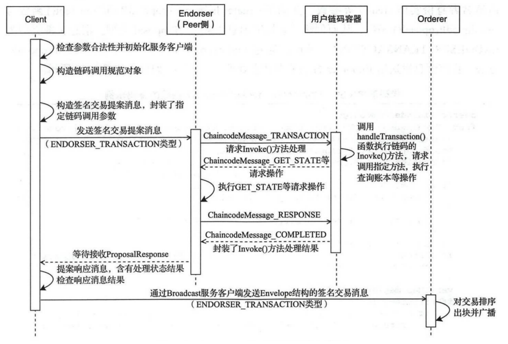
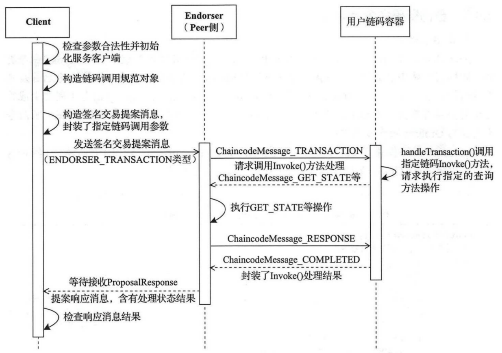

`environment:`      
`fabric v1.4.2`


##  1.概述

我们这里主要是讲到`peer chaincode invoke`和`peer chaincode query`这两条调用链码的命令。
链码涉及到5个服务，分别是client，peer背书节点、用户链码容器和Orderer节点(invoke)		
主要流程:	
* 客户端构造提案信息并发送给背书节点
* 背书节点检提案的合法性
* 背书节点调用用户链码
* 提案背书返回
* client提交签名交易给orderer节点进行广播(invoke才需要，query不需要)


## 2. peer chaincode invoke
以下是在客户端执行`"peer chaincode invoke ..."`的业务流程图:


```go
#-n 实例化链码的名称。 -c --ctor，链码的具体执行参数，为json格式。 -C 通道
peer chaincode invoke -n mycc -c '{"Args":["set", "a", "20"]}' -C myc
```
### 2.1 客户端构造提案信息并发送给背书节点

客户端的整个流程入口我们还是定位`fabric/peer/main.go`的`main`函数，最后找到`fabric/peer/chaincode/invoke.go`的`invokeCmd`函数:
```go
// invokeCmd returns the cobra command for Chaincode Invoke
func invokeCmd(cf *ChaincodeCmdFactory) *cobra.Command {
	chaincodeInvokeCmd = &cobra.Command{
		Use:       "invoke",
		Short:     fmt.Sprintf("Invoke the specified %s.", chainFuncName),
		Long:      fmt.Sprintf("Invoke the specified %s. It will try to commit the endorsed transaction to the network.", chainFuncName),
		ValidArgs: []string{"1"},
		RunE: func(cmd *cobra.Command, args []string) error {
			return chaincodeInvoke(cmd, cf)
		},
	}
	flagList := []string{
		"name",
		"ctor",
		"channelID",
		"peerAddresses",
		"tlsRootCertFiles",
		"connectionProfile",
		"waitForEvent",
		"waitForEventTimeout",
	}
	attachFlags(chaincodeInvokeCmd, flagList)

	return chaincodeInvokeCmd
}
```


```go
func chaincodeInvoke(cmd *cobra.Command, cf *ChaincodeCmdFactory) error {
	if channelID == "" {
		return errors.New("The required parameter 'channelID' is empty. Rerun the command with -C flag")
	}
	// Parsing of the command line is done so silence cmd usage
	cmd.SilenceUsage = true

	var err error
	if cf == nil {
        // 初始化ChaincodeCmdFactory
		cf, err = InitCmdFactory(cmd.Name(), true, true)
		if err != nil {
			return err
		}
	}
	defer cf.BroadcastClient.Close()

	return chaincodeInvokeOrQuery(cmd, true, cf)
}
```
`InitCmdFactory`函数我们就不看了，要看就看peer链码安装篇,我们重点看`chaincodeInvokeOrQuery`

```go
func chaincodeInvokeOrQuery(cmd *cobra.Command, invoke bool, cf *ChaincodeCmdFactory) (err error) {
	// 生成ChaincodeSpec结构
	spec, err := getChaincodeSpec(cmd)
	if err != nil {
		return err
	}

	// call with empty txid to ensure production code generates a txid.
	// otherwise, tests can explicitly set their own txid
	txID := ""
	// 发送背书请求和广播信息给orderer节点
	proposalResp, err := ChaincodeInvokeOrQuery(
		spec,
		channelID,
		txID,
		invoke,
		cf.Signer,
		cf.Certificate,
		cf.EndorserClients,
		cf.DeliverClients,
		cf.BroadcastClient)

	if err != nil {
		return errors.Errorf("%s - proposal response: %v", err, proposalResp)
	}

	if invoke {  // peer chaincode invoke
		logger.Debugf("ESCC invoke result: %v", proposalResp)
		pRespPayload, err := putils.GetProposalResponsePayload(proposalResp.Payload)
		if err != nil {
			return errors.WithMessage(err, "error while unmarshaling proposal response payload")
		}
		ca, err := putils.GetChaincodeAction(pRespPayload.Extension)
		if err != nil {
			return errors.WithMessage(err, "error while unmarshaling chaincode action")
		}
		if proposalResp.Endorsement == nil {
			return errors.Errorf("endorsement failure during invoke. response: %v", proposalResp.Response)
		}
		logger.Infof("Chaincode invoke successful. result: %v", ca.Response)
	} else {	// peer chaincode query
		if proposalResp == nil {
			return errors.New("error during query: received nil proposal response")
		}
		if proposalResp.Endorsement == nil {
			return errors.Errorf("endorsement failure during query. response: %v", proposalResp.Response)
		}

		if chaincodeQueryRaw && chaincodeQueryHex {
			return fmt.Errorf("options --raw (-r) and --hex (-x) are not compatible")
		}
		if chaincodeQueryRaw {
			fmt.Println(proposalResp.Response.Payload)
			return nil
		}
		if chaincodeQueryHex {
			fmt.Printf("%x\n", proposalResp.Response.Payload)
			return nil
		}
		fmt.Println(string(proposalResp.Response.Payload))
	}
	return nil
}
```
上面一看`ChaincodeInvokeOrQuery`为重点函数

```go
func ChaincodeInvokeOrQuery(
	spec *pb.ChaincodeSpec,
	cID string,
	txID string,
	invoke bool,
	signer msp.SigningIdentity,
	certificate tls.Certificate,
	endorserClients []pb.EndorserClient,
	deliverClients []api.PeerDeliverClient,
	bc common.BroadcastClient,
) (*pb.ProposalResponse, error) {
	// Build the ChaincodeInvocationSpec message
	invocation := &pb.ChaincodeInvocationSpec{ChaincodeSpec: spec}

	creator, err := signer.Serialize()
	if err != nil {
		return nil, errors.WithMessage(err, fmt.Sprintf("error serializing identity for %s", signer.GetIdentifier()))
	}

	funcName := "invoke"
	if !invoke {
		funcName = "query"
	}

	// extract the transient field if it exists
	var tMap map[string][]byte
	if transient != "" {
		if err := json.Unmarshal([]byte(transient), &tMap); err != nil {
			return nil, errors.Wrap(err, "error parsing transient string")
		}
	}
	// 构造Proposal数据结构
	prop, txid, err := putils.CreateChaincodeProposalWithTxIDAndTransient(pcommon.HeaderType_ENDORSER_TRANSACTION, cID, invocation, creator, txID, tMap)
	if err != nil {
		return nil, errors.WithMessage(err, fmt.Sprintf("error creating proposal for %s", funcName))
	}
	// 签名
	signedProp, err := putils.GetSignedProposal(prop, signer)
	if err != nil {
		return nil, errors.WithMessage(err, fmt.Sprintf("error creating signed proposal for %s", funcName))
	}
	var responses []*pb.ProposalResponse
	for _, endorser := range endorserClients {
		// 发送请求背书到peer节点
		proposalResp, err := endorser.ProcessProposal(context.Background(), signedProp)
		if err != nil {
			return nil, errors.WithMessage(err, fmt.Sprintf("error endorsing %s", funcName))
		}
		responses = append(responses, proposalResp)
	}

	if len(responses) == 0 {
		// this should only happen if some new code has introduced a bug
		return nil, errors.New("no proposal responses received - this might indicate a bug")
	}
	// all responses will be checked when the signed transaction is created.
	// for now, just set this so we check the first response's status
	proposalResp := responses[0]

	if invoke {
		if proposalResp != nil {
			if proposalResp.Response.Status >= shim.ERRORTHRESHOLD {
				return proposalResp, nil
			}
			// assemble a signed transaction (it's an Envelope message)
			env, err := putils.CreateSignedTx(prop, signer, responses...)
			if err != nil {
				return proposalResp, errors.WithMessage(err, "could not assemble transaction")
			}
			var dg *deliverGroup
			var ctx context.Context
			if waitForEvent {
				var cancelFunc context.CancelFunc
				ctx, cancelFunc = context.WithTimeout(context.Background(), waitForEventTimeout)
				defer cancelFunc()

				dg = newDeliverGroup(deliverClients, peerAddresses, certificate, channelID, txid)
				// connect to deliver service on all peers
				err := dg.Connect(ctx)
				if err != nil {
					return nil, err
				}
			}

			// send the envelope for ordering
			if err = bc.Send(env); err != nil {
				return proposalResp, errors.WithMessage(err, fmt.Sprintf("error sending transaction for %s", funcName))
			}

			if dg != nil && ctx != nil {
				// wait for event that contains the txid from all peers
				err = dg.Wait(ctx)
				if err != nil {
					return nil, err
				}
			}
		}
	}

	return proposalResp, nil
}
```
`ChaincodeInvokeOrQuery`的流程跟链码安装和实例化差不多，都是构造`Proposal`数据结构，签名等，然后就调用`ProcessProposal`发送背书请求

### 2.2 背书节点检提案的合法性
参考`peer链码安装`部分


### 2.3 背书节点调用用户链码
我们直接定位到`core/chaincode/shim/chaincode`的`chatWithPeer`函数，在链码实例化的时候说过，用户链码容器启动后，就进入`chatWithPeer`等待消息命令。
```go
func chatWithPeer(chaincodename string, stream PeerChaincodeStream, cc Chaincode) error {
	// Create the shim handler responsible for all control logic
	// 新建Handler对象
	handler := newChaincodeHandler(stream, cc)
	defer stream.CloseSend()

	// Send the ChaincodeID during register.
	// 获取链码名称
	chaincodeID := &pb.ChaincodeID{Name: chaincodename}
	// 将获取的链码名称序列化为有效载荷.
	payload, err := proto.Marshal(chaincodeID)
	if err != nil {
		return errors.Wrap(err, "error marshalling chaincodeID during chaincode registration")
	}

	// Register on the stream
	chaincodeLogger.Debugf("Registering.. sending %s", pb.ChaincodeMessage_REGISTER)
	// 链码容器通过handler开始通过gRPC连接向Peer节点发送第一个消息了，链码容器向Peer节点发送REGISTER消息，并附上链码的名称
	if err = handler.serialSend(&pb.ChaincodeMessage{Type: pb.ChaincodeMessage_REGISTER, Payload: payload}); err != nil {
		return errors.WithMessage(err, "error sending chaincode REGISTER")
	}

	// holds return values from gRPC Recv below
	// 定义一个接收消息的结构体
	type recvMsg struct {
		msg *pb.ChaincodeMessage
		err error
	}
	msgAvail := make(chan *recvMsg, 1)
	errc := make(chan error)

	receiveMessage := func() {
		in, err := stream.Recv()
		msgAvail <- &recvMsg{in, err}
	}
	// 开启线程接收由Peer节点返回的响应消息
	go receiveMessage()
	for {
		select {
		case rmsg := <-msgAvail:
			switch {
			case rmsg.err == io.EOF:
				err = errors.Wrapf(rmsg.err, "received EOF, ending chaincode stream")
				chaincodeLogger.Debugf("%+v", err)
				return err
			case rmsg.err != nil:
				err := errors.Wrap(rmsg.err, "receive failed")
				chaincodeLogger.Errorf("Received error from server, ending chaincode stream: %+v", err)
				return err
			case rmsg.msg == nil:
				err := errors.New("received nil message, ending chaincode stream")
				chaincodeLogger.Debugf("%+v", err)
				return err
			default:
				chaincodeLogger.Debugf("[%s]Received message %s from peer", shorttxid(rmsg.msg.Txid), rmsg.msg.Type)
				// 处理接收到的信息
				err := handler.handleMessage(rmsg.msg, errc)
				if err != nil {
					err = errors.WithMessage(err, "error handling message")
					return err
				}
				// 当消息处理完成后，再次接收消息
				go receiveMessage()
			}

		case sendErr := <-errc:
			if sendErr != nil {
				err := errors.Wrap(sendErr, "error sending")
				return err
			}
		}
	}
```
然后我们一直可以定位`handleMessage=>handleReady=>handleTransaction`     
好了，我们去看看`handleTransaction`
```go 
// handleTransaction Handles request to execute a transaction.
func (handler *Handler) handleTransaction(msg *pb.ChaincodeMessage, errc chan error) {
	// The defer followed by triggering a go routine dance is needed to ensure that the previous state transition
	// is completed before the next one is triggered. The previous state transition is deemed complete only when
	// the beforeInit function is exited. Interesting bug fix!!
	go func() {
		//better not be nil
		var nextStateMsg *pb.ChaincodeMessage

		defer func() {
			handler.triggerNextState(nextStateMsg, errc)
		}()

		errFunc := func(err error, ce *pb.ChaincodeEvent, errStr string, args ...interface{}) *pb.ChaincodeMessage {
			if err != nil {
				payload := []byte(err.Error())
				chaincodeLogger.Errorf(errStr, args...)
				return &pb.ChaincodeMessage{Type: pb.ChaincodeMessage_ERROR, Payload: payload, Txid: msg.Txid, ChaincodeEvent: ce, ChannelId: msg.ChannelId}
			}
			return nil
		}

		// Get the function and args from Payload
		input := &pb.ChaincodeInput{}
		unmarshalErr := proto.Unmarshal(msg.Payload, input)
		if nextStateMsg = errFunc(unmarshalErr, nil, "[%s] Incorrect payload format. Sending %s", shorttxid(msg.Txid), pb.ChaincodeMessage_ERROR.String()); nextStateMsg != nil {
			return
		}

		// Call chaincode's Run
		// Create the ChaincodeStub which the chaincode can use to callback
		stub := new(ChaincodeStub)
		err := stub.init(handler, msg.ChannelId, msg.Txid, input, msg.Proposal)
		if nextStateMsg = errFunc(err, stub.chaincodeEvent, "[%s] Transaction execution failed. Sending %s", shorttxid(msg.Txid), pb.ChaincodeMessage_ERROR.String()); nextStateMsg != nil {
			return
		}
		// 调用链码的Invoke函数
		res := handler.cc.Invoke(stub)

		// Endorser will handle error contained in Response.
		resBytes, err := proto.Marshal(&res)
		if nextStateMsg = errFunc(err, stub.chaincodeEvent, "[%s] Transaction execution failed. Sending %s", shorttxid(msg.Txid), pb.ChaincodeMessage_ERROR.String()); nextStateMsg != nil {
			return
		}

		// Send COMPLETED message to chaincode support and change state
		chaincodeLogger.Debugf("[%s] Transaction completed. Sending %s", shorttxid(msg.Txid), pb.ChaincodeMessage_COMPLETED)
		nextStateMsg = &pb.ChaincodeMessage{Type: pb.ChaincodeMessage_COMPLETED, Payload: resBytes, Txid: msg.Txid, ChaincodeEvent: stub.chaincodeEvent, ChannelId: stub.ChannelId}
	}()
}
```
我们可以看到`handler.cc.Invoke(stub)`有这么一语句，这里就是调用链码的`Invoke`,我们看看例子链码。
无论是`invoke`或者`query`命令都有这个入口进写具体的业务逻辑。
```go
func (t *SimpleChaincode) Invoke(stub shim.ChaincodeStubInterface) pb.Response {
	fmt.Println("ex02 Invoke")
	function, args := stub.GetFunctionAndParameters()
	if function == "invoke" {
		// Make payment of X units from A to B
		return t.invoke(stub, args)
	} else if function == "delete" {
		// Deletes an entity from its state
		return t.delete(stub, args)
	} else if function == "query" {
		// the old "Query" is now implemtned in invoke
		return t.query(stub, args)
	}

	return shim.Error("Invalid invoke function name. Expecting \"invoke\" \"delete\" \"query\"")
}
```
那么到这里我们可以看清整个代码的业务逻辑，执行完用户代码后就是提案背书返回，广播信息给orderer节点，这两部分可以看`peer节点背书提案流程`和`peer链码实例化`

## 3. peer chaincode query
`peer chaincode query`命令的流程跟`peer chaincode invoke`类似，只是最后步骤不需要广播给orderer节点
以下是在客户端执行`"peer chaincode query ..."`的业务流程图:



参考:   
[fabric源码解析2——peer命令结构](https://blog.csdn.net/idsuf698987/article/details/75034998)