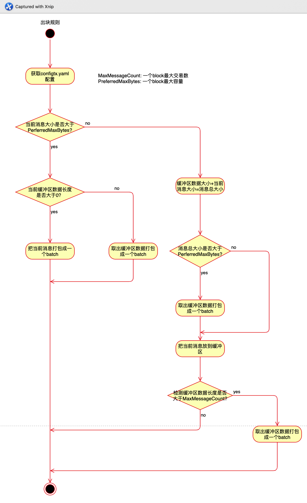

`environment:`      
`fabric v2.2.0`

## 出块规则
* 容量大于PreferredMaxBytes时出块
* 交易数量大于MaxMessageCount时出块
* 不满足上面条件，但有交易待出的话，超时BatchTimeout出块  
(参数都在configtx.yaml上设置)

## BlockCutter流程


## BlockCutter代码分析
代码位于：orderer/common/blockcutter/blockcutter.go，该模块用于将Envelope消息进行打包切分区块
```
// Ordered should be invoked sequentially as messages are ordered
//
// messageBatches length: 0, pending: false
//   - impossible, as we have just received a message
// messageBatches length: 0, pending: true
//   - no batch is cut and there are messages pending
// messageBatches length: 1, pending: false
//   - the message count reaches BatchSize.MaxMessageCount
// messageBatches length: 1, pending: true
//   - the current message will cause the pending batch size in bytes to exceed BatchSize.PreferredMaxBytes.
// messageBatches length: 2, pending: false
//   - the current message size in bytes exceeds BatchSize.PreferredMaxBytes, therefore isolated in its own batch.
// messageBatches length: 2, pending: true
//   - impossible
//
// Note that messageBatches can not be greater than 2.
// messageBatches的长度<=2
func (r *receiver) Ordered(msg *cb.Envelope) (messageBatches [][]*cb.Envelope, pending bool) {
	if len(r.pendingBatch) == 0 { // 判断当前批次是否为空，如果为空标记区块形成时间
		// We are beginning a new batch, mark the time
		r.PendingBatchStartTime = time.Now()
	}
	// 获取order配置，主要是获取BatchTimeout，MaxMessageCount， AbsoluteMaxBytes等上述三个参数用于判定形成区块的规则
	ordererConfig, ok := r.sharedConfigFetcher.OrdererConfig()
	if !ok {
		logger.Panicf("Could not retrieve orderer config to query batch parameters, block cutting is not possible")
	}

	batchSize := ordererConfig.BatchSize()
	// 获取当前消息大小
	messageSizeBytes := messageSizeBytes(msg)
	if messageSizeBytes > batchSize.PreferredMaxBytes { //当当前消息大于PreferredMaxBytes时，直接Cut形成区块Batch
		logger.Debugf("The current message, with %v bytes, is larger than the preferred batch size of %v bytes and will be isolated.", messageSizeBytes, batchSize.PreferredMaxBytes)

		// cut pending batch, if it has any messages
		// 该条件就是最多形成2个区块Batch的代码
		if len(r.pendingBatch) > 0 {
			messageBatch := r.Cut()
			messageBatches = append(messageBatches, messageBatch)
		}

		// create new batch with single message
		// 创建一个新的Batch只有该消息（大于PreferredMaxBytes值）
		messageBatches = append(messageBatches, []*cb.Envelope{msg})

		// Record that this batch took no time to fill
		r.Metrics.BlockFillDuration.With("channel", r.ChannelID).Observe(0)

		return
	}
	// 当消息不大于PreferredMaxBytes时，判断消息该消息与之前的消息大小是否大于PreferredMaxBytes
	messageWillOverflowBatchSizeBytes := r.pendingBatchSizeBytes+messageSizeBytes > batchSize.PreferredMaxBytes
	// 如果大于2MB(默认)则形成区块
	if messageWillOverflowBatchSizeBytes {
		logger.Debugf("The current message, with %v bytes, will overflow the pending batch of %v bytes.", messageSizeBytes, r.pendingBatchSizeBytes)
		logger.Debugf("Pending batch would overflow if current message is added, cutting batch now.")
		messageBatch := r.Cut()
		r.PendingBatchStartTime = time.Now()
		messageBatches = append(messageBatches, messageBatch)
	}

	logger.Debugf("Enqueuing message into batch")
	r.pendingBatch = append(r.pendingBatch, msg)
	r.pendingBatchSizeBytes += messageSizeBytes
	pending = true
	// 判断Batch消息是否大于MaxMessageCount，如果是则形成区块Batch
	if uint32(len(r.pendingBatch)) >= batchSize.MaxMessageCount {
		logger.Debugf("Batch size met, cutting batch")
		messageBatch := r.Cut()
		messageBatches = append(messageBatches, messageBatch)
		pending = false
	}

	return
}

// Cut returns the current batch and starts a new one
func (r *receiver) Cut() []*cb.Envelope {
	if r.pendingBatch != nil {
		r.Metrics.BlockFillDuration.With("channel", r.ChannelID).Observe(time.Since(r.PendingBatchStartTime).Seconds())
	}
	r.PendingBatchStartTime = time.Time{}
	batch := r.pendingBatch
	r.pendingBatch = nil
	r.pendingBatchSizeBytes = 0
	return batch
}
```
* Ordered为添加新的交易到缓冲区，返回messageBatches(即可以打包的block数组)和缓冲区状态pending
* messageBatches的长度不会超过2
* pending是留个超时是否打包来判断用的
* Cut函数为取出缓冲区打成一个block返回

## 超时打包代码
代码位于：orderer/consensus/solo/consensus.go
```
func (ch *chain) main() {
	// 创建打包超时定时器
	var timer <-chan time.Time
	var err error
	// 循环接收消息
	for {
		// 获取当前的配置序号
		seq := ch.support.Sequence()
		err = nil
		select {
		case msg := <-ch.sendChan:
			if msg.configMsg == nil {
				// NormalMsg
				if msg.configSeq < seq {
					_, err = ch.support.ProcessNormalMsg(msg.normalMsg)
					if err != nil {
						logger.Warningf("Discarding bad normal message: %s", err)
						continue
					}
				}
				// 把交易分组，每组为一个batch
				batches, pending := ch.support.BlockCutter().Ordered(msg.normalMsg)

				for _, batch := range batches {
					block := ch.support.CreateNextBlock(batch)
					ch.support.WriteBlock(block, nil)
				}

				switch {
				case timer != nil && !pending: // 如果计时开始但缓冲区没数据，把计时关掉
					// Timer is already running but there are no messages pending, stop the timer
					timer = nil
				case timer == nil && pending: // 如果计时没开始但缓冲区有数据，开始计时
					// Timer is not already running and there are messages pending, so start it
					timer = time.After(ch.support.SharedConfig().BatchTimeout())
					logger.Debugf("Just began %s batch timer", ch.support.SharedConfig().BatchTimeout().String())
				default:
					// Do nothing when:
					// 1. Timer is already running and there are messages pending
					// 2. Timer is not set and there are no messages pending
				}

			} 
            ... ...
		// 打包BatchTimeout超时定时器触发
		case <-timer:
			//clear the timer
			timer = nil
			// 直接对缓存的message进行Cut打包
			batch := ch.support.BlockCutter().Cut()
			// 如果batch为空，说明无消息可打包，继续等待消息
			if len(batch) == 0 {
				logger.Warningf("Batch timer expired with no pending requests, this might indicate a bug")
				continue
			}
			// 创建区块，写入账本
			logger.Debugf("Batch timer expired, creating block")
			block := ch.support.CreateNextBlock(batch)
			ch.support.WriteBlock(block, nil)
		// 接收到exit chan时退出主逻辑
		case <-ch.exitChan:
			logger.Debugf("Exiting")
			return
		}
	}
}
```
从上面代码可以看出如果缓冲区有数据就打开计时器，到超时如果还有数据在缓冲区的话就打包缓冲区里面的数据


参考:   
[Fabric 1.4源码详解（一）Order BlockCutter](https://blog.csdn.net/lym2088/article/details/103367685)