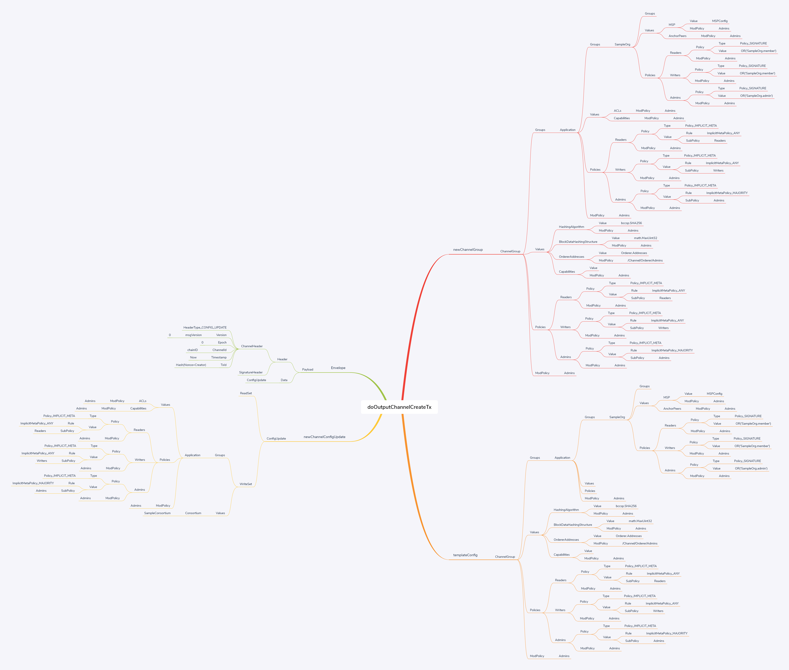
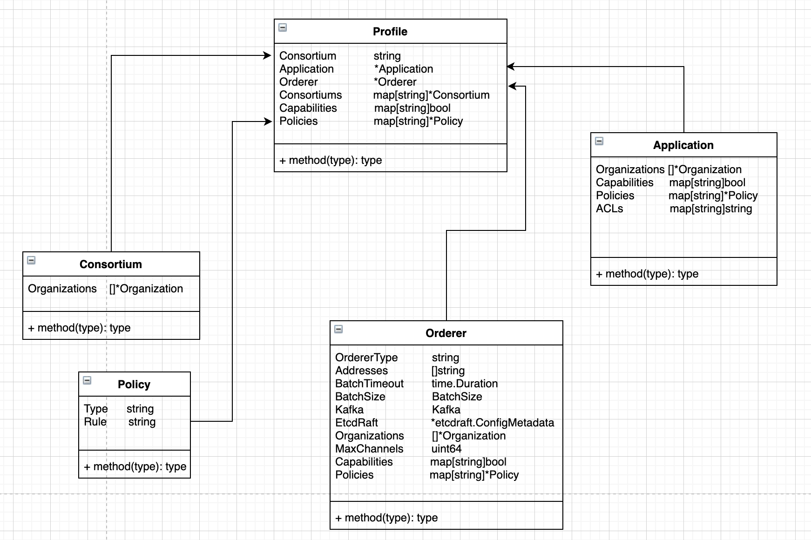

`环境:`  
`fabric: v2.2.0`  

# outputBlock


# doOutPutChannelCreateTx
`newChannelGroup-templateConfig=newChannelConfigUpdate>Envelope`


`configtxgen -profile TwoOrgsChannel -outputCreateChannelTx ./channel-artifacts/mychannel.tx -channelID mychannel`



入口函数:`cmd/configtxgen/main.go`
```
func main() {
	
    ... ... 
	logger.Info("Loading configuration")
	err := factory.InitFactories(nil)
	if err != nil {
		logger.Fatalf("Error on initFactories: %s", err)
	}
	var profileConfig *genesisconfig.Profile
	if outputBlock != "" || outputChannelCreateTx != "" || outputAnchorPeersUpdate != "" {
		if profile == "" {
			logger.Fatalf("The '-profile' is required when '-outputBlock', '-outputChannelCreateTx', or '-outputAnchorPeersUpdate' is specified")
		}

		if configPath != "" {
			// 从路径configPath读入配置文件，返回Profile
			profileConfig = genesisconfig.Load(profile, configPath)
		} else {
			// 如果没有路径会根据环境变量FABRIC_CFG_PATH读取配置文件
			profileConfig = genesisconfig.Load(profile)
		}
	}

    ... ...

	if outputChannelCreateTx != "" {
		// 生成并输出$(channelID).tx文件
		if err := doOutputChannelCreateTx(profileConfig, baseProfile, channelID, outputChannelCreateTx); err != nil {
			logger.Fatalf("Error on outputChannelCreateTx: %s", err)
		}
	}
    ... ...
}
```
`cmd/configtxgen/main.go`
```
// cmd/configtxgen/main.go
// 创建应用通道交易配置文件
func doOutputChannelCreateTx(conf, baseProfile *genesisconfig.Profile, channelID string, outputChannelCreateTx string) error {
	logger.Info("Generating new channel configtx")

	var configtx *cb.Envelope
	var err error
	if baseProfile == nil {
		// 返回Envelope结构体数据
		configtx, err = encoder.MakeChannelCreationTransaction(channelID, nil, conf)
	} else {
		configtx, err = encoder.MakeChannelCreationTransactionWithSystemChannelContext(channelID, nil, conf, baseProfile)
	}
	if err != nil {
		return err
	}

	//将指定的内容序列化为一个protobuf消息之后将其写入到由outputChannelCreateTx变量代表（用户指定的文件）的文件中。即生成最终的目标文件。
	logger.Info("Writing new channel tx")
	// 把configtx写入文件outputChannelCreateTx
	err = writeFile(outputChannelCreateTx, protoutil.MarshalOrPanic(configtx), 0640)
	if err != nil {
		return fmt.Errorf("error writing channel create tx: %s", err)
	}
	return nil
}
```


```
// MakeChannelCreationTransaction is a handy utility function for creating transactions for channel creation.
// It assumes the invoker has no system channel context so ignores all but the application section.
func MakeChannelCreationTransaction(
	channelID string,
	signer identity.SignerSerializer,
	conf *genesisconfig.Profile,
) (*cb.Envelope, error) {
	template, err := DefaultConfigTemplate(conf)
	if err != nil {
		return nil, errors.WithMessage(err, "could not generate default config template")
	}
	return MakeChannelCreationTransactionFromTemplate(channelID, signer, conf, template)
}
```


```
// NewChannelCreateConfigUpdate generates a ConfigUpdate which can be sent to the orderer to create a new channel.  Optionally, the channel group of the
// ordering system channel may be passed in, and the resulting ConfigUpdate will extract the appropriate versions from this file.
// 返回ConfigUpdate结构体，可以将它发送给Orderer以创建一个新通道。可选地，这个通道组可以传入Orderer系统通道，生成的ConfigUpdate将从该文件中提取适当的版本。
func NewChannelCreateConfigUpdate(channelID string, conf *genesisconfig.Profile, templateConfig *cb.ConfigGroup) (*cb.ConfigUpdate, error) {
	if conf.Application == nil {
		return nil, errors.New("cannot define a new channel with no Application section")
	}

	if conf.Consortium == "" {
		return nil, errors.New("cannot define a new channel with no Consortium value")
	}

	newChannelGroup, err := NewChannelGroup(conf)
	if err != nil {
		return nil, errors.Wrapf(err, "could not turn parse profile into channel group")
	}
	// 对比templateConfig和newChannelGroup，返回updt(ConfigUpdate)
	updt, err := update.Compute(&cb.Config{ChannelGroup: templateConfig}, &cb.Config{ChannelGroup: newChannelGroup})
	if err != nil {
		return nil, errors.Wrapf(err, "could not compute update")
	}

	// Add the consortium name to create the channel for into the write set as required.
	// 根据需要添加联盟名称，以便将通道创建到写入集中
	updt.ChannelId = channelID
	updt.ReadSet.Values[channelconfig.ConsortiumKey] = &cb.ConfigValue{Version: 0}
	updt.WriteSet.Values[channelconfig.ConsortiumKey] = &cb.ConfigValue{
		Version: 0,
		Value: protoutil.MarshalOrPanic(&cb.Consortium{
			Name: conf.Consortium,
		}),
	}

	return updt, nil
}
```


参考:   
[Hyperledger-Fabric源码分析（configtxgen-outputChannelCreateTx）](https://www.jianshu.com/p/58a10a36ae9a)       
[hyperledge工具-configtxgen](https://www.cnblogs.com/wanghui-garcia/p/10496849.html)        
[Hyperledger Fabric（V1.2）源码深度解析－使用configtxgen工具生成通道交易配置文件](https://www.chaindesk.cn/witbook/30/527)
