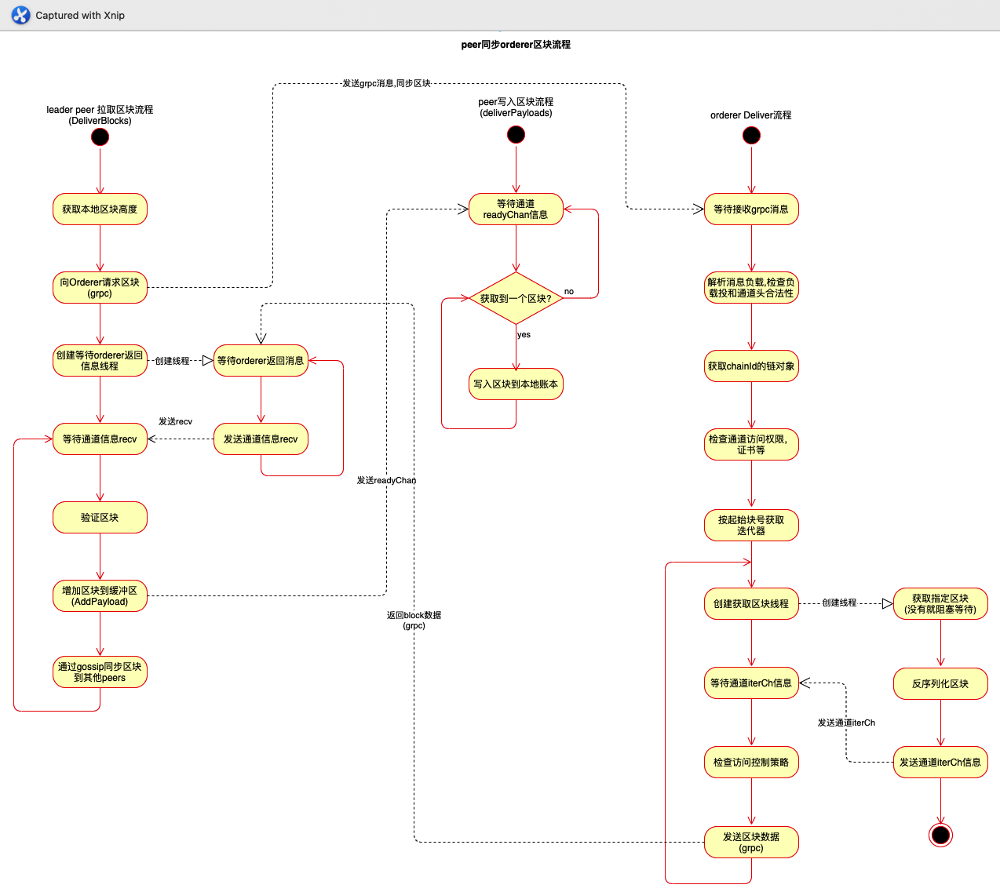

`environment:`      
`fabric v2.2.0`


## peer加入通道流程
* 接收加入通道命令
* 进行背书流程
* 调用CSCC系统链码
* Peer本地文件初始化、数据库初始化
* 开启gossip服务，leader Peer选举并连接orderer
  * leader peer开启一个不断向orderer请求区块的服务
  * 开启一个服务不断从gossip.payload获取区块写入账本
* 对于每个新创建的channel，需要install每一个sys chaincode（DeploySysCCs函数）


## peer&orderer deliver block流程图



## peer拉取区块和peer写入区块流程代码
在文件`internal/peer/channel/join.go`函数调用顺序为`joinCmd=>join=>executeJoin`，然后接着背书，调用CSCC系统链码。
CSCC链码在文件`core/scc/cscc/configure.go`，调用函数顺序`Invoke=>InvokeNoShim=>joinChain`

```
// joinChain will join the specified chain in the configuration block.
// Since it is the first block, it is the genesis block containing configuration
// for this chain, so we want to update the Chain object with this info
func (e *PeerConfiger) joinChain(
	channelID string,
	block *common.Block,
	deployedCCInfoProvider ledger.DeployedChaincodeInfoProvider,
	lr plugindispatcher.LifecycleResources,
	nr plugindispatcher.CollectionAndLifecycleResources,
) pb.Response {
	if err := e.peer.CreateChannel(channelID, block, deployedCCInfoProvider, lr, nr); err != nil {
		return shim.Error(err.Error())
	}

	return shim.Success(nil)
}
```
位于`core/peer/peer.go`的函数`CreateChannel`。
```
func (p *Peer) CreateChannel(
	cid string,
	cb *common.Block,
	deployedCCInfoProvider ledger.DeployedChaincodeInfoProvider,
	legacyLifecycleValidation plugindispatcher.LifecycleResources,
	newLifecycleValidation plugindispatcher.CollectionAndLifecycleResources,
) error {
	// 初始化本地文件，数据库等
	l, err := p.LedgerMgr.CreateLedger(cid, cb)
	if err != nil {
		return errors.WithMessage(err, "cannot create ledger from genesis block")
	}
	// 开启gossip服务，leader Peer选举并连接orderer的grpc服务
	if err := p.createChannel(cid, l, deployedCCInfoProvider, legacyLifecycleValidation, newLifecycleValidation); err != nil {
		return err
	}

	p.initChannel(cid)
	return nil
}
```
* `CreateLedger`函数主要是按照mychannel.block创建账本文件，db数据库等
* `createChannel`函数主要是开启gossip服务，请求orderer拉取block和写区块流程

这里主要看两个流程，对应上面流程图中peer写入区块流程:`createChannel=>InitializeChannel=>NewGossipStateProvider=>deliverPayloads`    
和leader peer拉取区块流程(设计节点为leader peer):`createChannel=>InitializeChannel=>StartDeliverForChannel=>DeliverBlocks`
### peer写入区块服务
直接看位于`gossip/state/state.go`的函数`deliverPayloads`
```
func (s *GossipStateProviderImpl) deliverPayloads() {
	for {
		select {
		// Wait for notification that next seq has arrived
		// 等待通道payloads readyChan接收信号
		case <-s.payloads.Ready():
			s.logger.Debugf("[%s] Ready to transfer payloads (blocks) to the ledger, next block number is = [%d]", s.chainID, s.payloads.Next())
			// Collect all subsequent payloads
			for payload := s.payloads.Pop(); payload != nil; payload = s.payloads.Pop() {
				rawBlock := &common.Block{}
				if err := pb.Unmarshal(payload.Data, rawBlock); err != nil {
					s.logger.Errorf("Error getting block with seqNum = %d due to (%+v)...dropping block", payload.SeqNum, errors.WithStack(err))
					continue
				}
				if rawBlock.Data == nil || rawBlock.Header == nil {
					s.logger.Errorf("Block with claimed sequence %d has no header (%v) or data (%v)",
						payload.SeqNum, rawBlock.Header, rawBlock.Data)
					continue
				}
				s.logger.Debugf("[%s] Transferring block [%d] with %d transaction(s) to the ledger", s.chainID, payload.SeqNum, len(rawBlock.Data.Data))

				// Read all private data into slice
				var p util.PvtDataCollections
				if payload.PrivateData != nil {
					err := p.Unmarshal(payload.PrivateData)
					if err != nil {
						s.logger.Errorf("Wasn't able to unmarshal private data for block seqNum = %d due to (%+v)...dropping block", payload.SeqNum, errors.WithStack(err))
						continue
					}
				}
				// 写入区块
				if err := s.commitBlock(rawBlock, p); err != nil {
					if executionErr, isExecutionErr := err.(*vsccErrors.VSCCExecutionFailureError); isExecutionErr {
						s.logger.Errorf("Failed executing VSCC due to %v. Aborting chain processing", executionErr)
						return
					}
					s.logger.Panicf("Cannot commit block to the ledger due to %+v", errors.WithStack(err))
				}
			}
		case <-s.stopCh:
			s.logger.Debug("State provider has been stopped, finishing to push new blocks.")
			return
		}
	}
}
```
这个服务就是不断的等待payloadbuffer出现消息，如果有就从buffer拿出block写到本地账本    
位于`gossip/state/payloads_buffer.go`就是payloadbuffer接口

### peer从orderer拉取区块服务
```
// DeliverBlocks used to pull out blocks from the ordering service to
// distributed them across peers
func (d *Deliverer) DeliverBlocks() {
	failureCounter := 0
	totalDuration := time.Duration(0)

	// InitialRetryDelay * backoffExponentBase^n > MaxRetryDelay
	// backoffExponentBase^n > MaxRetryDelay / InitialRetryDelay
	// n * log(backoffExponentBase) > log(MaxRetryDelay / InitialRetryDelay)
	// n > log(MaxRetryDelay / InitialRetryDelay) / log(backoffExponentBase)
	maxFailures := int(math.Log(float64(d.MaxRetryDelay)/float64(d.InitialRetryDelay)) / math.Log(backoffExponentBase))
	for {
		select {
		case <-d.DoneC:
			return
		default:
		}

		if failureCounter > 0 {
			var sleepDuration time.Duration
			if failureCounter-1 > maxFailures {
				sleepDuration = d.MaxRetryDelay
			} else {
				sleepDuration = time.Duration(math.Pow(1.2, float64(failureCounter-1))*100) * time.Millisecond
			}
			totalDuration += sleepDuration
			if totalDuration > d.MaxRetryDuration {
				if d.YieldLeadership {
					d.Logger.Warningf("attempted to retry block delivery for more than %v, giving up", d.MaxRetryDuration)
					return
				}
				d.Logger.Warningf("peer is a static leader, ignoring peer.deliveryclient.reconnectTotalTimeThreshold")
			}
			d.sleeper.Sleep(sleepDuration, d.DoneC)
		}
		// 获取本地账本区块高度
		ledgerHeight, err := d.Ledger.LedgerHeight()
		if err != nil {
			d.Logger.Error("Did not return ledger height, something is critically wrong", err)
			return
		}
		// 创建请求block的Envelope
		seekInfoEnv, err := d.createSeekInfo(ledgerHeight)
		if err != nil {
			d.Logger.Error("Could not create a signed Deliver SeekInfo message, something is critically wrong", err)
			return
		}
		// 请求连接orderer deliver服务
		deliverClient, endpoint, cancel, err := d.connect(seekInfoEnv)
		if err != nil {
			d.Logger.Warningf("Could not connect to ordering service: %s", err)
			failureCounter++
			continue
		}

		connLogger := d.Logger.With("orderer-address", endpoint.Address)

		recv := make(chan *orderer.DeliverResponse)
		go func() {
			for {
				// 等待orderer deliver服务的区块数据
				resp, err := deliverClient.Recv()
				if err != nil {
					connLogger.Warningf("Encountered an error reading from deliver stream: %s", err)
					close(recv)
					return
				}
				select {
				case recv <- resp:
				case <-d.DoneC:
					close(recv)
					return
				}
			}
		}()

	RecvLoop: // Loop until the endpoint is refreshed, or there is an error on the connection
		for {
			select {
			case <-endpoint.Refreshed:
				connLogger.Infof("Ordering endpoints have been refreshed, disconnecting from deliver to reconnect using updated endpoints")
				break RecvLoop
			// 等待recv通道消息，block数据
			case response, ok := <-recv:
				if !ok {
					connLogger.Warningf("Orderer hung up without sending status")
					failureCounter++
					break RecvLoop
				}
				// 处理消息
				err = d.processMsg(response)
				if err != nil {
					connLogger.Warningf("Got error while attempting to receive blocks: %v", err)
					failureCounter++
					break RecvLoop
				}
				failureCounter = 0
			case <-d.DoneC:
				break RecvLoop
			}
		}

		// cancel and wait for our spawned go routine to exit
		cancel()
		<-recv
	}
}
```
* 通过grpc向orderer deliver服务获取相应高度的区块
* 等待orderer deliver服务返回block数据

```
func (d *Deliverer) processMsg(msg *orderer.DeliverResponse) error {
	switch t := msg.Type.(type) {
	case *orderer.DeliverResponse_Status:
		if t.Status == common.Status_SUCCESS {
			return errors.Errorf("received success for a seek that should never complete")
		}

		return errors.Errorf("received bad status %v from orderer", t.Status)
	case *orderer.DeliverResponse_Block:
		blockNum := t.Block.Header.Number
		if err := d.BlockVerifier.VerifyBlock(gossipcommon.ChannelID(d.ChannelID), blockNum, t.Block); err != nil {
			return errors.WithMessage(err, "block from orderer could not be verified")
		}

		marshaledBlock, err := proto.Marshal(t.Block)
		if err != nil {
			return errors.WithMessage(err, "block from orderer could not be re-marshaled")
		}

		// Create payload with a block received
		payload := &gossip.Payload{
			Data:   marshaledBlock,
			SeqNum: blockNum,
		}

		// Use payload to create gossip message
		gossipMsg := &gossip.GossipMessage{
			Nonce:   0,
			Tag:     gossip.GossipMessage_CHAN_AND_ORG,
			Channel: []byte(d.ChannelID),
			Content: &gossip.GossipMessage_DataMsg{
				DataMsg: &gossip.DataMessage{
					Payload: payload,
				},
			},
		}

		d.Logger.Debugf("Adding payload to local buffer, blockNum = [%d]", blockNum)
		// Add payload to local state payloads buffer
		// 增加区块到payload buff
		if err := d.Gossip.AddPayload(d.ChannelID, payload); err != nil {
			d.Logger.Warningf("Block [%d] received from ordering service wasn't added to payload buffer: %v", blockNum, err)
			return errors.WithMessage(err, "could not add block as payload")
		}

		// Gossip messages with other nodes
		d.Logger.Debugf("Gossiping block [%d]", blockNum)
		// 同步区块到组织内的其他peer节点
		d.Gossip.Gossip(gossipMsg)
		return nil
	default:
		d.Logger.Warningf("Received unknown: %v", t)
		return errors.Errorf("unknown message type '%T'", msg.Type)
	}
}
```
收到从orderer deliver返回的block数据，然后处理block数据
* 把block数据push到payloadbuffer
* 同步区块到组织内的其他peer节点


## orderer deliver流程代码
orderer deliver grpc服务的入口函数Deliver位于`orderer/common/server/server.go`
```
// Deliver sends a stream of blocks to a client after ordering
func (s *server) Deliver(srv ab.AtomicBroadcast_DeliverServer) error {
	logger.Debugf("Starting new Deliver handler")
	defer func() {
		if r := recover(); r != nil {
			logger.Criticalf("Deliver client triggered panic: %s\n%s", r, debug.Stack())
		}
		logger.Debugf("Closing Deliver stream")
	}()
	// policyChecker策略检查器方法，用于检查消息是否满足ChannelReaders（/Channel/Readers）通道读权限策略
	policyChecker := func(env *cb.Envelope, channelID string) error {
		chain := s.GetChain(channelID)
		if chain == nil {
			return errors.Errorf("channel %s not found", channelID)
		}
		// In maintenance mode, we typically require the signature of /Channel/Orderer/Readers.
		// This will block Deliver requests from peers (which normally satisfy /Channel/Readers).
		sf := msgprocessor.NewSigFilter(policies.ChannelReaders, policies.ChannelOrdererReaders, chain)
		return sf.Apply(env)
	}
	// 创建deliverServer类型，Receiver消息追踪器
	deliverServer := &deliver.Server{
		PolicyChecker: deliver.PolicyCheckerFunc(policyChecker),
		Receiver: &deliverMsgTracer{
			Receiver: srv,
			msgTracer: msgTracer{
				debug:    s.debug,
				function: "Deliver",
			},
		},
		ResponseSender: &responseSender{
			AtomicBroadcast_DeliverServer: srv,
		},
	}
	return s.dh.Handle(srv.Context(), deliverServer)
}
```
接着看Handle`common/deliver/deliver.go`

```
// Handle receives incoming deliver requests.
func (h *Handler) Handle(ctx context.Context, srv *Server) error {
	addr := util.ExtractRemoteAddress(ctx)
	logger.Debugf("Starting new deliver loop for %s", addr)
	h.Metrics.StreamsOpened.Add(1)
	defer h.Metrics.StreamsClosed.Add(1)
	for {
		logger.Debugf("Attempting to read seek info message from %s", addr)
		envelope, err := srv.Recv()
		if err == io.EOF {
			logger.Debugf("Received EOF from %s, hangup", addr)
			return nil
		}
		if err != nil {
			logger.Warningf("Error reading from %s: %s", addr, err)
			return err
		}
		// 从Orderer节点本地指定通道的区块账本中获取请求的区块数据
		status, err := h.deliverBlocks(ctx, srv, envelope)
		if err != nil {
			return err
		}
		// 发送状态回应
		err = srv.SendStatusResponse(status)
		if status != cb.Status_SUCCESS {
			return err
		}
		if err != nil {
			logger.Warningf("Error sending to %s: %s", addr, err)
			return err
		}

		logger.Debugf("Waiting for new SeekInfo from %s", addr)
	}
}
```

```
func (h *Handler) deliverBlocks(ctx context.Context, srv *Server, envelope *cb.Envelope) (status cb.Status, err error) {
	addr := util.ExtractRemoteAddress(ctx)
	payload, chdr, shdr, err := h.parseEnvelope(ctx, envelope) // 解析消息负载payload，检查消息负载头和通道头的合法性
	if err != nil {
		logger.Warningf("error parsing envelope from %s: %s", addr, err)
		return cb.Status_BAD_REQUEST, nil
	}
	// 从多通道注册管理器字典里获取指定通道（ChainID）的链支持对象
	chain := h.ChainManager.GetChain(chdr.ChannelId)
	if chain == nil {
		// Note, we log this at DEBUG because SDKs will poll waiting for channels to be created
		// So we would expect our log to be somewhat flooded with these
		logger.Debugf("Rejecting deliver for %s because channel %s not found", addr, chdr.ChannelId)
		return cb.Status_NOT_FOUND, nil
	}

	labels := []string{
		"channel", chdr.ChannelId,
		"filtered", strconv.FormatBool(isFiltered(srv)),
		"data_type", srv.DataType(),
	}
	h.Metrics.RequestsReceived.With(labels...).Add(1)
	defer func() {
		labels := append(labels, "success", strconv.FormatBool(status == cb.Status_SUCCESS))
		h.Metrics.RequestsCompleted.With(labels...).Add(1)
	}()

	seekInfo := &ab.SeekInfo{}
	if err = proto.Unmarshal(payload.Data, seekInfo); err != nil {
		logger.Warningf("[channel: %s] Received a signed deliver request from %s with malformed seekInfo payload: %s", chdr.ChannelId, addr, err)
		return cb.Status_BAD_REQUEST, nil
	}

	erroredChan := chain.Errored()
	if seekInfo.ErrorResponse == ab.SeekInfo_BEST_EFFORT {
		// In a 'best effort' delivery of blocks, we should ignore consenter errors
		// and continue to deliver blocks according to the client's request.
		erroredChan = nil
	}
	select {
	case <-erroredChan:
		logger.Warningf("[channel: %s] Rejecting deliver request for %s because of consenter error", chdr.ChannelId, addr)
		return cb.Status_SERVICE_UNAVAILABLE, nil
	default:
	}
	// 构建访问控制对象accessControl，封装一些信息
	accessControl, err := NewSessionAC(chain, envelope, srv.PolicyChecker, chdr.ChannelId, h.ExpirationCheckFunc)
	if err != nil {
		logger.Warningf("[channel: %s] failed to create access control object due to %s", chdr.ChannelId, err)
		return cb.Status_BAD_REQUEST, nil
	}
	// 检查当前信息是否满足指定通道的访问权限，检查证书时间是否过期
	if err := accessControl.Evaluate(); err != nil {
		logger.Warningf("[channel: %s] Client %s is not authorized: %s", chdr.ChannelId, addr, err)
		return cb.Status_FORBIDDEN, nil
	}
	// 区块搜索信息seekInfo，检查请求范围是否合法
	if seekInfo.Start == nil || seekInfo.Stop == nil {
		logger.Warningf("[channel: %s] Received seekInfo message from %s with missing start or stop %v, %v", chdr.ChannelId, addr, seekInfo.Start, seekInfo.Stop)
		return cb.Status_BAD_REQUEST, nil
	}

	logger.Debugf("[channel: %s] Received seekInfo (%p) %v from %s", chdr.ChannelId, seekInfo, seekInfo, addr)

	cursor, number := chain.Reader().Iterator(seekInfo.Start)
	defer cursor.Close()
	var stopNum uint64
	switch stop := seekInfo.Stop.Type.(type) {
	case *ab.SeekPosition_Oldest:
		stopNum = number
	case *ab.SeekPosition_Newest:
		// when seeking only the newest block (i.e. starting
		// and stopping at newest), don't reevaluate the ledger
		// height as this can lead to multiple blocks being
		// sent when only one is expected
		if proto.Equal(seekInfo.Start, seekInfo.Stop) {
			stopNum = number
			break
		}
		stopNum = chain.Reader().Height() - 1
	case *ab.SeekPosition_Specified:
		stopNum = stop.Specified.Number
		if stopNum < number {
			logger.Warningf("[channel: %s] Received invalid seekInfo message from %s: start number %d greater than stop number %d", chdr.ChannelId, addr, number, stopNum)
			return cb.Status_BAD_REQUEST, nil
		}
	}

	for {
		if seekInfo.Behavior == ab.SeekInfo_FAIL_IF_NOT_READY {
			if number > chain.Reader().Height()-1 {
				return cb.Status_NOT_FOUND, nil
			}
		}

		var block *cb.Block
		var status cb.Status

		iterCh := make(chan struct{})
		go func() {
			block, status = cursor.Next() // 获取需要读取区块的游标cursor，会阻塞，等待下一个block的生成
			close(iterCh)
		}()

		select {
		case <-ctx.Done(): // peer主节点断开连接
			logger.Debugf("Context canceled, aborting wait for next block")
			return cb.Status_INTERNAL_SERVER_ERROR, errors.Wrapf(ctx.Err(), "context finished before block retrieved")
		case <-erroredChan:
			// TODO, today, the only user of the errorChan is the orderer consensus implementations.  If the peer ever reports
			// this error, we will need to update this error message, possibly finding a way to signal what error text to return.
			logger.Warningf("Aborting deliver for request because the backing consensus implementation indicates an error")
			return cb.Status_SERVICE_UNAVAILABLE, nil
		case <-iterCh: // 检查到有新block
			// Iterator has set the block and status vars
		}

		if status != cb.Status_SUCCESS {
			logger.Errorf("[channel: %s] Error reading from channel, cause was: %v", chdr.ChannelId, status)
			return status, nil
		}

		// increment block number to support FAIL_IF_NOT_READY deliver behavior
		number++
		// 再次检查是否满足访问控制策略
		if err := accessControl.Evaluate(); err != nil {
			logger.Warningf("[channel: %s] Client authorization revoked for deliver request from %s: %s", chdr.ChannelId, addr, err)
			return cb.Status_FORBIDDEN, nil
		}

		logger.Debugf("[channel: %s] Delivering block [%d] for (%p) for %s", chdr.ChannelId, block.Header.Number, seekInfo, addr)

		signedData := &protoutil.SignedData{Data: envelope.Payload, Identity: shdr.Creator, Signature: envelope.Signature}
		// 发送区块数据
		if err := srv.SendBlockResponse(block, chdr.ChannelId, chain, signedData); err != nil {
			logger.Warningf("[channel: %s] Error sending to %s: %s", chdr.ChannelId, addr, err)
			return cb.Status_INTERNAL_SERVER_ERROR, err
		}

		h.Metrics.BlocksSent.With(labels...).Add(1)

		if stopNum == block.Header.Number {
			break
		}
	}

	logger.Debugf("[channel: %s] Done delivering to %s for (%p)", chdr.ChannelId, addr, seekInfo)

	return cb.Status_SUCCESS, nil
}
```
值得注意的是这里，如果是拉取n+1高度区块的话(当前是区块高度n)，`cursor.Next()`会一直等待新的区块才返回
```
go func() {
  block, status = cursor.Next() // 获取需要读取区块的游标cursor，会阻塞，等待下一个block的生成
  close(iterCh)
}()
```


参考:   
[菜鸟系列 Fabric 源码学习 - 区块同步](https://www.h3399.cn/201911/737267.html)		 
[技术指南：Fabric中数据同步的实现](https://www.8btc.com/article/344455)         
[菜鸟系列Fabric源码学习 — 区块同步](https://blog.csdn.net/weixin_45714179/article/details/103323003)   
[Fabric v2.0 源码解析——典型的业务流程](https://blog.csdn.net/ice_fire_x/article/details/105290391)