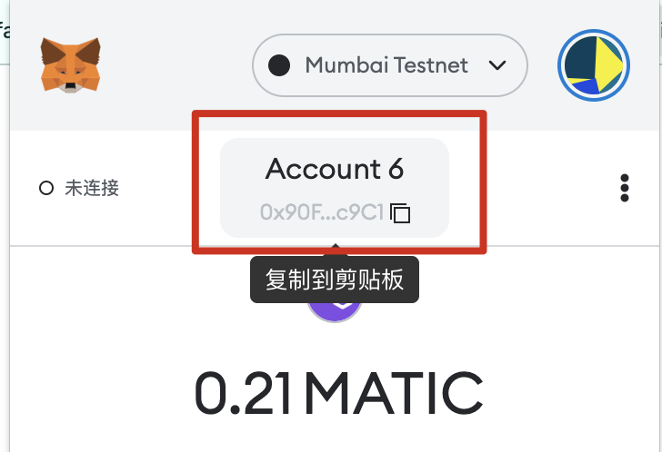
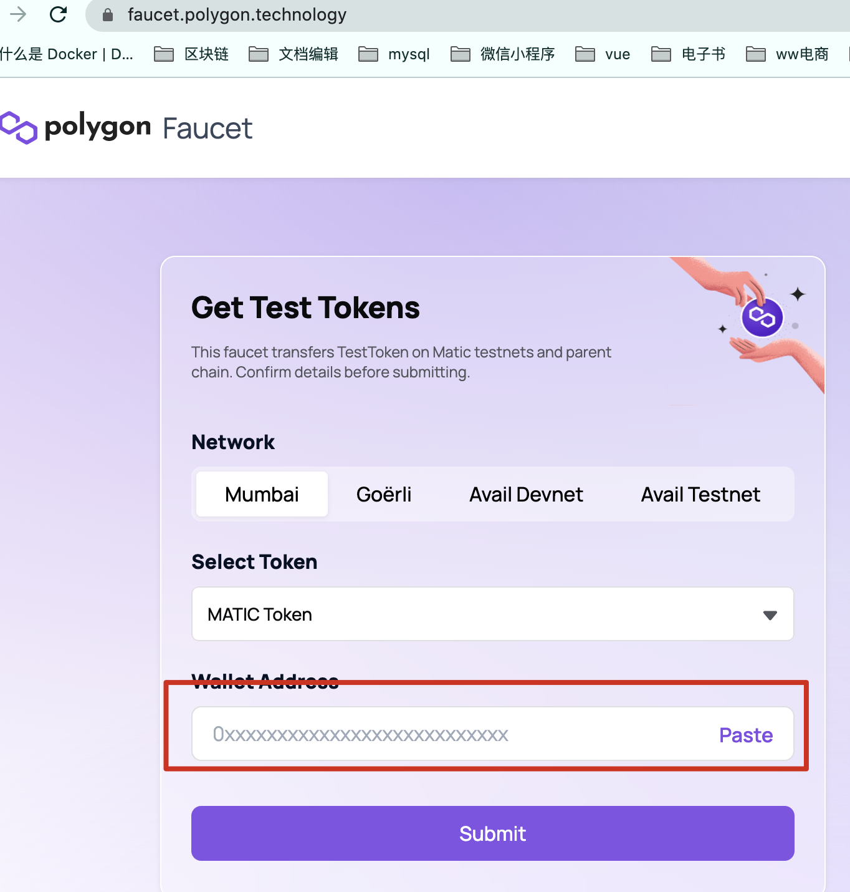
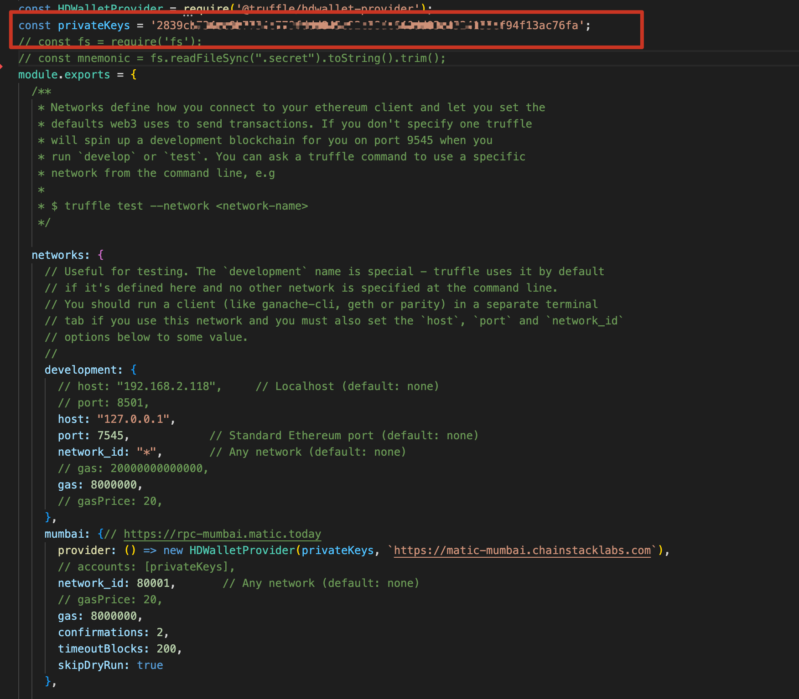

## Mumbai获取Matic代币

安装metamask插件，增加Mumbai测试网络


在metamask上创建账户:


打开链接 [https://faucet.polygon.technology/](https://faucet.polygon.technology/)
把创建好的账号复制到Wallet Address栏，按Submit，然后等1到2分钟就可以领取到matic代币，如下图




## 发布合约代码到Mumbai网络
从metamask上或者有matic代币的账号私钥


把私钥填到mecha-contract项目的truffle-config.js配置里



执行`truffle mirgate --network mumbai`发布全部合约到测试网
如果想发布某一个合约就执行`truffle mirgate -f 7 --to 7  --network mumbai`
如下是发布成功后的打印信息:
```
1_initial_migration.js
======================

   Deploying 'Migrations'
   ----------------------
   > transaction hash:    0x2c1914a9667bad810076eb618a243d3320992ee1dbea7b77e6f3d7e810cd6f41
   > Blocks: 3            Seconds: 14
   > contract address:    0x689A488055F23F236c2eca228718d1D6D6CFa9e8
   > block number:        26695776
   > block timestamp:     1654926383
   > account:             0xDf40D489563D6040daa47c87Cd785EcE2cB8d4a8
   > balance:             1.598583095713537048
   > gas used:            179786 (0x2be4a)
   > gas price:           1.000000008 gwei
   > value sent:          0 ETH
   > total cost:          0.000179786001438288 ETH

2_initial_mecha.js
==================

   Deploying 'MechaCore'
   ---------------------
   > transaction hash:    0xe58cbf21d8a3d49601e7b0f1b6802474b0fa2f6f25f1be7f8a6df5dbf77c433d
   > Blocks: 2            Seconds: 22
   > contract address:    0x2C27ca18e912c900AD43751E0Ee7c4C8D2577D26
   > block number:        26695809
   > block timestamp:     1654926559
   > account:             0xDf40D489563D6040daa47c87Cd785EcE2cB8d4a8
   > balance:             1.586905733620118152
   > gas used:            5801553 (0x588651)
   > gas price:           1.000000008 gwei
   > value sent:          0 ETH
   > total cost:          0.005801553046412424 ETH

   Pausing for 2 confirmations...
   ------------------------------
   > confirmation number: 1 (block: 26695810)
   > confirmation number: 2 (block: 26695811)

   > Saving migration to chain.
   > Saving artifacts
   -------------------------------------
   > Total cost:     0.005801553046412424 ETH

3_initial_sec.js
================

   Deploying 'SECERC20'
   --------------------
   > transaction hash:    0x0e6c8acf5569a22172685005a22a9dae55aa115ea98fb6f8db99bbc4fe9c8d56
   > Blocks: 1            Seconds: 10
   > contract address:    0xE184824A287d171DadfdDaFa90ab2350A52aB5aE
   > block number:        26695824
   > block timestamp:     1654926709
   > account:             0xDf40D489563D6040daa47c87Cd785EcE2cB8d4a8
   > balance:             1.586068643613421432
   > gas used:            811312 (0xc6130)
   > gas price:           1.000000008 gwei
   > value sent:          0 ETH
   > total cost:          0.000811312006490496 ETH

   Pausing for 2 confirmations...
   ------------------------------
   > confirmation number: 1 (block: 26695825)
   > confirmation number: 2 (block: 26695826)

   > Saving migration to chain.
   > Saving artifacts
   -------------------------------------
   > Total cost:     0.000811312006490496 ETH
   
4_initial_mec.js
================

   Deploying 'MECERC20'
   --------------------
   > transaction hash:    0x15ccdc9794ccfbcb0cad95905b703938dc420246b615bae364508f984f789d94
   > Blocks: 1            Seconds: 14
   > contract address:    0xd7c5292BC46333c4212DaacB10FD82B6D1cb1214
   > block number:        26695832
   > block timestamp:     1654926789
   > account:             0xDf40D489563D6040daa47c87Cd785EcE2cB8d4a8
   > balance:             1.585183972606344064
   > gas used:            856093 (0xd101d)
   > gas price:           1.000000008 gwei
   > value sent:          0 ETH
   > total cost:          0.000856093006848744 ETH

   Pausing for 2 confirmations...
   ------------------------------
   > confirmation number: 1 (block: 26695833)
   > confirmation number: 2 (block: 26695834)

   > Saving migration to chain.
   > Saving artifacts
   -------------------------------------
   > Total cost:     0.000856093006848744 ETH

5_initial_hlc.js
================

   Deploying 'HLCERC20'
   --------------------
   > transaction hash:    0xd26c349f7623c4310e725366a284af7ffb4fef2496d7dddfe789b7b841ce6919
   > Blocks: 2            Seconds: 10
   > contract address:    0x54B62465192101eeF3fDC3eD6dde7E2ccbe0F51B
   > block number:        26695741
   > block timestamp:     1654926207
   > account:             0xDf40D489563D6040daa47c87Cd785EcE2cB8d4a8
   > balance:             1.598762881714975336
   > gas used:            1205583 (0x12654f)
   > gas price:           1.000000008 gwei
   > value sent:          0 ETH
   > total cost:          0.001205583009644664 ETH

   Pausing for 2 confirmations...
   ------------------------------
   > confirmation number: 1 (block: 26695743)
   > confirmation number: 3 (block: 26695745)
   > Saving artifacts
   -------------------------------------
   > Total cost:     0.001205583009644664 ETH

6_initial_mlc.js
================

   Deploying 'MLCERC20'
   --------------------
   > transaction hash:    0xc6eafebdb1126f84d18db8996bec6ec049f93462e8ec594d80b4f3b92e4f4406
   > Blocks: 2            Seconds: 18
   > contract address:    0x89942A1FDd7C70B7DbEf1a54C85fB6c7360963e3
   > block number:        26695842
   > block timestamp:     1654926889
   > account:             0xDf40D489563D6040daa47c87Cd785EcE2cB8d4a8
   > balance:             1.583949811596470776
   > gas used:            1205583 (0x12654f)
   > gas price:           1.000000008 gwei
   > value sent:          0 ETH
   > total cost:          0.001205583009644664 ETH

   Pausing for 2 confirmations...
   ------------------------------
   > confirmation number: 1 (block: 26695843)
   > confirmation number: 2 (block: 26695844)

   > Saving migration to chain.
   > Saving artifacts
   -------------------------------------
   > Total cost:     0.001205583009644664 ETH
   
7_initial_llc.js
================

   Deploying 'LLCERC20'
   --------------------
   > transaction hash:    0x8903f65c821e6720d8cb115232776fd9b1c4d6955af66c9a458d4a137068025c
   > Blocks: 1            Seconds: 14
   > contract address:    0xC92B5E981a223931d15F9782E9910E21C02e241E
   > block number:        26695850
   > block timestamp:     1654926969
   > account:             0xDf40D489563D6040daa47c87Cd785EcE2cB8d4a8
   > balance:             1.582715650586597488
   > gas used:            1205583 (0x12654f)
   > gas price:           1.000000008 gwei
   > value sent:          0 ETH
   > total cost:          0.001205583009644664 ETH

   Pausing for 2 confirmations...
   ------------------------------
   > confirmation number: 1 (block: 26695851)
   > confirmation number: 2 (block: 26695852)

   > Saving migration to chain.
   > Saving artifacts
   -------------------------------------
   > Total cost:     0.001205583009644664 ETH
```

参考:
https://wiki.aavegotchi.com/cn/mumbai-testnet     
https://docs.polygon.technology/docs/develop/truffle/
