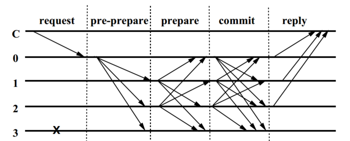

## 支持拜占庭故障的共识算法
### POW
    工作量证明共识机制，俗称挖矿。要想生产新的区块，就必须进行成千上万次哈希碰撞的运算。而这些运算，会消耗很多电力，造成能源浪费，因此也倍受垢病。更让大家担心的是，一旦大部分算力被垄断，去中心化就受到威胁。

### POS（Proof of Stake，权益证明）   
    根据你持有货币的量和时间进行利息分配的制度，在POS模式下，你的“挖矿”收益正比于你的币龄，而与电脑的计算性能无关。  
    在POS机制中，仍然存在算力挖矿，需要算力解决一个数学难题。但数学难题的难度和持币者的“币龄”相关。简单来说，持币者持有币的时间越长，难题越简单，挖到币的概率越大。   
    每个币每天产生1币龄，比如你持有100个币，总共持有了30天，那么，此时你的币龄就为3000，这个时候，如果你发现了一个POS区块，你的币龄就会被清空为0。你每被清空365币龄，你将会从区块中获得0.05个币的利息（等同于手中持有币就可以得到相应的利息）。 
 `hash (block_header) < target * coinage`

参考:   
[pos算法原理（详解pos共识算法的特点）](https://www.changchenghao.cn/n/696777.html)     
[POS共识机制竟然漏洞这么多 | 分析POS共识机制的原理带来的思考](https://blog.51cto.com/wenxing/3044739)

### POA
  

### PBFT
   PBFT算法解决了拜占庭将军问题    
   拜占庭是古代东罗马帝国的首都，为了防御在每块封地都驻扎一支由单个将军带领的军队，将军之间只能靠信差传递消息。在战争时，所有将军必须达成共识，决定是否共同开战。   
   但是，在军队内可能有叛徒，这些人将影响将军们达成共识。拜占庭将军问题是指在已知有将军是叛徒的情况下，剩余的将军如何达成一致决策的问题    
   `在一个由(3f+1)个节点构成的系统中，只要有不少于(2f+1)个非恶意节点正常工作，该系统就能达成一致性，如：7个节点的系统中允许2个节点出现拜占庭错误。`
     
* REQUEST
  * 客户端向主节点发出请求
* PRE-PREPARE
  * 主节点收到请求进行消息校验
  * 广播消息给其他副节点
* PREPARE
  * 副节点收到主节点消息后进行校验
  * 副节点向其他节点发送消息
* COMMIT
  * 主节点和副本节点收到PREPARE消息后验证消息
  * 若是副本节点i收到了2f+1个验证经过的PREPARE消息，则向其余节点包括主节点发送一条消息
* REPLY
  * 主节点和副本节点收到COMMIT消息后进行校验
  * 若是副本节点i收到了2f+1个验证经过的COMMIT消息，说明当前网络中的大部分节点已经达成共识，返回给客户端

参考:   
[深刻浅出PBFT算法原理](https://www.shangmayuan.com/a/2acd71700a4d437d98712c8c.html)

## 支持非拜占庭故障的共识算法
### RAFT
Raft是一个分布式崩溃故障容错共识算法，它可以保证在系统中部分节点出现非拜占庭故障的情况下，系统依然可以处理客户端的请求。   

节点状态:  
* 领导状态
* 跟随状态
* 候选状态

#### 领导人选举
* 节点刚启动的时候都是跟随者状态，就有跟随者变成候选状态
* 如果跟随者没有收到领导者发出的心跳(领导者离线),也会有跟随者变成候选人
* 候选人向其他节点发出请求投票  
* 其他节点会进行投票表决   
* 当得到大半投票(f/2+1,包括自己那一票)，候选人变成领导者   
`客户端只会跟领导者进行交互`     
`选举超时随机到150到300之间，没个节点不一样`     
任期term

#### 日志复制
* 客户端向领导者发送一个`set 5`操作
* 领导者向自己日志中做了一个更新(add)操作
* 领导者向其他跟随者发送`set 5`操作，让其他跟随者进行更新(add)操作
* 领导等到大多数(f/2+1)跟随者的更新回复，领导者进行日志提交，然后让其他跟随者也进行日志提交
`日志状态，更新=>提交`

Raft在复制状态机架构中扮演什么角色？  
Raft的作用是确保跟随节点的日志与主导节点的日志保持一致（即：日志复制），这样整个分布式系统的行为看起来是一致的，即使部分节点出现故障也没有影响。   
另一个问题，客户端是否需要了解哪个是主导节点？    
答案是NO，客户端可以向任何一个节点发送请求，如果该节点是主导节点，那么它会直接处理请求，否则的话，该节点会转发请求给主导节点。    

视频: [彻底搞懂Raft算法](https://www.bilibili.com/video/BV1Ev411t7jh/?spm_id_from=333.788.recommend_more_video.-1)   
动画: https://raft.github.io/raftscope/index.html   

参考:  
[HYPERLEDGER FABRIC RAFT共识详解](https://www.freesion.com/article/2585407398/)   

### Paxos

参考:   
[Paxos共识算法详解](https://juejin.cn/post/6844903817297788942)    
[浅谈 CAP 和 Paxos 共识算法](https://www.jiqizhixin.com/articles/2020-02-20-3)

### Kafka
### Zookeeper
  

### DPOS  
    DPOS 共识最大的特征，就是在 POS 权益证明的基础之上，加入了现实世界中议会选举制度。  
    EOS 的超级节点，就是从 100 个备用节点中，经过所有持币用户投票选举诞生的最终获得记帐权的 21 个节点。
