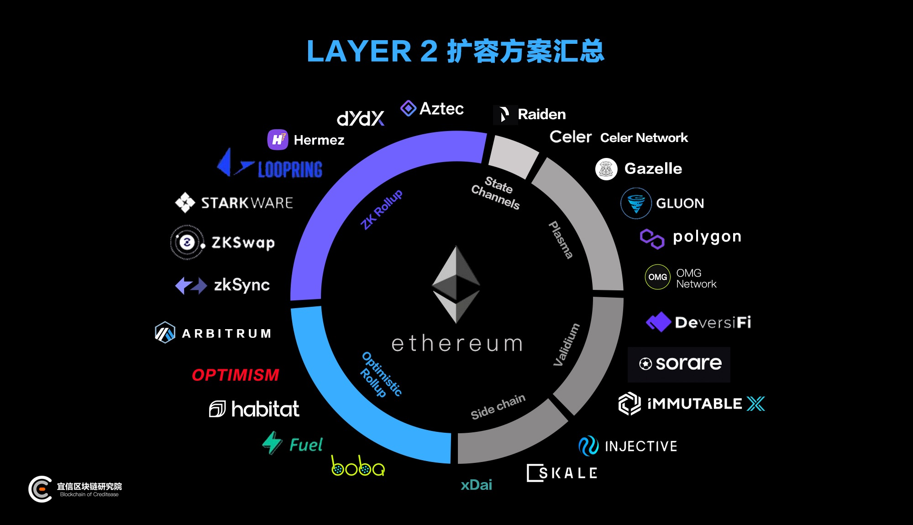

Layer2扩容方案：
* 状态通道（State Channels）
* 侧链（Sidechain）
* Plasma
* Rollup
* Validium。

[科普 | 一文对比以太坊Layer2扩容方案](https://www.8btc.com/media/6699616)      
[一文读懂以太坊的各大扩容方案](https://learnblockchain.cn/article/3114)