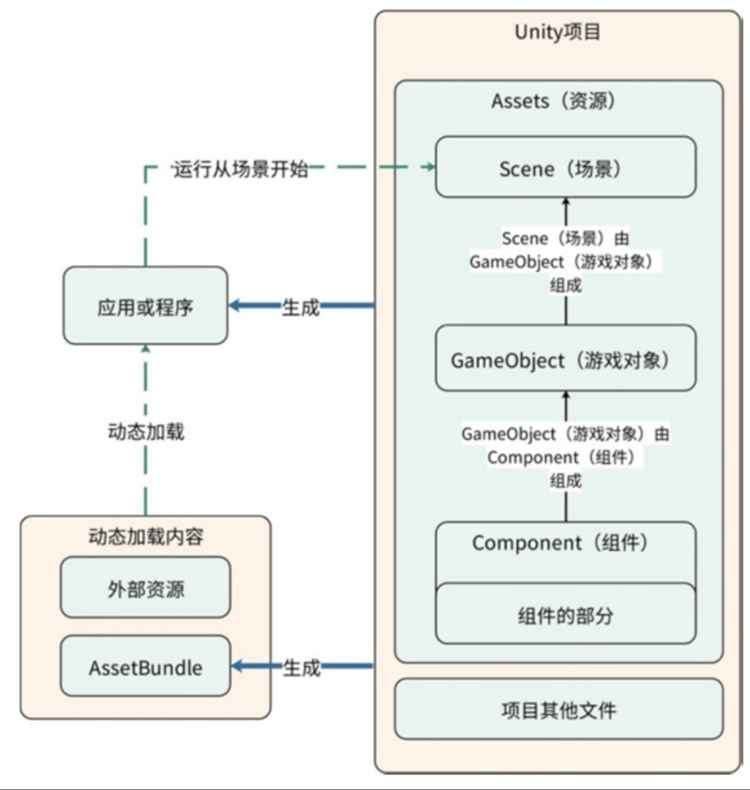

### 基本概念
* 坐标系(左手，右手坐标系)
* 支持牛顿力学三大定理(惯性定律，运动定律，作用于反作用力)
* 游戏对象(GameObject),每一个游戏对象都有一个Transform。Transform不止包含位置信息，还包含旋转和缩放信息
* 组件，组成游戏对象的东西叫作组件(Component)。不同的组件组成了不同的游戏对象，使其拥有了不同的功能。Transform是组件，开发者写的代码（也就是脚本(Scripts)）也是一种重要的组件。
* 场景，想要一次把一整个Unity的虚拟世界全部创造出来，很累也没有必要，所以每次创造的都是Unity的虚拟世界的一个碎片，这个碎片就叫场景(Scene)。Unity通过不同的场景来讲述或者展现被创造出来的一个或者几个虚拟世界。
* 摄像机，想要一次把一整个Unity的虚拟世界全部创造出来，很累也没有必要，所以每次创造的都是Unity的虚拟世界的一个碎片，这个碎片就叫场景(Scene)。Unity通过不同的场景来讲述或者展现被创造出来的一个或者几个虚拟世界。想要一次把一整个Unity的虚拟世界全部创造出来，很累也没有必要，所以每次创造的都是Unity的虚拟世界的一个碎片，这个碎片就叫场景(Scene)。Unity通过不同的场景来讲述或者展现被创造出来的一个或者几个虚拟世界。
* 资源，Unity世界中的内容最终都由资源(Asset)组成。一个资源可以是一个场景，也可以是一个游戏对象，或者是一个组件，或者是组件的一个组成部分。凡是没有成为资源的内容是无法直接进入场景的（动态加载除外）。


### 切换场景
```C#
UnityEngine.SceneManagement.SceneManager.LoadScene(1);
```
### 动画制作
点击物体，然后ctrl + 6，调出动面板


### 相机跟随


参考:
[unity 3D游戏开发学习资料集合(入门进阶必备，建议收藏)](https://juejin.cn/post/7067059880686780447)  
免费 2020 unity3d/u3d 100套成品游戏源码完整项目可运行工程资源合集:  
https://pan.baidu.com/s/1twpvb1Yja-fJJ790uXKAvg 密码:tk7z