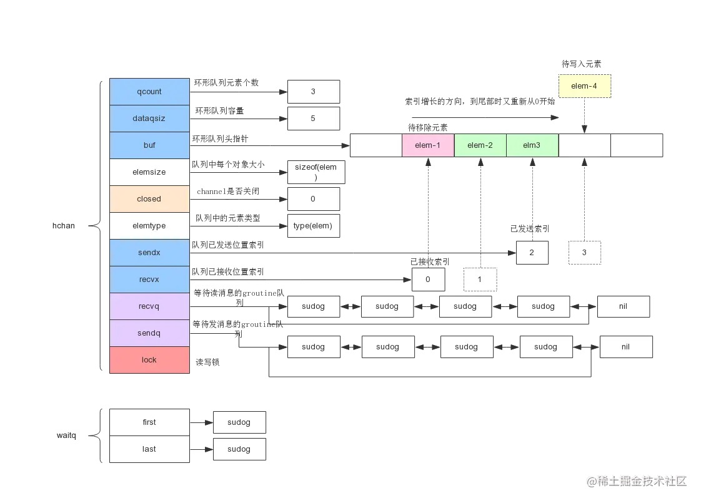

`go1.16.5`


`汇编指令: go tool compile -N -l -S hello.go>hello.s`


&emsp;&emsp;下面从源码结构上分析channel

### channel数据结构



```
type hchan struct {
	// 当前队列中buf总元素个数
	qcount uint // total data in the queue
	// 环形队列长度，即缓冲区大小（申明channel时指定的大小）
	dataqsiz uint // size of the circular queue
	// 环形队列指针
	buf unsafe.Pointer // points to an array of dataqsiz elements
	// buf中每个元素的大小
	elemsize uint16
	// 当前通道是否处于关闭状态，创建通道时该字段为0，关闭时字段为1
	closed uint32
	// 元素类型，用于传值过程的赋值
	elemtype *_type // element type
	// 环形缓冲区中已发送位置索引
	sendx uint // send index
	// 环形缓冲区中已接收位置索引
	recvx uint // receive index
	// 等待读消息的groutine队列
	recvq waitq // list of recv waiters
	// 等待写消息的groutine队列
	sendq waitq // list of send waiters

	// 互斥锁，为每个读写操作锁定通道（发送和接收必须互斥）
	lock mutex
}
```
### 创建通道

```
func makechan(t *chantype, size int) *hchan {
	elem := t.elem

	// compiler checks this but be safe.
	// 缓冲区中元素类型的尺寸不能超过16k
	if elem.size >= 1<<16 {
		throw("makechan: invalid channel element type")
	}
	// 判断是否位数对齐
	if hchanSize%maxAlign != 0 || elem.align > maxAlign {
		throw("makechan: bad alignment")
	}
	// 计算缓冲区的总长度，并判断是否溢出
	mem, overflow := math.MulUintptr(elem.size, uintptr(size))
	if overflow || mem > maxAlloc-hchanSize || size < 0 {
		panic(plainError("makechan: size out of range"))
	}

	// Hchan does not contain pointers interesting for GC when elements stored in buf do not contain pointers.
	// buf points into the same allocation, elemtype is persistent.
	// SudoG's are referenced from their owning thread so they can't be collected.
	// TODO(dvyukov,rlh): Rethink when collector can move allocated objects.
	var c *hchan
	switch {
	case mem == 0:
		// no buffer 的场景，这种 channel 可以看成 pipe；
		// channel长度或者元素类型尺寸为0时，也就是缓冲区长度为0时，只用分配hchan所占用的内存空间。
		// Queue or element size is zero.
		c = (*hchan)(mallocgc(hchanSize, nil, true))
		// Race detector uses this location for synchronization.
		c.buf = c.raceaddr()
	case elem.ptrdata == 0:
		// channel 元素不含指针的场景，那么是分配出一个大内存块；
		// 元素类型不是指针类型，则将hchan和buf一次性分配出来
		// Elements do not contain pointers.
		// Allocate hchan and buf in one call.
		c = (*hchan)(mallocgc(hchanSize+mem, nil, true))
		// 缓冲区buf的指针位置在c+hchanSize（hchanSize补齐为8的倍数）
		c.buf = add(unsafe.Pointer(c), hchanSize)
	default:
		// 默认场景，hchan 结构体和 buffer 内存块单独分配；
		// 元素类型是指针类型，hchan和缓冲区单独分配
		// Elements contain pointers.
		c = new(hchan)
		c.buf = mallocgc(mem, elem, true)
	}
	// channel 元素大小，如果是 int，那么就是 8 字节；
	c.elemsize = uint16(elem.size)
	// 元素类型，这样就知道 channel 里面每个元素究竟是啥了；
	c.elemtype = elem
	// 元素 buffer 数组的大小，比如 make(chan int, 2)，那么这里赋值的就是 2；
	c.dataqsiz = uint(size)
	lockInit(&c.lock, lockRankHchan)

	if debugChan {
		print("makechan: chan=", c, "; elemsize=", elem.size, "; dataqsiz=", size, "\n")
	}
	return c
}
```
&emsp;&emsp;创建channel时，可以往channel中放入不同类型的数据，不同类型数据占用的空间大小也是不一样的，这决定了hchan和hchan中的buf字段需要开辟多大的存储空间。在go的源码中对不同的情况做不同的处理。包括三种情况：
* 如果是不带buffer的channel ，那么只需要分配出一个hchan结构体即可
* 如果channel元素（elem）内不含指针，那么hchan和buffer其实是可以在一起分配的，hchan和elem buffer的内存块连续；需要开辟的内存空间=hchan本身大小+每个元素的大小*申请的队列长度
* 如果channel元素（elem）是带有指针的，那么hchan和buffer就不能分配在一起，所以先new一个hchan结构，再单独分配elem buffer数组；这种情况下buf需要单独开辟空间，buf占用内存大小为每个元素的大小*申请的队列长度
`总体的原则是：总内存大小 = hchan需要的内存大小 + 元素需要的内存大小`

### 数据发送channel
```
func chansend(c *hchan, ep unsafe.Pointer, block bool, callerpc uintptr) bool {
	if c == nil {
		if !block { // 非阻塞模式直接退出
			return false
		}
		// 从这里可以观察到，向一个nil的channel中发送一个值将会导致永久阻塞
		gopark(nil, nil, waitReasonChanSendNilChan, traceEvGoStop, 2)
		throw("unreachable")
	}

	if debugChan {
		print("chansend: chan=", c, "\n")
	}

	if raceenabled {
		racereadpc(c.raceaddr(), callerpc, funcPC(chansend))
	}

	if !block && c.closed == 0 && full(c) { // 非阻塞模式下，没收可接收数据
		return false
	}

	var t0 int64
	if blockprofilerate > 0 {
		t0 = cputicks()
	}
	// 进行上锁，防止出现并发问题
	lock(&c.lock)

	if c.closed != 0 { // 通道已经关闭，解锁的同时panic,这也证实了向一个已经关闭的通道发送值会导致panic
		unlock(&c.lock)
		panic(plainError("send on closed channel"))
	}
	// 从等待接收的队列链表中取出一个接收者，进行值的拷贝
	if sg := c.recvq.dequeue(); sg != nil {
		// Found a waiting receiver. We pass the value we want to send
		// directly to the receiver, bypassing the channel buffer (if any).
		send(c, sg, ep, func() { unlock(&c.lock) }, 3)
		return true
	}

	if c.qcount < c.dataqsiz {
		// Space is available in the channel buffer. Enqueue the element to send.
		// 当该通道时bufferedChannel时，缓冲区还未满的情况下，从缓冲区中取出一个内存块
		qp := chanbuf(c, c.sendx)
		if raceenabled {
			racenotify(c, c.sendx, nil)
		}
		// 将数据拷贝到 buf 中
		typedmemmove(c.elemtype, qp, ep)
		c.sendx++
		if c.sendx == c.dataqsiz {
			c.sendx = 0
		}
		c.qcount++
		unlock(&c.lock)
		return true
	}

	if !block {// 非阻塞模式下直接返回，无需等待
		unlock(&c.lock)
		return false
	}

	// Block on the channel. Some receiver will complete our operation for us.
	// 获取当前goroutine
	gp := getg()
	mysg := acquireSudog()
	mysg.releasetime = 0
	if t0 != 0 {
		mysg.releasetime = -1
	}
	// No stack splits between assigning elem and enqueuing mysg
	// on gp.waiting where copystack can find it.
	mysg.elem = ep
	mysg.waitlink = nil
	mysg.g = gp
	mysg.isSelect = false
	mysg.c = c
	gp.waiting = mysg
	gp.param = nil
	// 将mysg插入到发送队列的尾部
	c.sendq.enqueue(mysg)
	atomic.Store8(&gp.parkingOnChan, 1)
	// 进行channel的解锁，并且将当前goroutine置为waiting状态。
	gopark(chanparkcommit, unsafe.Pointer(&c.lock), waitReasonChanSend, traceEvGoBlockSend, 2)
	// 这里进行保活一下，防止接受者还没有拷贝过去，这个值就已经被gc给回收了
	KeepAlive(ep)

	// someone woke us up.
	// G被唤醒
	if mysg != gp.waiting {
		throw("G waiting list is corrupted")
	}
	gp.waiting = nil
	gp.activeStackChans = false
	closed := !mysg.success
	gp.param = nil
	if mysg.releasetime > 0 {
		blockevent(mysg.releasetime-t0, 2)
	}
	mysg.c = nil
	// G被唤醒，状态改成可执行状态，从这里开始继续执行
	releaseSudog(mysg)
	if closed {
		if c.closed == 0 {
			throw("chansend: spurious wakeup")
		}
		panic(plainError("send on closed channel"))
	}
	return true
}
```

* 判断recvq列队是否有等待接收数据的goroutine，如果有直接把数据发给等待接收数据的goroutine，然后唤醒该goroutine；
* 如果没有等待接收数据的goroutine，就把数据放到缓存buf(只有缓存型channel才有这一步)
* 如果列队满了，就把当前发送goroutine放到sendq列队中，等待有接收数据的goroutine才能被取出唤醒。

### 从channel接收数据

```
func chanrecv(c *hchan, ep unsafe.Pointer, block bool) (selected, received bool) {
	// raceenabled: don't need to check ep, as it is always on the stack
	// or is new memory allocated by reflect.

	if debugChan {
		print("chanrecv: chan=", c, "\n")
	}

	if c == nil {
		if !block { // 如果是非阻塞模式，直接返回
			return
		}
		// 向一个nil的channel中读取一个值将会导致永久阻塞
		gopark(nil, nil, waitReasonChanReceiveNilChan, traceEvGoStop, 2)
		throw("unreachable")
	}

	// Fast path: check for failed non-blocking operation without acquiring the lock.
	if !block && empty(c) {// 非阻塞，没数据等待接收，直接返回
		// After observing that the channel is not ready for receiving, we observe whether the
		// channel is closed.
		//
		// Reordering of these checks could lead to incorrect behavior when racing with a close.
		// For example, if the channel was open and not empty, was closed, and then drained,
		// reordered reads could incorrectly indicate "open and empty". To prevent reordering,
		// we use atomic loads for both checks, and rely on emptying and closing to happen in
		// separate critical sections under the same lock.  This assumption fails when closing
		// an unbuffered channel with a blocked send, but that is an error condition anyway.
		if atomic.Load(&c.closed) == 0 {
			// Because a channel cannot be reopened, the later observation of the channel
			// being not closed implies that it was also not closed at the moment of the
			// first observation. We behave as if we observed the channel at that moment
			// and report that the receive cannot proceed.
			return
		}
		// The channel is irreversibly closed. Re-check whether the channel has any pending data
		// to receive, which could have arrived between the empty and closed checks above.
		// Sequential consistency is also required here, when racing with such a send.
		if empty(c) {
			// The channel is irreversibly closed and empty.
			if raceenabled {
				raceacquire(c.raceaddr())
			}
			if ep != nil {
				typedmemclr(c.elemtype, ep)
			}
			return true, false
		}
	}

	var t0 int64
	if blockprofilerate > 0 {
		t0 = cputicks()
	}
	// 进行上锁，防止出现并发问题
	lock(&c.lock)

	if c.closed != 0 && c.qcount == 0 {
		if raceenabled {
			raceacquire(c.raceaddr())
		}
		unlock(&c.lock)
		if ep != nil {
			typedmemclr(c.elemtype, ep)
		}
		return true, false
	}
	// 从发送列队sendq中取出一个等待发送者，进行数据的获取
	if sg := c.sendq.dequeue(); sg != nil {
		// Found a waiting sender. If buffer is size 0, receive value
		// directly from sender. Otherwise, receive from head of queue
		// and add sender's value to the tail of the queue (both map to
		// the same buffer slot because the queue is full).
		recv(c, sg, ep, func() { unlock(&c.lock) }, 3)
		return true, true
	}

	if c.qcount > 0 { // buf列队中有数据
		// Receive directly from queue
		// 从接收数据的索引出取出数据
		// 等价于 c.buf[c.recvx]
		qp := chanbuf(c, c.recvx)
		if raceenabled {
			racenotify(c, c.recvx, nil)
		}
		if ep != nil {
			// 将数据拷贝到接收数据的协程
			typedmemmove(c.elemtype, ep, qp)
		}
		typedmemclr(c.elemtype, qp)
		// 接收数据的索引前移
		c.recvx++
		// 环形队列，如果到了末尾，再从0开始
		if c.recvx == c.dataqsiz {
			c.recvx = 0
		}
		// 发送数据的索引移动位置
		c.qcount--
		unlock(&c.lock)
		return true, true
	}
	// 同步非阻塞，协程直接返回
	if !block {
		unlock(&c.lock)
		return false, false
	}

	// no sender available: block on this channel.
	gp := getg()
	mysg := acquireSudog()
	mysg.releasetime = 0
	if t0 != 0 {
		mysg.releasetime = -1
	}
	// No stack splits between assigning elem and enqueuing mysg
	// on gp.waiting where copystack can find it.
	// 同步阻塞
	// 如果代码走到这，说明没有任何数据可以获取到，阻塞住协程，并加入channel的接收队列中
	mysg.elem = ep
	mysg.waitlink = nil
	gp.waiting = mysg
	mysg.g = gp
	mysg.isSelect = false
	mysg.c = c
	gp.param = nil
	// 添加到接收队列recvq中
	c.recvq.enqueue(mysg)
	// Signal to anyone trying to shrink our stack that we're about
	// to park on a channel. The window between when this G's status
	// changes and when we set gp.activeStackChans is not safe for
	// stack shrinking.
	atomic.Store8(&gp.parkingOnChan, 1)
	// 进行channel的解锁，并且将当前goroutine置为waiting状态。
	gopark(chanparkcommit, unsafe.Pointer(&c.lock), waitReasonChanReceive, traceEvGoBlockRecv, 2)

	// someone woke us up
	// G被唤醒
	if mysg != gp.waiting {
		throw("G waiting list is corrupted")
	}
	gp.waiting = nil
	gp.activeStackChans = false
	if mysg.releasetime > 0 {
		blockevent(mysg.releasetime-t0, 2)
	}
	success := mysg.success
	gp.param = nil
	mysg.c = nil
	// G被唤醒，状态改成可执行状态，从这里开始继续执行
	releaseSudog(mysg)
	return true, success
}
```
&emsp;&emsp;chanrecv函数的返回值有两个值，selected，received，其中 selected 一般作为 select 结合的函数返回值，指明是否要进入 select-case 的代码分支，received 表明是否从队列中成功获取到元素
* 判断sendq列队是否有等待发送数据的goroutine，如果有，直接把等待发送goroutine的数据获取过来，然后唤醒该goroutine；
* 如果没有等待发送数据的goroutine，就从buf上获取数据(只有缓存型channel才有这一步)
* 如果列队没数据，就把当前发送goroutine放到recvq列队中，等待有发送数据的goroutine才能被取出唤醒。


### 关闭channel
```
func closechan(c *hchan) {
	// channel为空，抛出异常
	if c == nil {
		panic(plainError("close of nil channel"))
	}
	// 上锁
	lock(&c.lock)
	// 如果channel已经被关闭，抛出异常
	if c.closed != 0 {
		unlock(&c.lock)
		panic(plainError("close of closed channel"))
	}

	if raceenabled {
		callerpc := getcallerpc()
		racewritepc(c.raceaddr(), callerpc, funcPC(closechan))
		racerelease(c.raceaddr())
	}
	// 设置关闭状态的值
	c.closed = 1
	// 申明一个存放g的list，把所有的groutine放进来
	// 目的是尽快释放锁，因为队列中可能还有数据需要处理，可能用到锁
	var glist gList

	// release all readers
	for {
		// 从recvq列队中拿出数据
		sg := c.recvq.dequeue()
		if sg == nil {
			break
		}
		if sg.elem != nil {
			typedmemclr(c.elemtype, sg.elem)
			sg.elem = nil
		}
		if sg.releasetime != 0 {
			sg.releasetime = cputicks()
		}
		gp := sg.g
		gp.param = unsafe.Pointer(sg)
		sg.success = false
		if raceenabled {
			raceacquireg(gp, c.raceaddr())
		}
		glist.push(gp)
	}

	// release all writers (they will panic)
	for {
		// 从sendq列队中拿出数据
		sg := c.sendq.dequeue()
		if sg == nil {
			break
		}
		sg.elem = nil
		if sg.releasetime != 0 {
			sg.releasetime = cputicks()
		}
		gp := sg.g
		gp.param = unsafe.Pointer(sg)
		sg.success = false
		if raceenabled {
			raceacquireg(gp, c.raceaddr())
		}
		glist.push(gp)
	}
	unlock(&c.lock)

	// Ready all Gs now that we've dropped the channel lock.
	// 处理临时队列中所有的groutine
	for !glist.empty() {
		gp := glist.pop()
		gp.schedlink = 0
		// 放入调度队列，等待被调度
		goready(gp, 3)
	}
}
```
* 上锁，把closed置1
* 把recvq和sendq列队的goroutine放在glist
* 遍历glist唤醒所以的goroutine


### select和channel结合
```
// compiler implements
//
//	select {
//	case c <- v:
//		... foo
//	default:
//		... bar
//	}
//
// as
//
//	if selectnbsend(c, v) {
//		... foo
//	} else {
//		... bar
//	}
//
func selectnbsend(c *hchan, elem unsafe.Pointer) (selected bool) {
	// 调用的就是 chansend 函数，block 参数为 false；
	return chansend(c, elem, false, getcallerpc())
}
```
* select跟channel结合后会调用selectnbsend，最后调用chansend，block为false

```
// compiler implements
//
//	select {
//	case v = <-c:
//		... foo
//	default:
//		... bar
//	}
//
// as
//
//	if selectnbrecv(&v, c) {
//		... foo
//	} else {
//		... bar
//	}
//
func selectnbrecv(elem unsafe.Pointer, c *hchan) (selected bool) {
	selected, _ = chanrecv(c, elem, false)
	return
}

// compiler implements
//
//	select {
//	case v, ok = <-c:
//		... foo
//	default:
//		... bar
//	}
//
// as
//
//	if c != nil && selectnbrecv2(&v, &ok, c) {
//		... foo
//	} else {
//		... bar
//	}
//
func selectnbrecv2(elem unsafe.Pointer, received *bool, c *hchan) (selected bool) {
	// TODO(khr): just return 2 values from this function, now that it is in Go.
	selected, *received = chanrecv(c, elem, false)
	return
}
```
* 跟selectnbsend类似

### for-range和channel结合

```
for m := range c {
    // ...   do something
}
```
最后变成
```
for (   ; ok = chanrecv2( c, ep )  ;   ) {
    // do something
}
```

```
func chanrecv2(c *hchan, elem unsafe.Pointer) (received bool) {
	_, received = chanrecv(c, elem, true)
	return
}
```

&emsp;&emsp;chanrecv接收的参数是block=true ，这个for-range 是一个死循环，除非chanrecv2返回值为 false ，才有可能跳出循环，而chanrecv2在block=true场景下返回值为false的唯一原因只有：这个chan是close状态。


参考:   
[图解Golang的channel底层原理](https://studygolang.com/articles/20714)        
[深入理解Golang Channel](https://zhuanlan.zhihu.com/p/27917262)    
[GopherCon 2017: Kavya Joshi - Understanding Channels](https://www.youtube.com/watch?v=KBZlN0izeiY)     
[channel的使用及源码解析](https://studygolang.com/articles/25971)    
[图解Golang channel源码](https://juejin.cn/post/6875325172249788429)            
[golang channel 最详细的源码剖析](https://zhuanlan.zhihu.com/p/297053654)