`go1.16.5`

### 操作系统加载go程序
`go build main.go`  
我们写的go代码都是编译成可执行文件去机器上直接执行的，在linux平台上是ELF格式的可执行文件，linux能直接执行这个文件。
* 编译器：将 go 代码生成 .s 汇编代码，go 中使用的是 plan9 汇编
* 汇编起：将汇编代码转成机器代码，即目标程序 .o 文件
* 链接器：将多个 .o 文件合并链接得到最终可执行文件

经上述几个步骤生成可执行文件后，二进制文件在被操作系统加载起来运行时会经过如下几个阶段：
* 从磁盘上把可执行程序读入内存；
* 创建进程和主线程；
* 为主线程分配栈空间；
* 把由用户在命令行输入的参数拷贝到主线程的栈；
* 把主线程放入操作系统的运行队列等待被调度执起来运行；

### go启动流程
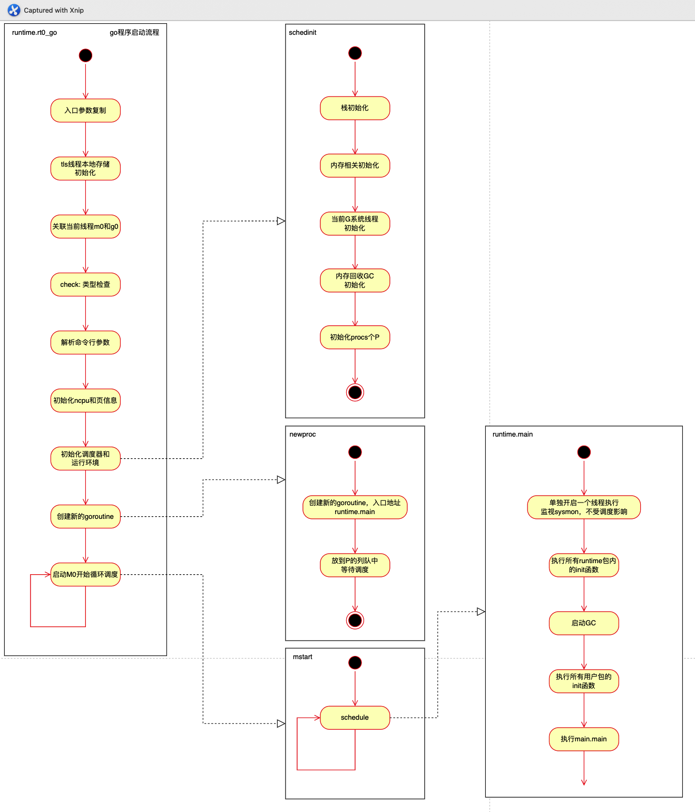
runtime.main主要流程:
* 启动系统后台监控sysmon线程(单独开一调线程，不参与调度)
* 执行 runtime 包内 init
* 启动gc
* 用户包依赖 init 的执行
* 执行用户main.mian方法
  
### GMP模型
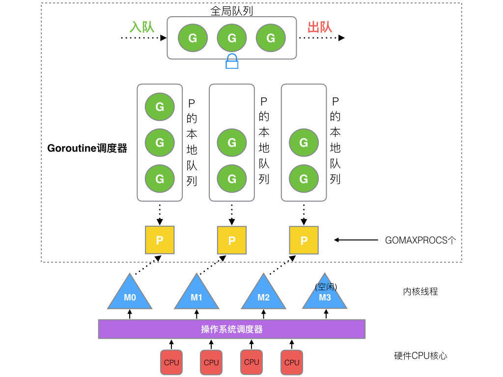

* 全局队列（Global Queue）：存放等待运行的 G。
* P 的本地队列：同全局队列类似，存放的也是等待运行的 G，存的数量有限，不超过 256 个。新建 G’时，G’优先加入到 P 的本地队列，如果队列满了，则会把本地队列中一半的 G 移动到全局队列。
* P 列表：所有的 P 都在程序启动时创建，并保存在数组中，最多有 GOMAXPROCS(可配置) 个。
* M：线程想运行任务就得获取 P，从 P 的本地队列获取 G，P 队列为空时，M 也会尝试从全局队列拿一批 G 放到 P 的本地队列，或从其他 P 的本地队列偷一半放到自己 P 的本地队列。M 运行 G，G 执行之后，M 会从 P 获取下一个 G，不断重复下去。

#### 运行规则
* 每个P都有一个局部队列，负责保存待执行的G，当局部队列满了就放到全局队列中
* 每个P都有一个M绑定，正常情况下M从局部队列中获取G执行
* M可以从其他队列偷取G执行（work stealing），也可以从全局队列获取G执行
* 当G因系统调用（syscall）阻塞时会阻塞M，此时P会和M解绑（hand off），并寻找新的空闲M，若没有空闲的M就会新建一个M
* 当G因channel或者network I/O阻塞时，不会阻塞M，M会寻找其他runnable的G；当阻塞的G恢复后会重新进入runnable进入P队列等待执行
* G是抢占调度。不像操作系统按时间片调度线程那样，Go调度器没有时间片概念，G因阻塞和被抢占而暂停，并且G只能在函数调用时有可能被抢占(栈扩张)，极端情况下(v1.14前)如果G一直做死循环就会霸占一个P和M，Go调度器也无能为力。

#### P和M何时会被创建
1、P 何时创建：在确定了P的最大数量n后，运行时系统会根据这个数量创建n个P。  
2、M 何时创建：没有足够的M来关联P并运行其中的可运行的G。比如所有的M此时都阻塞住了，而P中还有很多就绪任务，就会去寻找空闲的 M，而没有空闲的，就会去创建新的M。

### M0生命周期
* 启动程序后的编号为0的主线程(当前启动一个进程时，进程中会包含一个线程，进程中的第一个线程的编号设置为M0)
如果进程中不开任何线程，可以理解为一个进程就是一个线程。
* 在全局变量runtime.M0中，不需要在heap(堆)上分配。(M0在整个进程中是唯一的，无需在堆上分配)
* 负责执行初始化操作和启动第一个G(M0是负责启动第一个G的，go语言是跑在协程上)
* 启动第一个G之后，M0就和其他的M一样了(负责给其他M进行抢占)

### G0生命周期
* 每次启动一个M，都会第一个创建的goroutine，就是G0(G0不是整个进程唯一的，而是一个线程中唯一的)
* G0仅用于负责调度其他的G(M可能会有很多的G，然后G0用来保持调度栈的信息)当一个M从G1切换到G2，首先应该切换到G0，通过G0把G1干掉，把G2加进来，可以理解G0是一个转换的桥梁
* G0不指向任何可执行的函数
* 每一个M都会有一个自己的G0
* 在调度或系统调用是会使用M会切换到G0。来进行调度其他的G。
* M0的G0会放在全局空间

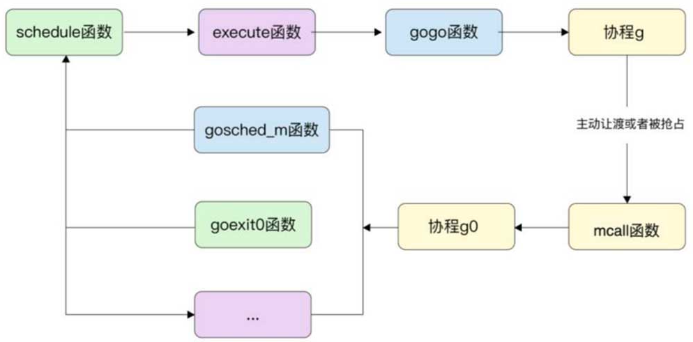

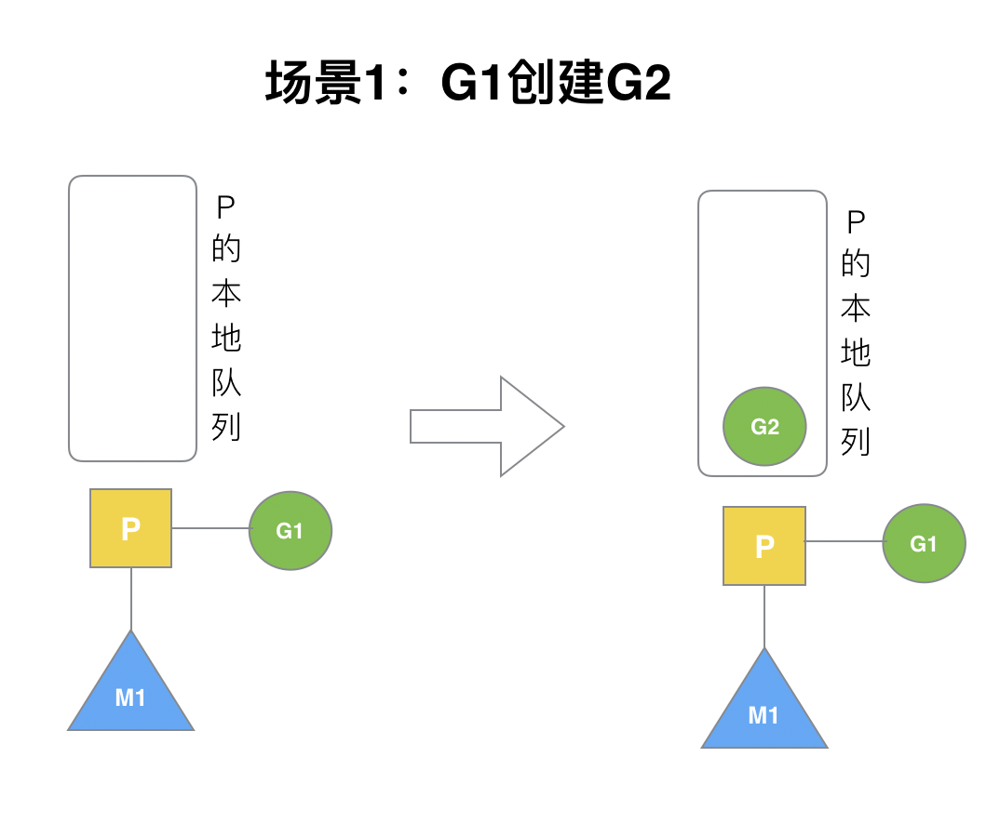
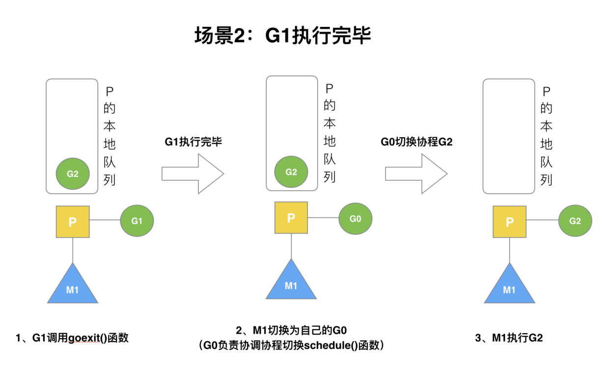
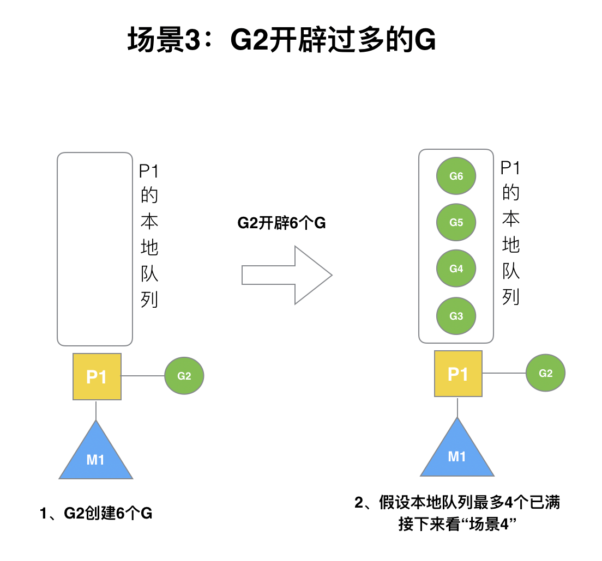
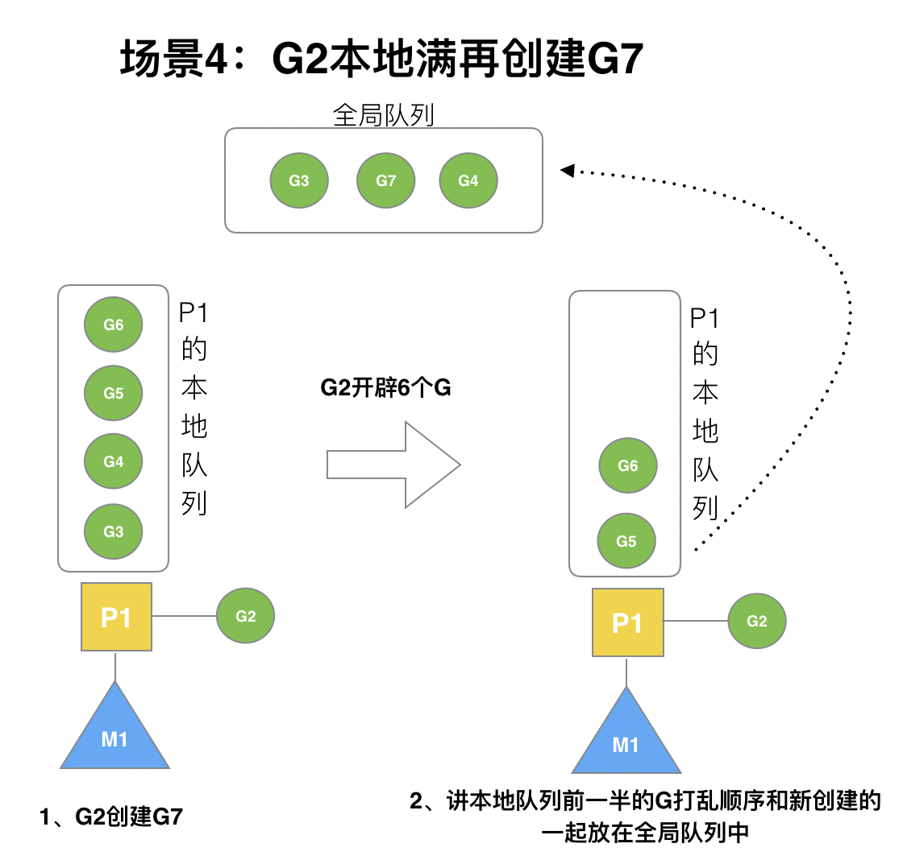
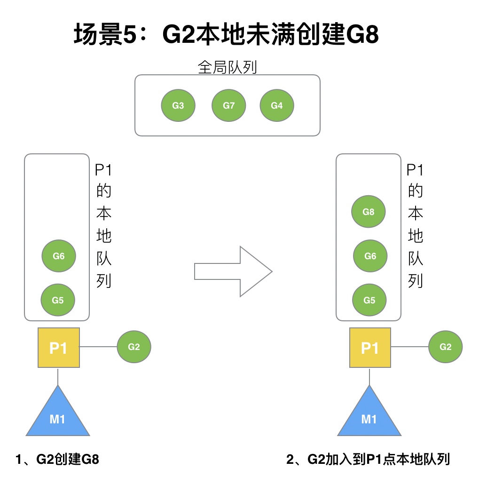

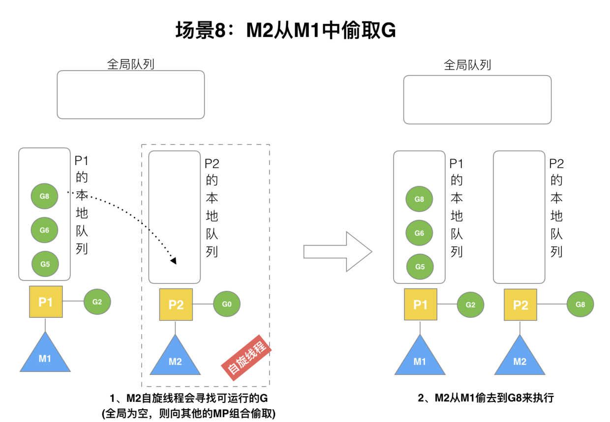
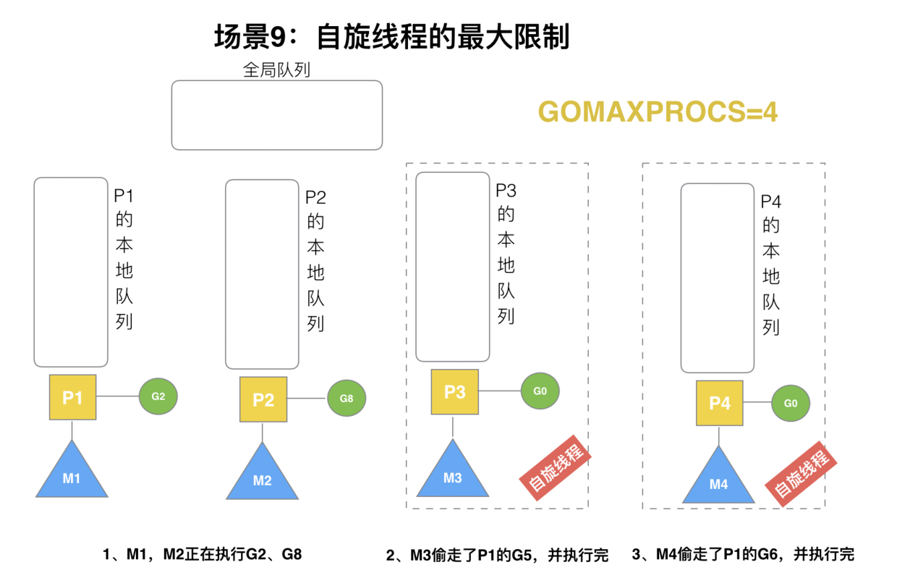
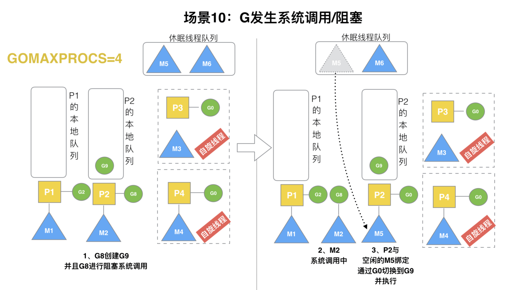
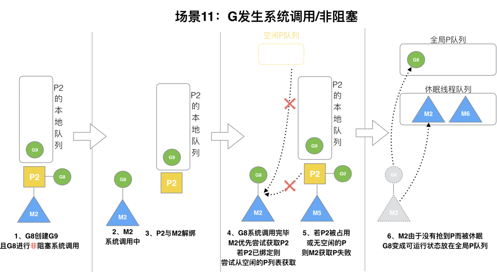

### 调度流程(go func())
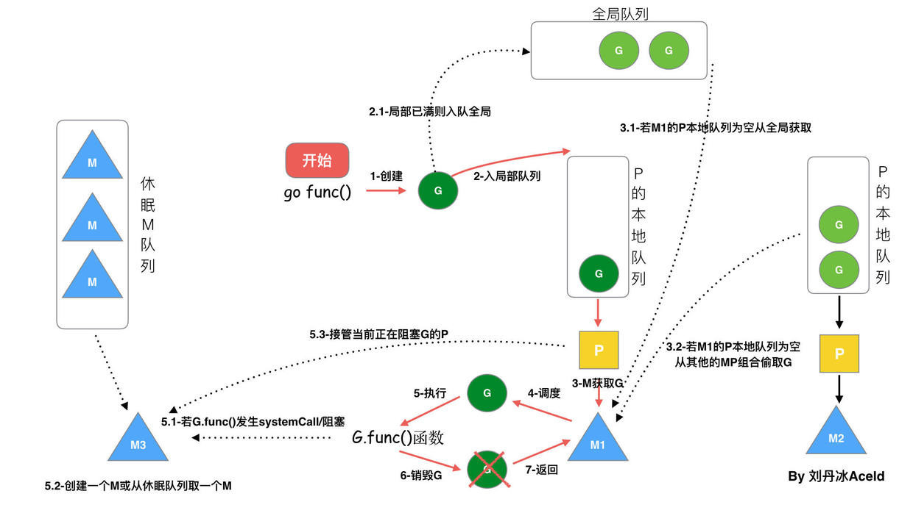

* 我们通过go func()来创建一个goroutine；从当前gFree找出一个空闲G复用，如果没有空闲可用G就新建一个  
* 有两个存储G的队列，一个是局部调度器P的本地队列、一个是全局G队列。新创建的G会先保存在P的本地队列中，如果 P的本地队列已经满了就会保存在全局的队列中；
* G只能运行在M中，一个M必须持有一个P，M与P是 1：1的关系。M会从P的本地队列弹出一个可执行状态的G来执行，如果 P的本地队列为空，就会想其他的MP组合偷取一个可执行的G来执行；
* 一个M调度G执行的过程是一个循环机制；
* 当M执行某一个G时候如果发生了syscall或则其余阻塞操作，M 会阻塞，如果当前有一些 G 在执行，runtime 会把这个线程 M 从 P 中摘除 (detach)，然后再创建一个新的操作系统的线程 (如果有空闲的线程可用就复用空闲线程) 来服务于这个 P；
* 当M系统调用结束时候，这个 G 会尝试获取一个空闲的 P 执行，并放入到这个 P 的本地队列。如果获取不到 P，那么这个线程 M 变成休眠状态， 加入到空闲线程中，然后这个 G 会被放入全局队列中

### 抢占式
  
&emsp;&emsp; `Go 的抢占式调度当 sysmon 发现 M 已运行同一个 G（Goroutine）10ms 以上时，它会将该 G 的内部参数 preempt 设置为 true。然后，在函数序言中，当 G 进行函数调用时，G 会检查自己的 preempt 标志，如果它为 true，则它将自己与 M 分离并推入“全局队列”。由于它的工作方式（函数调用触发），在 for{} 的情况下并不会发生抢占，如果没有函数调用，即使设置了抢占标志，也不会进行该标志的检查。Go1.14 引入抢占式调度（使用信号的异步抢占机制），sysmon 仍然会检测到运行了 10ms 以上的 G（goroutine）。然后，sysmon 向运行 G 的 P 发送信号（SIGURG）。Go 的信号处理程序会调用P上的一个叫作 gsignal 的 goroutine 来处理该信号，将其映射到 M 而不是 G，并使其检查该信号。gsignal 看到抢占信号，停止正在运行的 G`

`基于信号的抢占式调度
在之前的依赖栈增长检测代码的方式，遇到没有函数调用的情况下就会出现问题，在Go1.14这一问题得到解决。
在Linux中这种真正的抢占式调度是基于信号完成的，所以也称为“异步抢占”
“异步抢占”工作机制：
M 注册一个 SIGURG 信号的处理函数：sighandler。
sysmon 线程检测到执行时间过长的 goroutine、GC stw 时，会向相应的 M（或者说线程，每个线程对应一个 M）发送 SIGURG 信号。
收到信号后，内核执行 sighandler 函数，通过 pushCall 插入 asyncPreempt 函数调用。
回到当前 goroutine 执行 asyncPreempt 函数，通过 mcall 切到 g0 栈执行 gopreempt_m。
将当前 goroutine 插入到全局可运行队列，M 则继续寻找其他 goroutine 来运行。
被抢占的 goroutine 再次调度过来执行时，会继续原来的执行流。`

### G的状态
* 空闲中(_Gidle): 表示G刚刚新建, 仍未初始化
* 待运行(_Grunnable): 表示G在运行队列中, 等待M取出并运行
* 运行中(_Grunning): 表示M正在运行这个G, 这时候M会拥有一个P
* 系统调用中(_Gsyscall): 表示M正在运行这个G发起的系统调用, 这时候M并不拥有P
* 等待中(_Gwaiting): 表示G在等待某些条件完成, 这时候G不在运行也不在运行队列中(可能在channel的等待队列中)
* 已中止(_Gdead): 表示G未被使用, 可能已执行完毕(并在freelist中等待下次复用)
* 栈复制中(_Gcopystack): 表示G正在获取一个新的栈空间并把原来的内容复制过去(用于防止GC扫描)

参考:    
[Golang 调度原理简单了解](https://zhuanlan.zhihu.com/p/255196396)  
👍[详尽干货！从源码角度看 Golang 的调度](https://studygolang.com/articles/20651)   
[Golang 系统调用Syscall + RawSyscall](https://www.cnblogs.com/dream397/p/14301620.html)     
👍[[典藏版] Golang 调度器 GMP 原理与调度全分析](https://learnku.com/articles/41728)    
[【Golang详解】调度机制 抢占式调度](https://blog.51cto.com/u_15107299/3935086)  
[Go 语言问题集(Go Questions)](https://www.bookstack.cn/read/qcrao-Go-Questions/goroutine%20调度器-g0%20栈何用户栈如何切换.md)