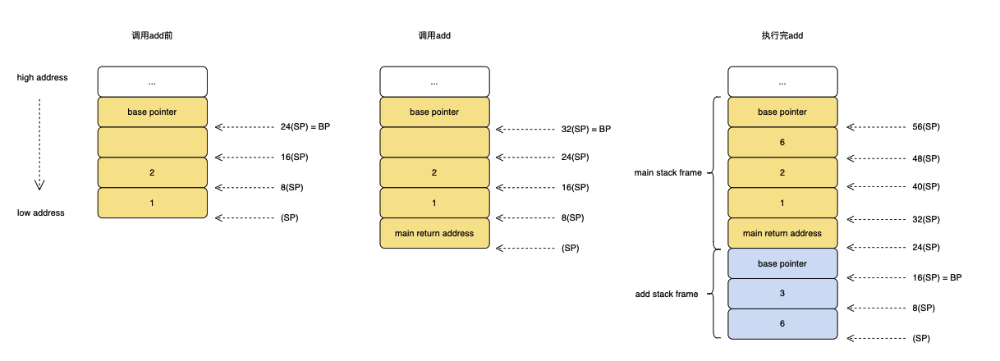
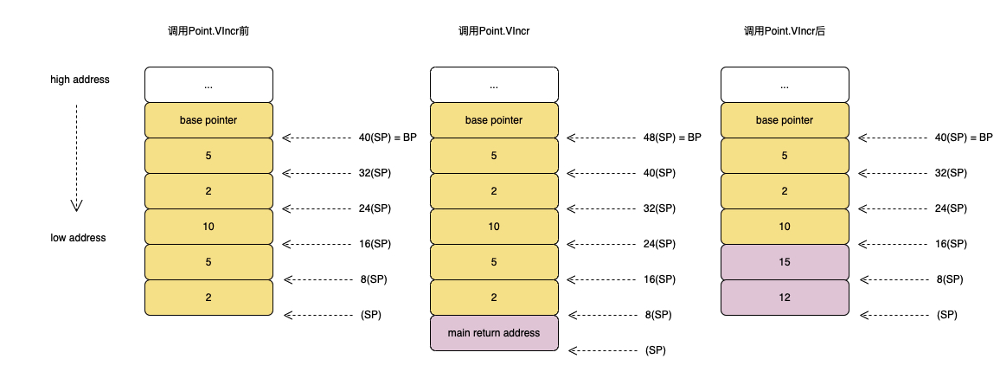
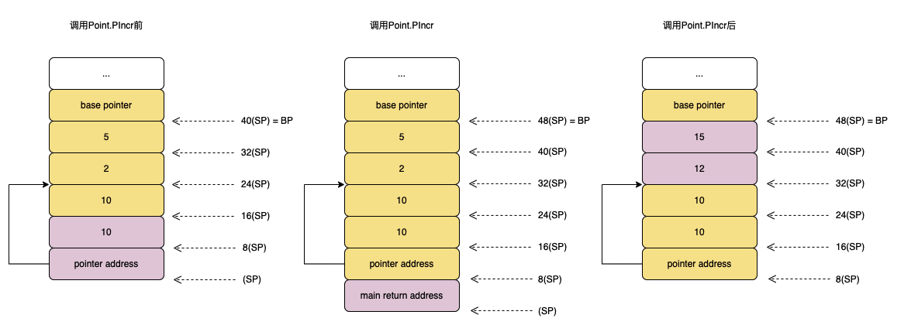

`go version go1.14.4 darwin/amd64`


## 一、直接函数调用
```
package main

func main() {
	add(1, 2)
}

//go:noinline
func add(a, b int) int {
	c := 3
	d := a + b + c
	return d
}
```
编写上面的函数保存为stack1.go,执行命令`go tool compile -S -N -l stack1.go>stack1.s`得到汇编指令

```
"".main STEXT size=68 args=0x0 locals=0x20
	0x0000 00000 (stack2.go:3)	TEXT	"".main(SB), ABIInternal, $32-0 ; 定义函数main，栈帧大小为32字节，0字节的参数(无参数)
	0x0000 00000 (stack2.go:3)	MOVQ	(TLS), CX     ; 将线程本地存储(thread local storage)传送到CX
	0x0009 00009 (stack2.go:3)	CMPQ	SP, 16(CX)    ; 栈溢出检测
	0x000d 00013 (stack2.go:3)	PCDATA	$0, $-2       ; GC 相关
	0x000d 00013 (stack2.go:3)	JLS	61
	0x000f 00015 (stack2.go:3)	PCDATA	$0, $-1       ; GC 相关
	0x000f 00015 (stack2.go:3)	SUBQ	$32, SP		  ; 分配了 32bytes 的栈地址
	0x0013 00019 (stack2.go:3)	MOVQ	BP, 24(SP)    ; 将 BP 的值存储到栈上
	0x0018 00024 (stack2.go:3)	LEAQ	24(SP), BP    ; 将刚分配的栈空间 8bytes 的地址赋值给BP
	0x001d 00029 (stack2.go:3)	PCDATA	$0, $-2
	0x001d 00029 (stack2.go:3)	PCDATA	$1, $-2
	0x001d 00029 (stack2.go:3)	FUNCDATA	$0, gclocals·33cdeccccebe80329f1fdbee7f5874cb(SB)  ; GC 相关
	0x001d 00029 (stack2.go:3)	FUNCDATA	$1, gclocals·33cdeccccebe80329f1fdbee7f5874cb(SB)  ; GC 相关
	0x001d 00029 (stack2.go:3)	FUNCDATA	$2, gclocals·33cdeccccebe80329f1fdbee7f5874cb(SB)  ; GC 相关
	0x001d 00029 (stack2.go:4)	PCDATA	$0, $0
	0x001d 00029 (stack2.go:4)	PCDATA	$1, $0
	0x001d 00029 (stack2.go:4)	MOVQ	$1, (SP)      ; 将给add函数的第一个参数1，写到SP
	0x0025 00037 (stack2.go:4)	MOVQ	$2, 8(SP)     ; 将给add函数的第二个参数2，写到SP
	0x002e 00046 (stack2.go:4)	CALL	"".add(SB)    ; 调用add函数, sp=sp+8, return address => sp 相当于PUSH IP,JMP somefunc
	0x0033 00051 (stack2.go:5)	MOVQ	24(SP), BP    ; 将栈上储存的值恢复BP
	0x0038 00056 (stack2.go:5)	ADDQ	$32, SP       ; 增加SP的值，栈收缩，收回 32 bytes的栈空间 
	0x003c 00060 (stack2.go:5)	RET
	0x003d 00061 (stack2.go:5)	NOP
	0x003d 00061 (stack2.go:3)	PCDATA	$1, $-1
	0x003d 00061 (stack2.go:3)	PCDATA	$0, $-2
	0x003d 00061 (stack2.go:3)	CALL	runtime.morestack_noctxt(SB)
	0x0042 00066 (stack2.go:3)	PCDATA	$0, $-1
	0x0042 00066 (stack2.go:3)	JMP	0
"".add STEXT nosplit size=65 args=0x18 locals=0x18
	0x0000 00000 (stack2.go:8)	TEXT	"".add(SB), NOSPLIT|ABIInternal, $24-24  ; 定义函数add，栈帧大小为24字节，24字节的参数和返回值
	0x0000 00000 (stack2.go:8)	SUBQ	$24, SP        ; 分配了 24bytes 的栈地址
	0x0004 00004 (stack2.go:8)	MOVQ	BP, 16(SP)     ; 将 BP 的值存储到栈上
	0x0009 00009 (stack2.go:8)	LEAQ	16(SP), BP     ; 将刚分配的栈空间 8bytes 的地址赋值给BP
	0x000e 00014 (stack2.go:8)	PCDATA	$0, $-2
	0x000e 00014 (stack2.go:8)	PCDATA	$1, $-2
	0x000e 00014 (stack2.go:8)	FUNCDATA	$0, gclocals·33cdeccccebe80329f1fdbee7f5874cb(SB)
	0x000e 00014 (stack2.go:8)	FUNCDATA	$1, gclocals·33cdeccccebe80329f1fdbee7f5874cb(SB)
	0x000e 00014 (stack2.go:8)	FUNCDATA	$2, gclocals·33cdeccccebe80329f1fdbee7f5874cb(SB)
	0x000e 00014 (stack2.go:8)	PCDATA	$0, $0
	0x000e 00014 (stack2.go:8)	PCDATA	$1, $0
	0x000e 00014 (stack2.go:8)	MOVQ	$0, "".~r2+48(SP)    ; 初始化返回值
	0x0017 00023 (stack2.go:9)	MOVQ	$3, "".c+8(SP)       ; 8(SP) = 3
	0x0020 00032 (stack2.go:10)	MOVQ	"".a+32(SP), AX      ; AX = 32(SP) = 1
	0x0025 00037 (stack2.go:10)	ADDQ	"".b+40(SP), AX      ; AX = AX + 40(SP) = AX + 2 = 3
	0x002a 00042 (stack2.go:10)	ADDQ	$3, AX               ; AX = AX + 3 = 6
	0x002e 00046 (stack2.go:10)	MOVQ	AX, "".d(SP)         ; (SP) = AX = 6
	0x0032 00050 (stack2.go:11)	MOVQ	AX, "".~r2+48(SP)    ; 48(SP) = AX = 6
	0x0037 00055 (stack2.go:11)	MOVQ	16(SP), BP           ; BP = 16(SP), 将栈上储存的值恢复BP
	0x003c 00060 (stack2.go:11)	ADDQ	$24, SP              ; 增加SP的值，栈收缩，收回 24 bytes的栈空间 
	0x0040 00064 (stack2.go:11)	RET
```
上面汇编主要是分为两个函数`main`和`add`:

```
0x0000 00000 (stack2.go:3)	TEXT	"".main(SB), ABIInternal, $32-0 
```
* `0x0000`: 当前指令相对于当前函数的偏移量；
* `TEXT`:由于程序代码在运行期会放在内存的 .text 段中，所以TEXT 是一个指令，用来定义一个函数；
* `"".main(SB)`: 表示的是包名.函数名，这里省略了包名。SB是一个虚拟寄存器，保存了静态基地址(static-base) 指针，即我们程序地址空间的开始地址；
* `$32-0`:$32表即将分配的栈帧大小；0指定了调用方传入的参数大小。

main函数代码主要做了以下操作:
* 申请32字节的栈，把BP的值放栈底，把分配到的栈地址赋值给BP
* 把参数1和2压到栈上，从参数列表的右往左压
* 调用add函数
* 恢复BP的值，收回栈空间
* 函数返回


add函数代码主要做了以下操作:
* 申请24字节的栈，把BP的值放栈底，把分配到的栈地址赋值给BP
* 进行取值计算操作等
* 恢复BP的值，收回栈空间
* 函数返回

栈的变化如下图:

`注意：调用add的时候，SP会发生变化，即SP=SP-8，而在函数返回的时候发生SP=SP+8原因如下:`   
&emsp;&emsp;`在Go汇编语言中CALL指令用于调用函数，RET指令用于从调用函数返回。但是CALL和RET指令并没有处理函数调用时输入参数和返回值的问题。CALL指令类似PUSH IP和JMP somefunc两个指令的组合，首先将当前的IP指令寄存器的值压入栈中，然后通过JMP指令将要调用函数的地址写入到IP寄存器实现跳转。而RET指令则是和CALL相反的操作，基本和POP IP指令等价，也就是将执行CALL指令时保存在SP中的返回地址重新载入到IP寄存器，实现函数的返回。`
以下操作是利用dlv来查看栈的情况:
```
➜  golang-demo dlv debug stack1.go
Type 'help' for list of commands.
(dlv) b main.main
Breakpoint 1 set at 0x105e8bf for main.main() ./stack2.go:3
(dlv) b main.add
Breakpoint 2 set at 0x105e900 for main.add() ./stack2.go:8
(dlv) c
> main.main() ./stack2.go:3 (hits goroutine(1):1 total:1) (PC: 0x105e8bf)
     1: package main
     2:
=>   3: func main() {
     4:         add(1, 2)
     5: }
     6:
     7: //go:noinline
     8: func add(a, b int) int {
(dlv) c
> main.add() ./stack2.go:8 (hits goroutine(1):1 total:1) (PC: 0x105e900)
     3: func main() {
     4:         add(1, 2)
     5: }
     6:
     7: //go:noinline
=>   8: func add(a, b int) int {
     9:         c := 3
    10:         d := a + b + c
    11:         return d
    12: }
(dlv) n
> main.add() ./stack2.go:9 (PC: 0x105e917)
     4:         add(1, 2)
     5: }
     6:
     7: //go:noinline
     8: func add(a, b int) int {
=>   9:         c := 3
    10:         d := a + b + c
    11:         return d
    12: }
(dlv) n
> main.add() ./stack2.go:10 (PC: 0x105e920)
     5: }
     6:
     7: //go:noinline
     8: func add(a, b int) int {
     9:         c := 3
=>  10:         d := a + b + c
    11:         return d
    12: }
(dlv) n
> main.add() ./stack2.go:11 (PC: 0x105e932)
     6:
     7: //go:noinline
     8: func add(a, b int) int {
     9:         c := 3
    10:         d := a + b + c
=>  11:         return d
    12: }
(dlv) n
> main.add() ./stack2.go:11 (PC: 0x105e937)
     6:
     7: //go:noinline
     8: func add(a, b int) int {
     9:         c := 3
    10:         d := a + b + c
=>  11:         return d
    12: }
(dlv) regs
   Rip = 0x000000000105e937
   Rsp = 0x000000c000040740
   Rax = 0x0000000000000006
   Rbx = 0x0000000000000000
   Rcx = 0x000000c000000180
   Rdx = 0x000000000107f610
   Rsi = 0x0000000000000001
   Rdi = 0x0000000000000001
   Rbp = 0x000000c000040750
    R8 = 0x0000000000000055
    R9 = 0xffffffff00000000
   R10 = 0x00000000010d1080
   R11 = 0x0000000000000202
   R12 = 0x0000000000203000
   R13 = 0x0000000000000000
   R14 = 0x0000000000000178
   R15 = 0x0000000000000004
Rflags = 0x0000000000000206     [PF IF IOPL=0]
    Cs = 0x000000000000002b
    Fs = 0x0000000000000000
    Gs = 0x0000000000000000

(dlv) print *(*int)(uintptr(0x000000c000040740))
6
(dlv) print *(*int)(uintptr(0x000000c000040740)+8)
3
(dlv) print *(*int)(uintptr(0x000000c000040740)+16)
824633984888
(dlv) print *(*int)(uintptr(0x000000c000040740)+24)
17164515
(dlv) print *(*int)(uintptr(0x000000c000040740)+32)
1
(dlv) print *(*int)(uintptr(0x000000c000040740)+40)
2
(dlv) print *(*int)(uintptr(0x000000c000040740)+48)
6
(dlv) print *(*int)(uintptr(0x000000c000040740)+56)
824633984976
```


## 二、结构体方法:值接收者与指针接收者
```
package main

func main() {
	p := Point{2, 5}
	p.VIncr(10)
	p.PIncr(10)
}

type Point struct {
	X int
	Y int
}

func (p Point) VIncr(factor int) {
	p.X += factor
	p.Y += factor
}

func (p *Point) PIncr(factor int) {
	p.X += factor
	p.Y += factor
}
```

```
"".main STEXT size=126 args=0x0 locals=0x30
	0x0000 00000 (stack3.go:3)	TEXT	"".main(SB), ABIInternal, $48-0  ; 定义函数main，栈帧大小为48字节，0字节的参数(无参数)
	0x0000 00000 (stack3.go:3)	MOVQ	(TLS), CX         ; 将线程本地存储(thread local storage)传送到CX
	0x0009 00009 (stack3.go:3)	CMPQ	SP, 16(CX)        ; 栈溢出检测
	0x000d 00013 (stack3.go:3)	PCDATA	$0, $-2           ; GC 相关
	0x000d 00013 (stack3.go:3)	JLS	119
	0x000f 00015 (stack3.go:3)	PCDATA	$0, $-1           ; GC 相关
	0x000f 00015 (stack3.go:3)	SUBQ	$48, SP           ; 分配了48bytes 的栈地址
	0x0013 00019 (stack3.go:3)	MOVQ	BP, 40(SP)        ; 将BP的值存储到栈上
	0x0018 00024 (stack3.go:3)	LEAQ	40(SP), BP        ; 将刚分配的栈空间8bytes的地址赋值给BP
	0x001d 00029 (stack3.go:3)	PCDATA	$0, $-2
	0x001d 00029 (stack3.go:3)	PCDATA	$1, $-2
	0x001d 00029 (stack3.go:3)	FUNCDATA	$0, gclocals·33cdeccccebe80329f1fdbee7f5874cb(SB)  ; GC 相关
	0x001d 00029 (stack3.go:3)	FUNCDATA	$1, gclocals·33cdeccccebe80329f1fdbee7f5874cb(SB)  ; GC 相关
	0x001d 00029 (stack3.go:3)	FUNCDATA	$2, gclocals·9fb7f0986f647f17cb53dda1484e0f7a(SB)  ; GC 相关
	0x001d 00029 (stack3.go:4)	PCDATA	$0, $0
	0x001d 00029 (stack3.go:4)	PCDATA	$1, $0
	0x001d 00029 (stack3.go:4)	XORPS	X0, X0                      ; 清空寄存器X0  
	0x0020 00032 (stack3.go:4)	MOVUPS	X0, "".p+24(SP)             ; 初始化大小为16bytes连续内存块
	0x0025 00037 (stack3.go:4)	MOVQ	$2, "".p+24(SP)             ; 初始化结构体 p 参数 x
	0x002e 00046 (stack3.go:4)	MOVQ	$5, "".p+32(SP)             ; 初始化结构体 p 参数 y
	0x0037 00055 (stack3.go:5)	MOVQ	$2, (SP)                    ; 初始化变量2
	0x003f 00063 (stack3.go:5)	MOVQ	$5, 8(SP)                   ; 初始化变量5
	0x0048 00072 (stack3.go:5)	MOVQ	$10, 16(SP)                 ; 初始化变量10
	0x0051 00081 (stack3.go:5)	CALL	"".Point.VIncr(SB)          ; 调用Point.VIncr方法
	0x0056 00086 (stack3.go:6)	PCDATA	$0, $1
	0x0056 00086 (stack3.go:6)	LEAQ	"".p+24(SP), AX             ; 将24(SP)地址值赋值到AX
	0x005b 00091 (stack3.go:6)	PCDATA	$0, $0
	0x005b 00091 (stack3.go:6)	MOVQ	AX, (SP)                    ; AX值赋给SP
	0x005f 00095 (stack3.go:6)	MOVQ	$10, 8(SP)                  ; 8(SP) = 10
	0x0068 00104 (stack3.go:6)	CALL	"".(*Point).PIncr(SB)       ; 调用(*Point).PIncr
	0x006d 00109 (stack3.go:7)	MOVQ	40(SP), BP                  ; 恢复BP
	0x0072 00114 (stack3.go:7)	ADDQ	$48, SP                     ; 收回栈空间
	0x0076 00118 (stack3.go:7)	RET
	0x0077 00119 (stack3.go:7)	NOP
	0x0077 00119 (stack3.go:3)	PCDATA	$1, $-1
	0x0077 00119 (stack3.go:3)	PCDATA	$0, $-2
	0x0077 00119 (stack3.go:3)	CALL	runtime.morestack_noctxt(SB)
	0x007c 00124 (stack3.go:3)	PCDATA	$0, $-1
	0x007c 00124 (stack3.go:3)	JMP	0
"".Point.VIncr STEXT nosplit size=31 args=0x18 locals=0x0
	0x0000 00000 (stack3.go:15)	TEXT	"".Point.VIncr(SB), NOSPLIT|ABIInternal, $0-24  ; 定义函数Point.VIncr，栈帧大小为0字节，24字节的参数
	0x0000 00000 (stack3.go:15)	PCDATA	$0, $-2
	0x0000 00000 (stack3.go:15)	PCDATA	$1, $-2
	0x0000 00000 (stack3.go:15)	FUNCDATA	$0, gclocals·33cdeccccebe80329f1fdbee7f5874cb(SB)
	0x0000 00000 (stack3.go:15)	FUNCDATA	$1, gclocals·33cdeccccebe80329f1fdbee7f5874cb(SB)
	0x0000 00000 (stack3.go:15)	FUNCDATA	$2, gclocals·33cdeccccebe80329f1fdbee7f5874cb(SB)
	0x0000 00000 (stack3.go:16)	PCDATA	$0, $0
	0x0000 00000 (stack3.go:16)	PCDATA	$1, $0
	0x0000 00000 (stack3.go:16)	MOVQ	"".p+8(SP), AX           ; AX = 8(SP) = 2
	0x0005 00005 (stack3.go:16)	ADDQ	"".factor+24(SP), AX     ; AX = AX + 24(SP) = 2+10 = 12
	0x000a 00010 (stack3.go:16)	MOVQ	AX, "".p+8(SP)           ; 8(SP) = 12
	0x000f 00015 (stack3.go:17)	MOVQ	"".p+16(SP), AX          ; AX = 16(SP) = 5
	0x0014 00020 (stack3.go:17)	ADDQ	"".factor+24(SP), AX     ; AX = AX + 24(SP) = 5+10 = 15
	0x0019 00025 (stack3.go:17)	MOVQ	AX, "".p+16(SP)          ; 16(SP) = 15
	0x001e 00030 (stack3.go:18)	RET
	0x0000 48 8b 44 24 08 48 03 44 24 18 48 89 44 24 08 48  H.D$.H.D$.H.D$.H
	0x0010 8b 44 24 10 48 03 44 24 18 48 89 44 24 10 c3     .D$.H.D$.H.D$..
"".(*Point).PIncr STEXT nosplit size=53 args=0x10 locals=0x0
	0x0000 00000 (stack3.go:20)	TEXT	"".(*Point).PIncr(SB), NOSPLIT|ABIInternal, $0-16 ; 定义函数Point.VIncr，栈帧大小为0字节，16字节的参数
	0x0000 00000 (stack3.go:20)	PCDATA	$0, $-2
	0x0000 00000 (stack3.go:20)	PCDATA	$1, $-2
	0x0000 00000 (stack3.go:20)	FUNCDATA	$0, gclocals·1a65e721a2ccc325b382662e7ffee780(SB)
	0x0000 00000 (stack3.go:20)	FUNCDATA	$1, gclocals·69c1753bd5f81501d95132d08af04464(SB)
	0x0000 00000 (stack3.go:20)	FUNCDATA	$2, gclocals·6e8d7ea4abad763909b26991048ee1fe(SB)
	0x0000 00000 (stack3.go:21)	PCDATA	$0, $1
	0x0000 00000 (stack3.go:21)	PCDATA	$1, $0
	0x0000 00000 (stack3.go:21)	MOVQ	"".p+8(SP), AX                ; AX = 8(SP) = 32(SP)地址值
	0x0005 00005 (stack3.go:21)	TESTB	AL, (AX)
	0x0007 00007 (stack3.go:21)	PCDATA	$0, $2
	0x0007 00007 (stack3.go:21)	MOVQ	"".p+8(SP), CX                ; CX = 8(SP) = 32(SP)地址值
	0x000c 00012 (stack3.go:21)	TESTB	AL, (CX)
	0x000e 00014 (stack3.go:21)	PCDATA	$0, $3
	0x000e 00014 (stack3.go:21)	MOVQ	(AX), AX                      ; 从 AX 里读到内存地址，从内存地址里拿到值，再读到AX, AX = 2
	0x0011 00017 (stack3.go:21)	ADDQ	"".factor+16(SP), AX          ; AX = AX + 10 = 12
	0x0016 00022 (stack3.go:21)	PCDATA	$0, $0
	0x0016 00022 (stack3.go:21)	MOVQ	AX, (CX)                      ; 将计算结果写入到CX的内存地址, 32(SP)=12
	0x0019 00025 (stack3.go:22)	PCDATA	$0, $1
	0x0019 00025 (stack3.go:22)	MOVQ	"".p+8(SP), AX                ; AX = 8(SP) = 32(SP)地址值
	0x001e 00030 (stack3.go:22)	TESTB	AL, (AX)
	0x0020 00032 (stack3.go:22)	PCDATA	$0, $2
	0x0020 00032 (stack3.go:22)	PCDATA	$1, $1
	0x0020 00032 (stack3.go:22)	MOVQ	"".p+8(SP), CX                ; CX = 8(SP) = 32(SP)地址值
	0x0025 00037 (stack3.go:22)	TESTB	AL, (CX)
	0x0027 00039 (stack3.go:22)	PCDATA	$0, $3
	0x0027 00039 (stack3.go:22)	MOVQ	8(AX), AX                     ; 从 AX 里读到内存地址值+8 ，然后从内存地址里拿到值，再读到AX, AX = 5
	0x002b 00043 (stack3.go:22)	ADDQ	"".factor+16(SP), AX          ; AX = AX + 10 = 12
	0x0030 00048 (stack3.go:22)	PCDATA	$0, $0
	0x0030 00048 (stack3.go:22)	MOVQ	AX, 8(CX)                     ; 将计算结果写入到CX的内存地址, 40(SP)=15
	0x0034 00052 (stack3.go:23)	RET
```

### 调用值接收者(value receiver)方法

main的主要做:
* 分配48字节栈空间，保存BP,重新设置BP
* 申请16字节连续内存块，初始化结构体`p := Point{2, 5}`
* 初始化变量2，5压到栈上
* 调用`Point.VIncr`方法
* 把结构体地址压到栈上
* 调用`(*Point).PIncr`方法
* 恢复BP，收回栈空间
* 返回

Point.VIncr方法主要做:
* 取值计算
* 保存结果到栈上
调用`Point.VIncr`方法前后栈的变化如下图:


&emsp;&emsp;从这上面可以看到，`main`在调用 `Point.VIncr` 方法的时候实际上是将值赋值到栈上给`Point.VIncr`当作参数在调用，对于在 `Point.VIncr`中的修改实际上都是修改栈上最后两个参数值。


### 调用指针接收者(pointer receiver)方法
Point.VIncr方法主要做:
* 取值计算
* 结果保存到`p := Point{2, 5}`内存上



&emsp;&emsp;通过分析我们知道在调用值接收者(value receiver)方法的时候，调用者 caller 会将参数值写入到栈上，调用函数 callee 实际上操作的是调用者 caller 栈帧上的参数值。
&emsp;&emsp;进行调用指针接收者(pointer receiver)方法调用的时候，和 value receiver 方法的区别是调用者 caller 写入栈的是参数的地址值，所以调用完之后可以直接体现在 receiver 的结构体中


参考:   
[从栈上理解 Go语言函数调用](https://www.luozhiyun.com/archives/518)