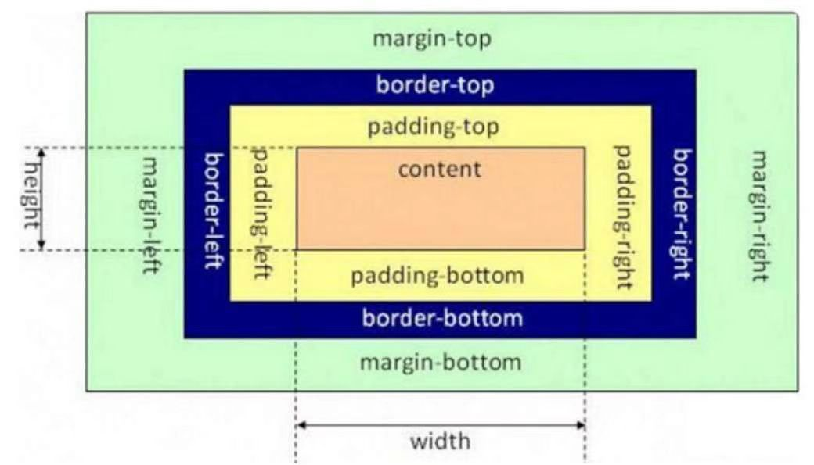

# HTML5+CSS3

## HTML5

todo

## CSS3

### 一、选择器

1. 元素选择器
   作用：根据标签名来选中指定的元素语法：标签名{}

   ```css
   p{
       color: red;
   }
   h1{
       color: green;
   }
   ```
2. id选择器作用：根据元素的id属性值选中一个元素语法：#id属性值{}例子：#box{} #red{}

   ```css
   #red{
       color: red;
   }
   ```
3. 类选择器作用：根据元素的class属性值选中一组元素语法：.class属性值

   ```css
   .blue{
       color: blue;
   }
   ```
4. 通配选择器作用：选中页面中的所有元素语法: *

   ```css
   *{
       color: red;
   }
   ```
5. 交集选择器作用：选中同时复合多个条件的元素语法：选择器1选择器2选择器3选择器n{}注意点：交集选择器中如果有元素选择器，必须使用元素选择器开头

   ```css
   div.red{
       font-size: 30px;
   }

   .a.b.c{
       color: blue
   }
   ```
6. 选择器分组（并集选择器）作用：同时选择多个选择器对应的元素语法：选择器1,选择器2,选择器3,选择器n{}#b1,.p1,h1,span,div.red{}

   ```css
   h1, .red{
       color: green
   }
   ```
7. 子元素选择器作用：选中指定父元素的指定子元素语法：父元素 > 子元素

   ```css
   div.box > span{
       color: orange;
   }
   ```
8. 后代元素选择器：作用：选中指定元素内的指定后代元素语法：祖先 后代

   ```css
   div span{
       color: skyblue
   } 
   ```
9. 属性选择器[属性名] 选择含有指定属性的元素[属性名=属性值] 选择含有指定属性和属性值的元素[属性名^=属性值] 选择属性值以指定值开头的元素[属性名$=属性值] 选择属性值以指定值结尾的元素[属性名*=属性值] 选择属性值中含有某值的元素的元素

   ```css
   /* p[title]{ */
   /* p[title=abc]{ */
   /* p[title^=abc]{ */
   /* p[title$=abc]{ */
   p[title*=e]{
       color: orange;
   }
   ```
10. 伪类选择器

    ```css
    /* 
        将ul里的第一个li设置为红色
    */

    /*
        伪类（不存在的类，特殊的类）
            - 伪类用来描述一个元素的特殊状态
                比如：第一个子元素、被点击的元素、鼠标移入的元素...
            - 伪类一般情况下都是使用:开头
                :first-child 第一个子元素
                :last-child 最后一个子元素
                :nth-child() 选中第n个子元素
                :only-child
                    特殊值：
                        n 第n个 n的范围0到正无穷
                        2n 或 even 表示选中偶数位的元素
                        2n+1 或 odd 表示选中奇数位的元素

                    - 以上这些伪类都是根据所有的子元素进行排序

                :first-of-type
                :last-of-type
                :nth-of-type()
                :only-of-type
                :empty
                    - 这几个伪类的功能和上述的类似，不通点是他们是在同类型元素中进行排序

            - :not() 否定伪类
                - 将符合条件的元素从选择器中去除
    */
    /* ul > li:first-child{
        color: red;
    } */

    /* ul > li:last-child{
        color: red;
    } */

    /* ul > li:nth-child(2n+1){
        color: red;
    } */

    /* ul > li:nth-child(even){
        color: red;
    } */

    /* ul > li:first-of-type{
        color: red;
    } */

    ul > li:not(:nth-of-type(3)){
        color: yellowgreen;
    }
    ```
11. a元素的伪类

    ```css
    /*
        :link 用来表示没访问过的链接（正常的链接）
    */
    a:link{
        color: red;
    }

    /* 
        :visited 用来表示访问过的链接
        由于隐私的原因，所以visited这个伪类只能修改链接的颜色
    */
    a:visited{
        color: orange; 
        /* font-size: 50px;   */
    }

    /* 
        :hover 用来表示鼠标移入的状态
    */
    a:hover{
        color: aqua;
        font-size: 50px;
    }

    /*
        :active 用来表示鼠标点击
    */
    a:active{
        color: yellowgreen;
    }
    p:first-child{
        color: red;
    }
    ```
12. 伪元素选择器伪元素，表示页面中一些特殊的并不真实的存在的元素（特殊的位置）伪元素使用 :: 开头::first-letter 表示第一个字母::first-line 表示第一行::selection 表示选中的内容::before 元素的开始::after 元素的最后- before 和 after 必须结合content属性来使用

    ```css
    p::first-letter{
        font-size: 50px;
    }

    p::first-line{
        background-color: yellow; 
    }

    p::selection{
        background-color: greenyellow;
    }

    /* div::before{
        content: 'abc';
        color: red;
    }

    div::after{
        content: 'haha';
        color: blue;
    } */

    div::before{
        content: '『';
        }

    div::after{
        content: '』';
    }
    ```
13. 选择器的权重

    ```css
    /* 
    样式的冲突
        - 当我们通过不同的选择器，选中相同的元素，并且为相同的样式设置不同的值时，此时就发生了样式的冲突。

    发生样式冲突时，应用哪个样式由选择器的权重（优先级）决定
    选择器的权重
        内联样式        1,0,0,0
        id选择器        0,1,0,0
        类和伪类选择器   0,0,1,0
        元素选择器       0,0,0,1
        通配选择器       0,0,0,0
        继承的样式       没有优先级

    比较优先级时，需要将所有的选择器的优先级进行相加计算，最后优先级越高，则越优先显示（分组选择器是单独计算的）,
        选择器的累加不会超过其最大的数量级，类选择器在高也不会超过id选择器
        如果优先级计算后相同，此时则优先使用靠下的样式

    可以在某一个样式的后边添加 !important ，则此时该样式会获取到最高的优先级，甚至超过内联样式，
        注意：在开发中这个玩意一定要慎用！
    */
    ```

### 二、样式的继承

* 样式的继承，我们为一个元素设置的样式同时也会应用到它的后代元素上继承是发生在祖先后代之间的
* 继承的设计是为了方便我们的开发，利用继承我们可以将一些通用的样式统一设置到共同的祖先元素上，这样只需设置一次即可让所有的元素都具有该样式
* 注意：并不是所有的样式都会被继承：
  比如 背景相关的，布局相关等的这些样式都不会被继承。

### 三、长度单位

    像素
        - 屏幕（显示器）实际上是由一个一个的小点点构成的
        - 不同屏幕的像素大小是不同的，像素越小的屏幕显示的效果越清晰
        - 所以同样的200px在不同的设备下显示效果不一样

    百分比
        - 也可以将属性值设置为相对于其父元素属性的百分比
        - 设置百分比可以使子元素跟随父元素的改变而改变

    em
        - em是相对于元素的字体大小来计算的
        - 1em = 1font-size
        - em会根据字体大小的改变而改变

    rem
        - rem是相对于根元素的字体大小来计算

### 四、颜色单位

在CSS中可以直接使用颜色名来设置各种颜色,比如：red、orange、yellow、blue、green ... ...
但是在css中直接使用颜色名是非常的不方便

    RGB值：
        - RGB通过三种颜色的不同浓度来调配出不同的颜色
        - R red，G green ，B blue
        - 每一种颜色的范围在 0 - 255 (0% - 100%) 之间
        - 语法：RGB(红色,绿色,蓝色)

    RGBA:
        - 就是在rgb的基础上增加了一个a表示不透明度
        - 需要四个值，前三个和rgb一样，第四个表示不透明度
            1表示完全不透明   0表示完全透明  .5半透明

    十六进制的RGB值：
        - 语法：#红色绿色蓝色
        - 颜色浓度通过 00-ff
        - 如果颜色两位两位重复可以进行简写
    #aabbcc --> #abc

    HSL值 HSLA值
        H 色相(0 - 360)
        S 饱和度，颜色的浓度 0% - 100%
        L 亮度，颜色的亮度 0% - 100%

### 五、盒子模型

#### 1、文件流

文档流（normal flow）

- 网页是一个多层的结构，一层摞着一层
- 通过CSS可以分别为每一层来设置样式
- 作为用户来讲只能看到最顶上一层
- `这些层中，最底下的一层称为文档流，文档流是网页的基础``我们所创建的元素默认都是在文档流中进行排列`
- 对于我们来元素主要有两个状态
  在文档流中
  不在文档流中（脱离文档流）
- 元素在文档流中有什么特点：

  - `块元素`

    - 块元素会在页面中独占一行(自上向下垂直排列)
    - 默认宽度是父元素的全部（会把父元素撑满）
    - 默认高度是被内容撑开（子元素）
  - `行内元素`

    - 行内元素不会独占页面的一行，只占自身的大小
    - 行内元素在页面中左向右水平排列，如果一行之中不能容纳下所有的行内元素则元素会换到第二行继续自左向右排列（书写习惯一致）
    - 行内元素的默认宽度和高度都是被内容撑开

#### 2、盒子模型

盒模型、盒子模型、框模型（box model）

- CSS将页面中的所有元素都设置为了一个矩形的盒子
- 将元素设置为矩形的盒子后，对页面的布局就变成将不同的盒子摆放到不同的位置
- 每一个盒子都由一下几个部分组成：
  - 内容区（content）
  - 内边距（padding）
  - 边框（border）
  - 外边距（margin）

```css
.box1{
/*
    内容区（content），元素中的所有的子元素和文本内容都在内容区中排列
    内容区的大小由width 和 height两个属性来设置
        width 设置内容区的宽度
        height 设置内容区的高度
*/
    width: 200px;
    height: 200px;
    background-color: #bfa;

/*
    边框（border），边框属于盒子边缘，边框里边属于盒子内部，出了边框都是盒子的外部
        边框的大小会影响到整个盒子的大小
    要设置边框，需要至少设置三个样式：
        边框的宽度 border-width
        边框的颜色 border-color
        边框的样式 border-style
*/
    color:red;
    border-width: 10px;
    /*border-color: red;*/
    border-style: solid;
}
```

* 盒子模型-边框

```css
.box1{
    width: 200px;
    height: 200px;
    background-color: #bfa;
    /*
        边框
            边框的宽度 border-width
            边框的颜色 border-color
            边框的样式 border-style
    */

    /*
    border-width: 10px; 
    默认值，一般都是 3个像素
    border-width可以用来指定四个方向的边框的宽度
        值的情况
            四个值：上 右 下 左
            三个值：上 左右 下
            两个值：上下 左右
            一个值：上下左右

    除了border-width还有一组 border-xxx-width
        xxx可以是 top right bottom left
        用来单独指定某一个边的宽度
    */
    /* border-width: 10px; */
    /* border-top-width: 10px;
    border-left-width: 30px; */

    color: red;
    /*border-bottom: red solid 1px;*/

    /*
    border-color用来指定边框的颜色，同样可以分别指定四个边的边框
        规则和border-width一样

    border-color也可以省略不写，如果省略了则自动使用color的颜色值
    */
    /* border-color: orange red yellow green;
    border-color: orange; */


    /*
        border-style 指定边框的样式
            solid 表示实线
            dotted 点状虚线
            dashed 虚线
            double 双线

            border-style的默认值是none 表示没有边框

    */
    /* border-style: solid dotted dashed double;
    border-style: solid; */

    /* border-width: 10px;
    border-color: orange;
    border-style: solid; */

    /*
    border简写属性，通过该属性可以同时设置边框所有的相关样式，并且没有顺序要求

    除了border以外还有四个 border-xxx
        border-top
        border-right
        border-bottom
        border-left
    */
    /* border: solid 10px orange; */
    /* border-top: 10px solid red;
    border-left: 10px solid red;
    border-bottom: 10px solid red; */

    border: 10px red solid;
    border-right: none;
}
```

* 盒子模型-内边距

```css
.box1{
    width: 200px;
    height: 200px;
    background-color: transparent;
    border: 10px orange solid;

    /*
        内边距（padding）
            - 内容区和边框之间的距离是内边距
            - 一共有四个方向的内边距：
                padding-top
                padding-right
                padding-bottom
                padding-left

            - 内边距的设置会影响到盒子的大小
            - 背景颜色会延伸到内边距上

        一共盒子的可见框的大小，由内容区 内边距 和 边框共同决定，
            所以在计算盒子大小时，需要将这三个区域加到一起计算
    */

    /* padding-top: 100px;
    padding-left: 100px;
    padding-right: 100px;
    padding-bottom: 100px; */

    /* 
    padding 内边距的简写属性，可以同时指定四个方向的内边距
        规则和border-width 一样
    */

    padding: 10px ;
}

.inner{
    width: 100%;
    height: 100%;
    background-color: yellow;
}
```

* 盒子模型-外边距

```css
 .box1{
    width: 200px;
    height: 200px;
    background-color: #bfa;
    border: 10px red solid;

    /*
        外边距（margin）
            - 外边距不会影响盒子可见框的大小
            - 但是外边距会影响盒子的位置
            - 一共有四个方向的外边距：
                margin-top
                    - 上外边距，设置一个正值，元素会向下移动
                margin-right
                    - 默认情况下设置margin-right不会产生任何效果
                margin-bottom
                    - 下外边距，设置一个正值，其下边的元素会向下移动
                margin-left
                    - 左外边距，设置一个正值，元素会向右移动

                - margin也可以设置负值，如果是负值则元素会向相反的方向移动

            - 元素在页面中是按照自左向右的顺序排列的，
                所以默认情况下如果我们设置的左和上外边距则会移动元素自身
                而设置下和右外边距会移动其他元素

            - margin的简写属性
                margin 可以同时设置四个方向的外边距 ，用法和padding一样

            - margin会影响到盒子实际占用空间
        */

        /* margin-top: 100px;
        margin-left: 100px;
        margin-bottom: 100px; */

        /* margin-bottom: 100px; */
        /* margin-top: -100px; */
        /* margin-left: -100px; */
        /* margin-bottom: -100px; */

        /* margin-right: 0px; */

        margin: 100px;
    }

    .box2{
        width: 220px;
        height: 220px;
        background-color: yellow
    }
```

#### 3、盒子模型布局

* 水平布局

```css
.outer{
    width: 800px;
    height: 200px;
    border: 10px red solid;
}

.inner{
    /* width: auto;  width的值默认就是auto*/
    width: 100px;
    height: 200px;
    background-color: #bfa;
    /*margin-right: auto;*/
    /*margin-left: auto;*/
    /* margin-left: 100px;
    margin-right: 400px */
    /*
        元素的水平方向的布局：
            元素在其父元素中水平方向的位置由以下几个属性共同决定“
                margin-left
                border-left
                padding-left
                width
                padding-right
                border-right
                margin-right

            一个元素在其父元素中，水平布局必须要满足以下的等式
margin-left+border-left+padding-left+width+padding-right+border-right+margin-right = 其父元素内容区的宽度 （必须满足）

        0 + 0 + 0 + 200 + 0 + 0 + 0 = 800
        0 + 0 + 0 + 200 + 0 + 0 + 600 = 800

        100 + 0 + 0 + 200 + 0 + 0 + 400 = 800
        100 + 0 + 0 + 200 + 0 + 0 + 500 = 800
            - 以上等式必须满足，如果相加结果使等式不成立，则称为过度约束，则等式会自动调整
                - 调整的情况：
                    - 如果这七个值中没有为 auto 的情况，则浏览器会自动调整margin-right值以使等式满足
            - 这七个值中有三个值和设置为auto
                width
                margin-left
                maring-right
                - 如果某个值为auto，则会自动调整为auto的那个值以使等式成立
                    0 + 0 + 0 + auto + 0 + 0 + 0 = 800  auto = 800
                    0 + 0 + 0 + auto + 0 + 0 + 200 = 800  auto = 600
                    200 + 0 + 0 + auto + 0 + 0 + 200 = 800  auto = 400

                    auto + 0 + 0 + 200 + 0 + 0 + 200 = 800  auto = 400

                    auto + 0 + 0 + 200 + 0 + 0 + auto = 800  auto = 300

                - 如果将一个宽度和一个外边距设置为auto，则宽度会调整到最大，设置为auto的外边距会自动为0
                - 如果将三个值都设置为auto，则外边距都是0，宽度最大
                - 如果将两个外边距设置为auto，宽度固定值，则会将外边距设置为相同的值
                    所以我们经常利用这个特点来使一个元素在其父元素中水平居中
                    示例：
                        width:xxxpx;
                        margin:0 auto;
        */
}
```

* 垂直布局

```css
.outer{
    background-color: #bfa;
    height: 600px;
    /*
        默认情况下父元素的高度被内容撑开
    */
}

.inner{
    width: 100px;
    background-color: yellow;
    height: 100px;
    margin-bottom: 100px;
}

.box1{
    width: 200px;
    height: 200px;
    background-color: #bfa;
    /*
        子元素是在父元素的内容区中排列的，
            如果子元素的大小超过了父元素，则子元素会从父元素中溢出
            使用 overflow 属性来设置父元素如何处理溢出的子元素

            可选值：
                visible，默认值 子元素会从父元素中溢出，在父元素外部的位置显示
                hidden 溢出内容将会被裁剪不会显示
                scroll 生成两个滚动条，通过滚动条来查看完整的内容
                auto 根据需要生成滚动条

        overflow-x:
        overflow-y:
    */
    overflow: auto;
}

.box2{
    width: 100px;
    height: 400px;
    background-color: orange;
}

```

#### 4、外边距的折叠

```css
.box1 , .box2{
    width: 200px;
    height: 200px;
    font-size: 100px;
}

/*
    垂直外边距的重叠（折叠）
        - 相邻的垂直方向外边距会发生重叠现象
        - 兄弟元素
            - 兄弟元素间的相邻垂直外边距会取两者之间的较大值（两者都是正值）
            - 特殊情况：
                如果相邻的外边距一正一负，则取两者的和
                如果相邻的外边距都是负值，则取两者中绝对值较大的

            - 兄弟元素之间的外边距的重叠，对于开发是有利的，所以我们不需要进行处理


        - 父子元素
            - 父子元素间相邻外边距，子元素的会传递给父元素（上外边距）
            - 父子外边距的折叠会影响到页面的布局，必须要进行处理

*/

.box1{
    background-color: #bfa;
    /* 设置一个下外边距 */
    margin-bottom: -100px;
    margin-left: auto;
    margin-right: auto;
}

.box2{
    background-color: orange;
    /* 设置一个上外边距 */
    margin-top: 100px;
}

.box3{
    width: 200px;
    height: 200px;
    background-color: #bfa;
    /* padding-top: 100px; */
    /* border-top: 1px #bfa solid; */
}

.box4{
    width: 100px;
    height: 100px;
    background-color: orange;
    margin-top: 100px;
}
```

#### 5、行内元素的盒子模型

```css
.s1{
    background-color: yellow;

    /* 
        行内元素的盒模型
            - 行内元素不支持设置宽度和高度
            - 行内元素可以设置padding，但是垂直方向padding不会影响页面的布局
            - 行内元素可以设置border，垂直方向的border不会影响页面的布局
            - 行内元素可以设置margin，垂直方向的margin不会影响布局
    */
    /* width: 100px;
    height: 100px; */

    /* padding: 100px; */

    /* border: 100px solid red; */

    margin: 100px;
}

.box1{
    width: 200px;
    height: 200px;
    background-color: #bfa;
}

a{
    /*
        display 用来设置元素显示的类型
            可选值：
                inline 将元素设置为行内元素
                block 将元素设置为块元素
                inline-block 将元素设置为行内块元素 
                        行内块，既可以设置宽度和高度又不会独占一行
                table 将元素设置为一个表格
                none 元素不在页面中显示

        visibility 用来设置元素的显示状态
            可选值：
                visible 默认值，元素在页面中正常显示
                hidden 元素在页面中隐藏 不显示，但是依然占据页面的位置
    */
    display: block;
    visibility: hidden;
    width: 100px;
    height: 100px;
    background-color: orange;
}
```

#### 6、默认样式

```vue
<!--
重置样式表：专门用来对浏览器的样式进行重置的
    reset.css 直接去除了浏览器的默认样式
    normalize.css 对默认样式进行了统一
-->
<style>
    /*
        默认样式：
            - 通常情况，浏览器都会为元素设置一些默认样式
            - 默认样式的存在会影响到页面的布局，
                通常情况下编写网页时必须要去除浏览器的默认样式（PC端的页面）
    */

    /* body{
        margin: 0;
    }

    p{
        margin: 0;
    }

    ul{
        margin: 0;
        padding: 0;
        /* 去除项目符号 * /
        list-style:none; 
    } */

    /* *{
        margin: 0;
        padding: 0;
    } */

    .box1{
        width: 100px;
        height: 100px;
        border: 1px solid black;
    }
</style>
```

#### 7、盒子的尺寸

```css
.box1{
    width: 100px;
    height: 100px;
    background-color: #bfa;
    padding: 10px;
    border: 10px red solid;
    /* 
        默认情况下，盒子可见框的大小由内容区、内边距和边框共同决定

            box-sizing 用来设置盒子尺寸的计算方式（设置width和height的作用）
                可选值：
                    content-box 默认值，宽度和高度用来设置内容区的大小
                    border-box 宽度和高度用来设置整个盒子可见框的大小
                        width 和 height 指的是内容区 和 内边距 和 边框的总大小
    */
    box-sizing: border-box;
}
```

#### 8、轮廓和圆角

```css
.box1{
    width: 200px;
    height: 200px;
    background-color: #bfa;

    /* box-shadow 用来设置元素的阴影效果，阴影不会影响页面布局 
        第一个值 水平偏移量 设置阴影的水平位置 正值向右移动 负值向左移动
        第二个值 垂直偏移量 设置阴影的水平位置 正值向下移动 负值向上移动
        第三个值 阴影的模糊半径
        第四个值 阴影的颜色
    */

    box-shadow: 0px 0px 50px rgba(0, 0, 0, .3) ; 

/* 

    outline 用来设置元素的轮廓线，用法和border一模一样
    轮廓和边框不同的点，就是轮廓不会影响到可见框的大小  
*/
  
}

/* .box1:hover{
    outline: 10px red solid;
} */

.box2{
    width: 200px;
    height: 200px;
    background-color: orange;

    /* border-radius: 用来设置圆角 圆角设置的圆的半径大小*/

    /* border-top-left-radius:  */
    /* border-top-right-radius */
    /* border-bottom-left-radius:  */
    /* border-bottom-right-radius:  */
    /* border-top-left-radius:50px 100px; */

    /*
        border-radius 可以分别指定四个角的圆角
            四个值 左上 右上 右下 左下
            三个值 左上 右上/左下 右下 
            两个个值 左上/右下 右上/左下  
        */
        border-radius: 20px / 40px;    /*设置椭圆*/

    /* 将元素设置为一个圆形 */
    /*border-radius: 50%;*/
}

```

### 六、浮动

#### 1、简介

```css
.box1{
    width: 400px;
    height: 200px;
    background-color: #bfa;

    /*
        通过浮动可以使一个元素向其父元素的左侧或右侧移动
            使用 float 属性来设置于元素的浮动
                可选值：
                    none 默认值 ，元素不浮动
                    left 元素向左浮动
                    right 元素向右浮动

            注意，元素设置浮动以后，水平布局的等式便不需要强制成立
                元素设置浮动以后，会完全从文档流中脱离，不再占用文档流的位置，
                    所以元素下边的还在文档流中的元素会自动向上移动

            浮动的特点：
                1、浮动元素会完全脱离文档流，不再占据文档流中的位置
                2、设置浮动以后元素会向父元素的左侧或右侧移动，
                3、浮动元素默认不会从父元素中移出
                4、浮动元素向左或向右移动时，不会超过它前边的其他浮动元素
                5、如果浮动元素的上边是一个没有浮动的块元素，则浮动元素无法上移
                6、浮动元素不会超过它上边的浮动的兄弟元素，最多最多就是和它一样高

            简单总结：
                浮动目前来讲它的主要作用就是让页面中的元素可以水平排列，
                    通过浮动可以制作一些水平方向的布局  
        */
    float: left;
}

.box2{
    width: 400px;
    height: 200px;
    background-color: orange;
    float: left;
}

.box3{
    width: 200px;
    height: 200px;
    background-color: yellow;
    float: right;
}
```

#### 2、浮动其他特点

```css
*{
    margin: 0;
    padding: 0;
}

.box1{
    width: 100px;
    height: 100px;
    background-color: #bfa;
    /* 
        浮动元素不会盖住文字，文字会自动环绕在浮动元素的周围，
            所以我们可以利用浮动来设置文字环绕图片的效果
    */
    float: left;
}

.box2{
    background-color: yellowgreen;
    /*
        元素设置浮动以后，将会从文档流中脱离，从文档流中脱离后，元素的一些特点也会发生变化

        脱离文档流的特点：
            块元素：
                1、块元素不在独占页面的一行
                2、脱离文档流以后，块元素的宽度和高度默认都被内容撑开

            行内元素：
                行内元素脱离文档流以后会变成块元素，特点和块元素一样

            脱离文档流以后，不需要再区分块和行内了
    */
    float: left;
}

.box3{
    background-color: orange
}

.s1{
    float: left;
    width: 200px;
    height: 200px;
    background-color: yellow;
}
```

#### 3、网页布局

```html
<!DOCTYPE html>
<html lang="en">
<head>
    <meta charset="UTF-8">
    <meta name="viewport" content="width=device-width, initial-scale=1.0">
    <meta http-equiv="X-UA-Compatible" content="ie=edge">
    <title>Document</title>
    <style>

        header, main, footer{
            width: 1000px;
            margin: 0 auto;
        }

        /* 设置头部 */
        header{
            height: 150px;
            background-color: silver;
        }

        /* 设置主体 */
        main{
            height: 500px;
            background-color: #bfa;
            margin: 10px auto;
        }

        nav, article, aside{
            float: left;
            height: 100%;
        }

        /* 设置左侧的导航 */
        nav{
            width: 200px;
            background-color: yellow;
        }

        /* 设置中间的内容 */
        article{
            width: 580px;
            background-color: orange;
            margin: 0 10px;
        }

        /* 设置右侧的内容 */
        aside{
            width: 200px;
            background-color: pink;
        }

        /* 设置底部 */
        footer{
            height: 150px;
            background-color: tomato;
        }
    </style>
</head>
<body>

    <!-- 创建头部 -->
    <header></header>

    <!-- 创建网页的主体 -->
    <main>
        <!-- 左侧导航 -->
       <nav></nav>

       <!-- 中间的内容 -->
       <article></article>

       <!-- 右边的边栏 -->
       <aside></aside>

    </main>
  
    <!-- 网页的底部 -->
    <footer></footer>
</body>
</html>
```

### 七、布局定位
#### 1、position属性的作用
position可选值：   
* static 默认值，元素是静止的没有开启定位，浏览器决定元素位置(默认位置)
* relative 开启元素的相对定位(`相对static时的位置`)，搭配top、bottom、left、right这四个属性一起使用，用来指定偏移的方向和距离
* absolute 开启元素的绝对定位，`相对于上级元素（一般是父元素）进行偏移，即定位基点是父元素`。如果定位基点(父元素)是static定位，定位基点就会变成整个网页的根元素。
* fixed 开启元素的固定定位，`相对于视口（viewport，浏览器窗口）进行偏移，即定位基点是浏览器窗口`。这会导致元素的位置不随页面滚动而变化，好像固定在网页上一样。
* sticky 开启元素的粘滞定位, 很像relative和fixed的结合：一些时候是relative定位（定位基点是自身默认位置），另一些时候自动变成fixed定位（定位基点是视口）。   
    sticky生效的前提是，必须搭配top、bottom、left、right这四个属性一起使用，不能省略，否则等同于relative定位，不产生"动态固定"的效果。
  
注意:       
`relative、absolute、fixed这三个属性值有一个共同点，都是相对于某个基点的定位，不同之处仅仅在于基点不同。`


参考:  
[CSS 定位详解](https://www.ruanyifeng.com/blog/2019/11/css-position.html)


### 参考

[尚硅谷Web前端零基础入门HTML5+CSS3基础教程丨初学者从入门到精通](https://www.bilibili.com/video/BV1XJ411X7Ud?p=1)
[尚硅谷Web前端零基础入门HTML5+CSS3基础教程 代码](https://github.com/JontyYang/Html_Css)
