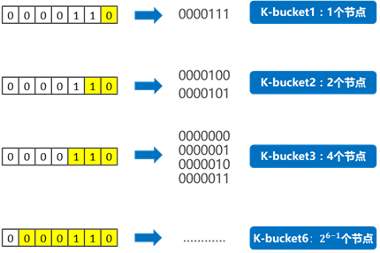
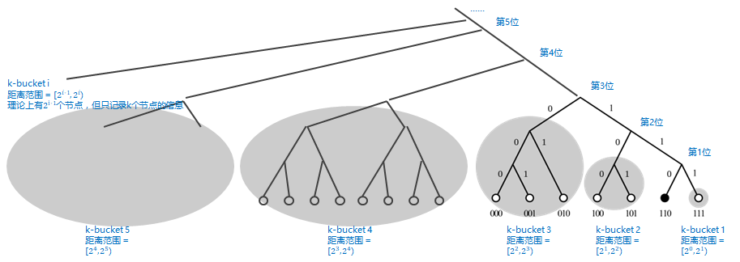

### 节点(NodeID)
&emsp;&emsp;Kad网络中每个节点都有一个160bit的ID值作为标志符，Key也是一个160bit的标志符，每一个加入Kad网络的节点都会被分配一个160bit的节点ID（node ID），这个ID值是随机产生的。 
#### 节点的距离  
&emsp;&emsp;Kad算法采用异或操作来计算节点之间的距离。通过异或操作，我们可以得到该距离算法有一下特点：   
  * (A ⊕ B) == (B ⊕ A)：对称性，A到B的距离和B到A的距离是相等的。
  * (A ⊕ A) == 0：节点自身与自身的距离是0。
  * (A ⊕ B) > 0 ：任意两个节点之间的距离一定大于0。
  * (A ⊕ B) + (B ⊕ C) >= (A ⊕ C)：三角不等，A经过B到C的距离总是大于等于A直接到C的距离  
  
  这里所说的距离是逻辑上的距离，与地理位置无关，所以有可能两个节点之间计算得到的逻辑距离很近，但实际上地理上的距离却很远。  
  例如：节点A的ID（011）和节点B的ID（101）距离：011 ⊕ 101 = 110 = 6。

### K-桶（K-bucket）机制
&emsp;&emsp;以0000110为基础节点，如果一个节点的ID，前面所有位数都与它相同，只有最后1位不同，这样的节点只有1个——0000111，与基础节点的异或值为0000001，即距离为1；对于0000110而言，这样的节点归为“k-bucket 1”；  
&emsp;&emsp;如果一个节点的ID，前面所有位数相同，从倒数第2位开始不同，这样的节点只有2个：0000101、0000100，与基础节点的异或值为0000011和0000010，即距离范围为3和2；对于0000110而言，这样的节点归为“k-bucket 2”；  
……  
&emsp;&emsp;如果一个节点的ID，前面所有位数相同，从倒数第n位开始不同，这样的节点只有2(i-1)个，与基础节点的距离范围为[2(i-1), 2i）；对于0000110而言，这样的节点归为“k-bucket i”；  

&emsp;&emsp;如果将整个网络的节点梳理为一个按节点ID排列的二叉树，树最末端的每个叶子便是一个节点，则下图就比较直观的展现出，节点之间的距离的关系。

### 节点的指令
Kademlia算法中，每个节点只有4个指令

* PING
-- 测试一个节点是否在线
* STORE
-- 要求一个节点存储一份数据
* FIND_NODE
-- 根据节点ID查找一个节点
* FIND_VALUE
-- 根据KEY查找一个数据，实则上跟FIND_NODE非常类似

### K-Bucket更新机制
* 主动收集节点：任何节点都可以发起FIND_NODE（查询节点）的请求，从而刷新K-桶中的节点信息。
* 被动收集节点：当收到其他节点发送过来的请求（如：FIND_NODE、FIND_VALUE），会把对方的节点ID加入到某个K-桶中。
* 检测失效节点：通过发起PING请求，判断K-桶中某个节点是否在线，然后清理K-桶中哪些下线的节点。

每个bucket里的节点都按最后一次接触的时间倒序排列
每次执行四个指令中的任意一个都会触发更新
当一个节点与自己接触时，检查它是否在K-bucket中
-- 如果在，那么将它挪到k-bucket列表的最底（最新）
-- 如果不在，PING一下列表最上面（最旧）的一个节点
-- a) 如果PING通了，将旧节点挪到列表最底，并丢弃新节点
-- b) 如果PING不通，删除旧节点，并将新节点加入列表

### 资源查找
当节点要查询<key, value>数据对时，和定位节点的过程类似。

* Step1：首先发起者会查找自己是否存储了<key, value>数据对，如果存在则直接返回，否则就返回K个距离key值最近的节点，并向这K个节点ID发起FIND_VALUE请求
* Step2：收到FIND_VALUE请求的节点，首先也是检查自己是否存储了<key, value>数据对，如果有直接返回value，如果没有，则在自己的对应的K-桶中返回K-个距离key值最近的节点
* Step3：发起者如果收到value则结束查询过程，否则发起者在收到这些节点后，更新自己的结果列表，并再次从其中K个距离key值最近的节点，挑选未发送请求的节点再次发起FIND_VALUE请求。
* Step4：上述步骤不断重复，直到获取到value或者无法获取比发起者当前已知的K个节点更接近key值的活动节点为止，这时就表示未找到value值。
如果上述FIND_VALUE最终找到value值，则<key, value>数据对会缓存在没有返回value值的最近节点上，这样下次再查询相同的key值时就可以加快查询速度。

所以，越热门的资源，其缓存的<key, value>数据对范围就越广。这也是为什么我们以前用P2P下载工具，下载的某个资源的人越多时，下载速度越快的原因。

### 保存资源
当节点收到一个<key, value>的数据时，它的存储过程如下：

* Step1：发起者首先定位K个距离目标key值最近的节点
* Step2：然后发起者对这K个节点发起STORE请求
* Step3：接收到STORE请求的节点将保存<key, value>数据
* Step4：同时，执行STORE操作的K个节点每小时重发布自己所有的<key, value>对数据
* Step5：最后，为了限制失效信息，所有<key, value>对数据在发布24小时后过期。

### 节点加入和离开
如果节点 u 要想加入 Kad 网络，它必须要和一个已经在 Kad 网络的节点（种子节点），比如 w，取得联系。其步骤如下：

* Step1：新节点A首先需要一个种子节点B作为引导，并把该种子节点加入到对应的K-桶中
* Step2：首先生成一个随机的节点ID值，直到离开网络，该节点会一直使用该ID
* Step3：向节点B发起FIND_NODE请求，请求定位的节点时自己的节点ID
* Step4：节点B在收到节点A的FIND_NODE请求后，会根据FIND_NODE请求的约定，找到K个距离A最近的节点，并返回给A节点
* Step5：A收到这些节点以后，就把它们加入到自己的K-桶中
* Step6：然后节点A会继续向这些刚拿到节点发起FIND_NODE请求，如此往复，直到A建立了足够详细的路由表。  
&emsp;&emsp;节点离开 Kad 网络不需要发布任何信息，Kademlia 协议的目标之一就是能够弹性工作在任意节点随时失效的情况下。为此，Kad 要求每个节点必须周期性的发布全部自己存放的 <key,value> 对数据，并把这些数据缓存在自己的 k 个最近邻居处，这样失效节点存放的数据会很快被更新到其他新节点上。

参考:   
[Kademlia协议](https://segmentfault.com/a/1190000023417884)     
[P2P 网络核心技术：Kademlia 协议](https://www.jianshu.com/p/eba4673b0d9a)     
[易懂分布式 | Kademlia算法](https://www.jianshu.com/p/f2c31e632f1d)     