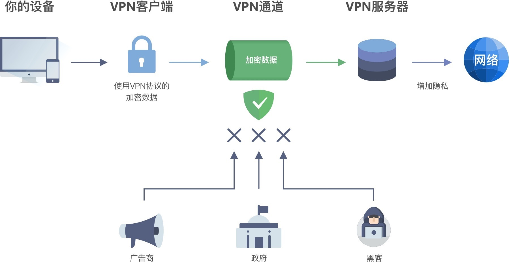

## VPN协议

* PPTP——点对点隧道协议
* L2TP/IPSec——二层隧道协议
* SSTP – 安全套接字隧道协议
* IKEv2 – 互联网密钥交换协议版本 2
* OpenVPN
* WireGuard
* Shadowsocks

参考:  
[小白也能懂技术——VPN工作原理是什么？](https://www.xinruiyun.cn/zhishiku/3385.html)     
[VPN 的工作原理是什么? 一文带您深入理解虚拟专用网是如何工作的](https://pandavpnpro.com/blog/zh-cn/how-does-a-vpn-work)